# SSS Corp ERP — System Overview

> **เอกสารภาพรวมระบบ** สำหรับเจ้าของธุรกิจ + ทีมงาน
> อ่านแล้วเข้าใจว่าระบบทำอะไรได้ ทำงานอย่างไร และเชื่อมต่อกันอย่างไร
>
> อัปเดตล่าสุด: 2026-03-02 | Phase 0-11 (partial) | 12 Modules | 133 Permissions

---

## สารบัญ

1. [สถาปัตยกรรมระบบ](#1-สถาปัตยกรรมระบบ)
2. [แผนที่โมดูล + จุดเชื่อมต่อ](#2-แผนที่โมดูล--จุดเชื่อมต่อ)
3. [แผนภาพการไหลของข้อมูล (5 Flow หลัก)](#3-แผนภาพการไหลของข้อมูล)
4. [แผนภาพสถานะเอกสาร (10 State Machines)](#4-แผนภาพสถานะเอกสาร)
5. [แผนที่หน้าจอ (Frontend)](#5-แผนที่หน้าจอ)
6. [ภาพร่างหน้าจอหลัก (Wireframes)](#6-ภาพร่างหน้าจอหลัก)
7. [ตารางสิทธิ์ผู้ใช้ (Permission Matrix)](#7-ตารางสิทธิ์ผู้ใช้)
8. [กฎธุรกิจสำคัญ (Business Rules)](#8-กฎธุรกิจสำคัญ)

---

# 1. สถาปัตยกรรมระบบ

ระบบ SSS Corp ERP ประกอบด้วย 3 ชั้นหลัก:

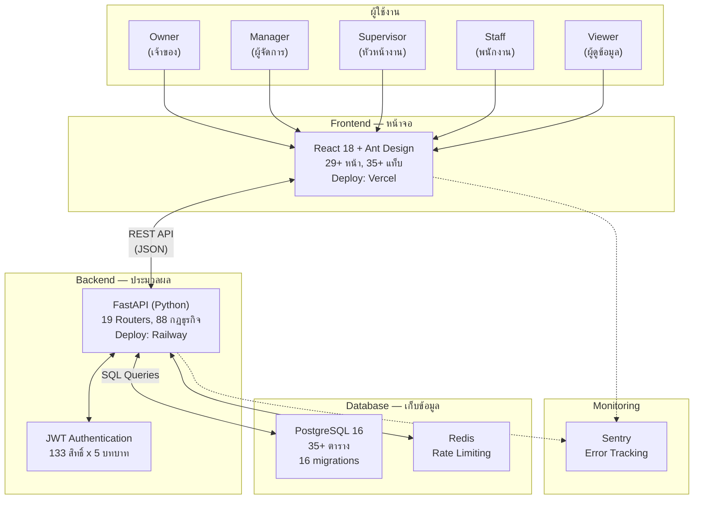
```mermaid
graph TB
    subgraph "ผู้ใช้งาน"
        U1["Owner<br/>(เจ้าของ)"]
        U2["Manager<br/>(ผู้จัดการ)"]
        U3["Supervisor<br/>(หัวหน้างาน)"]
        U4["Staff<br/>(พนักงาน)"]
        U5["Viewer<br/>(ผู้ดูข้อมูล)"]
    end

    subgraph "Frontend — หน้าจอ"
        FE["React 18 + Ant Design<br/>29+ หน้า, 35+ แท็บ<br/>Deploy: Vercel"]
    end

    subgraph "Backend — ประมวลผล"
        BE["FastAPI (Python)<br/>19 Routers, 88 กฎธุรกิจ<br/>Deploy: Railway"]
        AUTH["JWT Authentication<br/>133 สิทธิ์ x 5 บทบาท"]
    end

    subgraph "Database — เก็บข้อมูล"
        DB["PostgreSQL 16<br/>35+ ตาราง<br/>16 migrations"]
        REDIS["Redis<br/>Rate Limiting"]
    end

    subgraph "Monitoring"
        SENTRY["Sentry<br/>Error Tracking"]
    end

    U1 & U2 & U3 & U4 & U5 --> FE
    FE <-->|"REST API<br/>(JSON)"| BE
    BE <--> AUTH
    BE <-->|"SQL Queries"| DB
    BE <--> REDIS
    BE -.-> SENTRY
    FE -.-> SENTRY
```

### เทคโนโลยีที่ใช้

| ชั้น | เทคโนโลยี | หน้าที่ |
|------|----------|--------|
| หน้าจอ (Frontend) | React 18 + Vite + Ant Design | แสดงผล + รับข้อมูลจากผู้ใช้ |
| ไอคอน | Lucide React | ไอคอนทั้งระบบ |
| ประมวลผล (Backend) | FastAPI (Python 3.12) | ตรวจสอบกฎ + คำนวณ + จัดการข้อมูล |
| ฐานข้อมูล | PostgreSQL 16 + SQLAlchemy | เก็บข้อมูลทั้งหมด |
| Cache | Redis | จำกัดจำนวนการเรียก API |
| ยืนยันตัวตน | JWT Token | Login + สิทธิ์การเข้าถึง |
| Deploy หน้าจอ | Vercel | เว็บไซต์ออนไลน์ |
| Deploy ประมวลผล | Railway | เซิร์ฟเวอร์ออนไลน์ |

---

# 2. แผนที่โมดูล + จุดเชื่อมต่อ

ระบบมี **12 โมดูล** ที่ทำงานร่วมกัน:

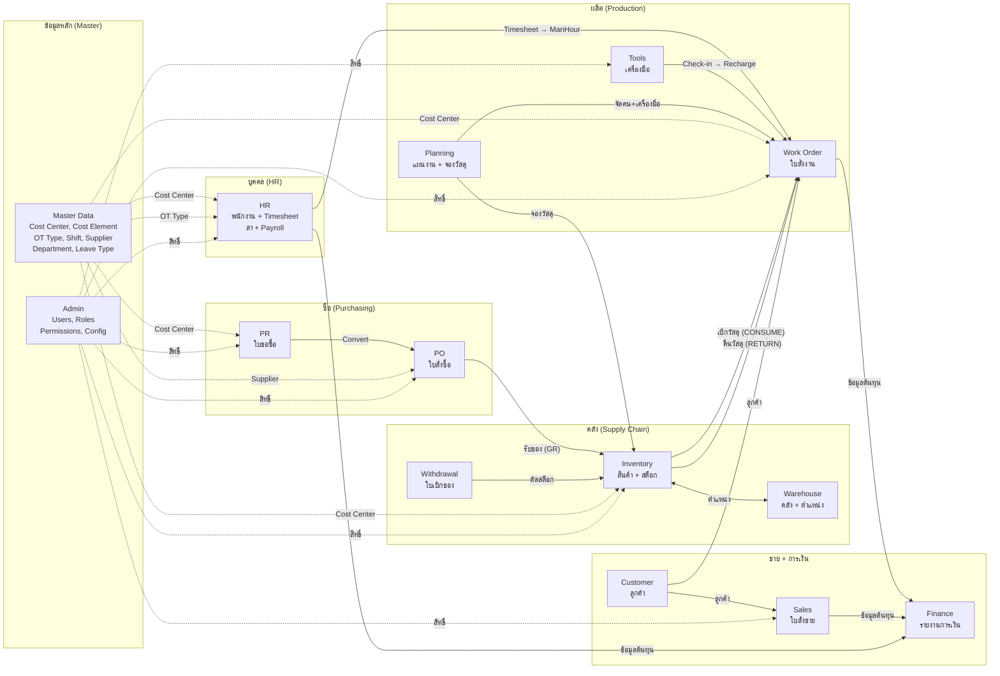
```mermaid
graph LR
    subgraph "ข้อมูลหลัก (Master)"
        MASTER["Master Data<br/>Cost Center, Cost Element<br/>OT Type, Shift, Supplier<br/>Department, Leave Type"]
        ADMIN["Admin<br/>Users, Roles<br/>Permissions, Config"]
    end

    subgraph "ซื้อ (Purchasing)"
        PR["PR<br/>ใบขอซื้อ"]
        PO["PO<br/>ใบสั่งซื้อ"]
    end

    subgraph "คลัง (Supply Chain)"
        INV["Inventory<br/>สินค้า + สต็อก"]
        WH["Warehouse<br/>คลัง + ตำแหน่ง"]
        WD["Withdrawal<br/>ใบเบิกของ"]
    end

    subgraph "ผลิต (Production)"
        WO["Work Order<br/>ใบสั่งงาน"]
        PLAN["Planning<br/>แผนงาน + จองวัสดุ"]
        TOOL["Tools<br/>เครื่องมือ"]
    end

    subgraph "บุคคล (HR)"
        HR["HR<br/>พนักงาน + Timesheet<br/>ลา + Payroll"]
    end

    subgraph "ขาย + การเงิน"
        SALES["Sales<br/>ใบสั่งขาย"]
        CUST["Customer<br/>ลูกค้า"]
        FIN["Finance<br/>รายงานการเงิน"]
    end

    PR -->|"Convert"| PO
    PO -->|"รับของ (GR)"| INV
    WD -->|"ตัดสต็อก"| INV
    INV <-->|"ตำแหน่ง"| WH
    INV -->|"เบิกวัสดุ (CONSUME)"| WO
    INV -->|"คืนวัสดุ (RETURN)"| WO
    HR -->|"Timesheet → ManHour"| WO
    TOOL -->|"Check-in → Recharge"| WO
    PLAN -->|"จัดคน+เครื่องมือ"| WO
    PLAN -->|"จองวัสดุ"| INV
    CUST -->|"ลูกค้า"| SALES
    CUST -->|"ลูกค้า"| WO
    MASTER -.->|"Cost Center"| WO & HR & PR & INV
    MASTER -.->|"OT Type"| HR
    MASTER -.->|"Supplier"| PO
    ADMIN -.->|"สิทธิ์"| PR & PO & INV & WO & HR & SALES & TOOL
    WO & SALES & HR -->|"ข้อมูลต้นทุน"| FIN
```

### ตารางจุดเชื่อมต่อ

| จาก | ไป | ประเภทการเชื่อม | ตัวอย่าง |
|------|-----|----------------|---------|
| PR | PO | เปลี่ยนสถานะ | PR อนุมัติแล้ว → กดแปลงเป็น PO |
| PO | Inventory | สร้าง movement | รับของ (GR) → สร้าง RECEIVE movement → stock เพิ่ม |
| Inventory | Work Order | เบิก/คืนวัสดุ | CONSUME → stock ลด + cost เข้า WO / RETURN → stock เพิ่ม |
| Withdrawal | Inventory | ตัดสต็อก | Issue ใบเบิก → สร้าง CONSUME/ISSUE movement ต่อรายการ |
| Inventory | Warehouse | ตำแหน่งจัดเก็บ | สินค้าอยู่ location ไหน, stock ต่อ location |
| HR (Timesheet) | Work Order | ค่าแรง | HR final approve → ManHour Cost เข้า WO |
| Tools | Work Order | ค่าเครื่องมือ | Check-in → คำนวณชั่วโมง x อัตรา → Tools Recharge เข้า WO |
| Planning | Work Order | จัดคน/เครื่องมือ | Daily Plan → จัดพนักงาน + เครื่องมือ ลง WO ต่อวัน |
| Planning | Inventory | จองวัสดุ | Material Reservation → กัน stock ไว้ให้ WO |
| Master Data | ทุก module | ข้อมูลอ้างอิง | Cost Center, Cost Element, OT Type, Supplier, Department |
| Customer | Sales + WO | ลูกค้า | SO ต้องมีลูกค้า, WO อ้างอิง SO |
| WO + Sales + HR | Finance | ต้นทุน/รายได้ | รายงานการเงินรวมจากทุกแหล่ง |

---

# 3. แผนภาพการไหลของข้อมูล

## Flow 1: ซื้อของ → เข้าสต็อก (PR → PO → GR → Inventory)

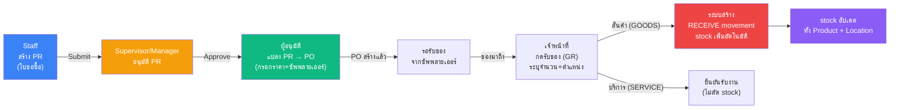
```mermaid
flowchart LR
    A["Staff<br/>สร้าง PR<br/>(ใบขอซื้อ)"] -->|"Submit"| B["Supervisor/Manager<br/>อนุมัติ PR"]
    B -->|"Approve"| C["ผู้อนุมัติ<br/>แปลง PR → PO<br/>(กรอกราคา+ซัพพลายเออร์)"]
    C -->|"PO สร้างแล้ว"| D["รอรับของ<br/>จากซัพพลายเออร์"]
    D -->|"ของมาถึง"| E["เจ้าหน้าที่<br/>กดรับของ (GR)<br/>ระบุจำนวน+ตำแหน่ง"]
    E -->|"สินค้า (GOODS)"| F["ระบบสร้าง<br/>RECEIVE movement<br/>stock เพิ่มอัตโนมัติ"]
    E -->|"บริการ (SERVICE)"| G["ยืนยันรับงาน<br/>(ไม่ตัด stock)"]
    F --> H["stock อัปเดต<br/>ทั้ง Product + Location"]

    style A fill:#3b82f6,color:#fff
    style B fill:#f59e0b,color:#fff
    style C fill:#10b981,color:#fff
    style F fill:#ef4444,color:#fff
    style H fill:#8b5cf6,color:#fff
```

**สรุป**: Staff ขอซื้อ → หัวหน้าอนุมัติ → แปลงเป็นใบสั่งซื้อ → ของมา → กดรับของ → stock เพิ่มอัตโนมัติ

---

## Flow 2: คำนวณต้นทุนงาน (Job Costing — 4 องค์ประกอบ)

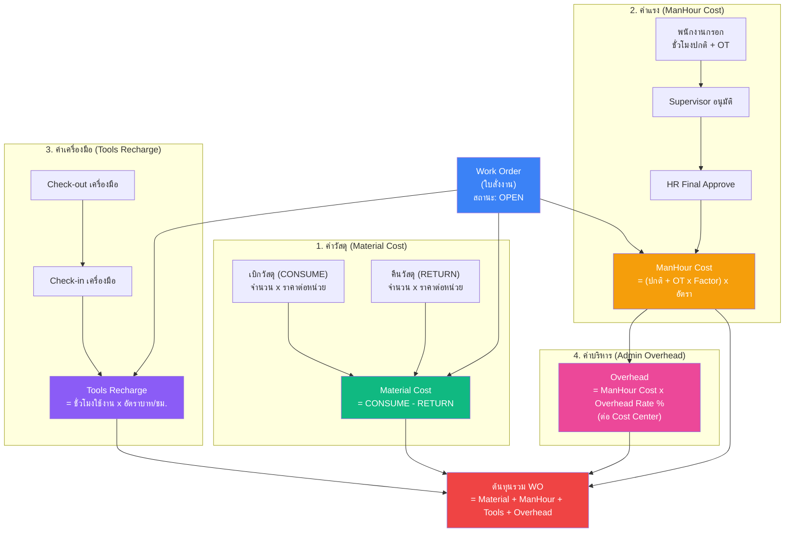
```mermaid
flowchart TB
    WO["Work Order<br/>(ใบสั่งงาน)<br/>สถานะ: OPEN"]

    subgraph "1. ค่าวัสดุ (Material Cost)"
        M1["เบิกวัสดุ (CONSUME)<br/>จำนวน x ราคาต่อหน่วย"]
        M2["คืนวัสดุ (RETURN)<br/>จำนวน x ราคาต่อหน่วย"]
        MC["Material Cost<br/>= CONSUME - RETURN"]
        M1 --> MC
        M2 --> MC
    end

    subgraph "2. ค่าแรง (ManHour Cost)"
        H1["พนักงานกรอก<br/>ชั่วโมงปกติ + OT"]
        H2["Supervisor อนุมัติ"]
        H3["HR Final Approve"]
        HC["ManHour Cost<br/>= (ปกติ + OT x Factor) x อัตรา"]
        H1 --> H2 --> H3 --> HC
    end

    subgraph "3. ค่าเครื่องมือ (Tools Recharge)"
        T1["Check-out เครื่องมือ"]
        T2["Check-in เครื่องมือ"]
        TC["Tools Recharge<br/>= ชั่วโมงใช้งาน x อัตราบาท/ชม."]
        T1 --> T2 --> TC
    end

    subgraph "4. ค่าบริหาร (Admin Overhead)"
        OC["Overhead<br/>= ManHour Cost x Overhead Rate %<br/>(ต่อ Cost Center)"]
    end

    WO --> MC & HC & TC
    HC --> OC

    TOTAL["ต้นทุนรวม WO<br/>= Material + ManHour + Tools + Overhead"]
    MC & HC & TC & OC --> TOTAL

    style WO fill:#3b82f6,color:#fff
    style TOTAL fill:#ef4444,color:#fff
    style MC fill:#10b981,color:#fff
    style HC fill:#f59e0b,color:#fff
    style TC fill:#8b5cf6,color:#fff
    style OC fill:#ec4899,color:#fff
```

**สรุป**: ต้นทุนงานรวม 4 ส่วน — วัสดุ (เบิก-คืน) + แรงงาน (ชั่วโมง x อัตรา) + เครื่องมือ (ชม. x อัตรา) + ค่าบริหาร (% ของค่าแรง)

---

## Flow 3: รายงานประจำวัน → Timesheet → Payroll

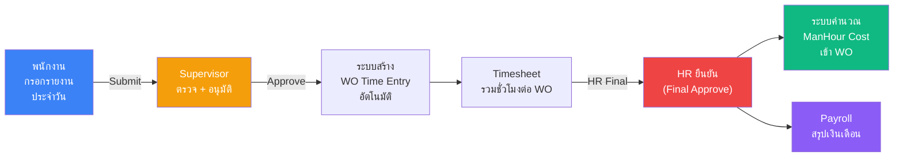
```mermaid
flowchart LR
    A["พนักงาน<br/>กรอกรายงาน<br/>ประจำวัน"] -->|"Submit"| B["Supervisor<br/>ตรวจ + อนุมัติ"]
    B -->|"Approve"| C["ระบบสร้าง<br/>WO Time Entry<br/>อัตโนมัติ"]
    C --> D["Timesheet<br/>รวมชั่วโมงต่อ WO"]
    D -->|"HR Final"| E["HR ยืนยัน<br/>(Final Approve)"]
    E --> F["ระบบคำนวณ<br/>ManHour Cost<br/>เข้า WO"]
    E --> G["Payroll<br/>สรุปเงินเดือน"]

    style A fill:#3b82f6,color:#fff
    style B fill:#f59e0b,color:#fff
    style E fill:#ef4444,color:#fff
    style F fill:#10b981,color:#fff
    style G fill:#8b5cf6,color:#fff
```

**สรุป**: พนักงานกรอก → หัวหน้าอนุมัติ → สร้าง Timesheet อัตโนมัติ → HR ตรวจสอบ → คำนวณต้นทุนแรงงาน + Payroll

---

## Flow 4: ใบเบิกของ (Stock Withdrawal Slip)

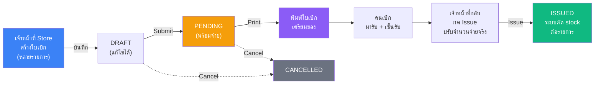
```mermaid
flowchart LR
    A["เจ้าหน้าที่ Store<br/>สร้างใบเบิก<br/>(หลายรายการ)"] -->|"บันทึก"| B["DRAFT<br/>(แก้ไขได้)"]
    B -->|"Submit"| C["PENDING<br/>(พร้อมจ่าย)"]
    C -->|"Print"| D["พิมพ์ใบเบิก<br/>เตรียมของ"]
    D --> E["คนเบิก<br/>มารับ + เซ็นรับ"]
    E --> F["เจ้าหน้าที่กลับ<br/>กด Issue<br/>ปรับจำนวนจ่ายจริง"]
    F -->|"Issue"| G["ISSUED<br/>ระบบตัด stock<br/>ต่อรายการ"]

    B -.->|"Cancel"| X["CANCELLED"]
    C -.->|"Cancel"| X

    style A fill:#3b82f6,color:#fff
    style C fill:#f59e0b,color:#fff
    style D fill:#8b5cf6,color:#fff
    style G fill:#10b981,color:#fff
    style X fill:#6b7280,color:#fff
```

**2 ประเภทใบเบิก**:
- **เบิกเข้า WO** (WO_CONSUME) → สร้าง CONSUME movement ต่อรายการ
- **เบิกจ่ายตาม Cost Center** (CC_ISSUE) → สร้าง ISSUE movement ต่อรายการ

---

## Flow 5: การเคลื่อนไหวสต็อก (6 ประเภท)

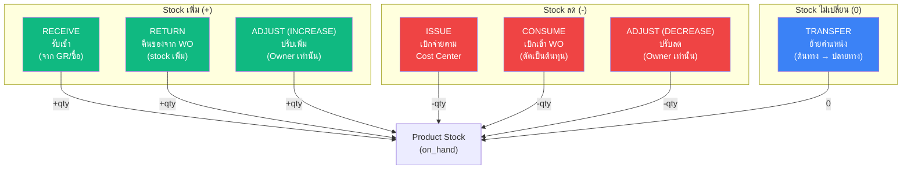
```mermaid
flowchart TB
    subgraph "Stock เพิ่ม (+)"
        R["RECEIVE<br/>รับเข้า<br/>(จาก GR/ซื้อ)"]
        RT["RETURN<br/>คืนของจาก WO<br/>(stock เพิ่ม)"]
        AI["ADJUST (INCREASE)<br/>ปรับเพิ่ม<br/>(Owner เท่านั้น)"]
    end

    subgraph "Stock ลด (-)"
        I["ISSUE<br/>เบิกจ่ายตาม<br/>Cost Center"]
        C["CONSUME<br/>เบิกเข้า WO<br/>(ตัดเป็นต้นทุน)"]
        AD["ADJUST (DECREASE)<br/>ปรับลด<br/>(Owner เท่านั้น)"]
    end

    subgraph "Stock ไม่เปลี่ยน (0)"
        T["TRANSFER<br/>ย้ายตำแหน่ง<br/>(ต้นทาง → ปลายทาง)"]
    end

    STOCK["Product Stock<br/>(on_hand)"]
    R & RT & AI -->|"+qty"| STOCK
    I & C & AD -->|"-qty"| STOCK
    T -->|"0"| STOCK

    style R fill:#10b981,color:#fff
    style RT fill:#10b981,color:#fff
    style AI fill:#10b981,color:#fff
    style I fill:#ef4444,color:#fff
    style C fill:#ef4444,color:#fff
    style AD fill:#ef4444,color:#fff
    style T fill:#3b82f6,color:#fff
```

| ประเภท | ทิศทาง | ต้องมีอะไร | ใครทำได้ |
|--------|--------|-----------|---------|
| RECEIVE | +stock | Product + จำนวน + ราคา | Staff+ |
| RETURN | +stock | **Work Order (OPEN)** + Product (วัสดุ) | Staff+ |
| ISSUE | -stock | **Cost Center** + Product + จำนวน | Staff+ |
| CONSUME | -stock | **Work Order (OPEN)** + Product (วัสดุ) | Staff+ |
| TRANSFER | 0 | ตำแหน่งต้นทาง + ปลายทาง (ต่างกัน) | Staff+ |
| ADJUST | +/- | ทิศทาง (เพิ่ม/ลด) + Product + จำนวน | **Owner เท่านั้น** |

---

# 4. แผนภาพสถานะเอกสาร

## 4.1 Work Order (ใบสั่งงาน)

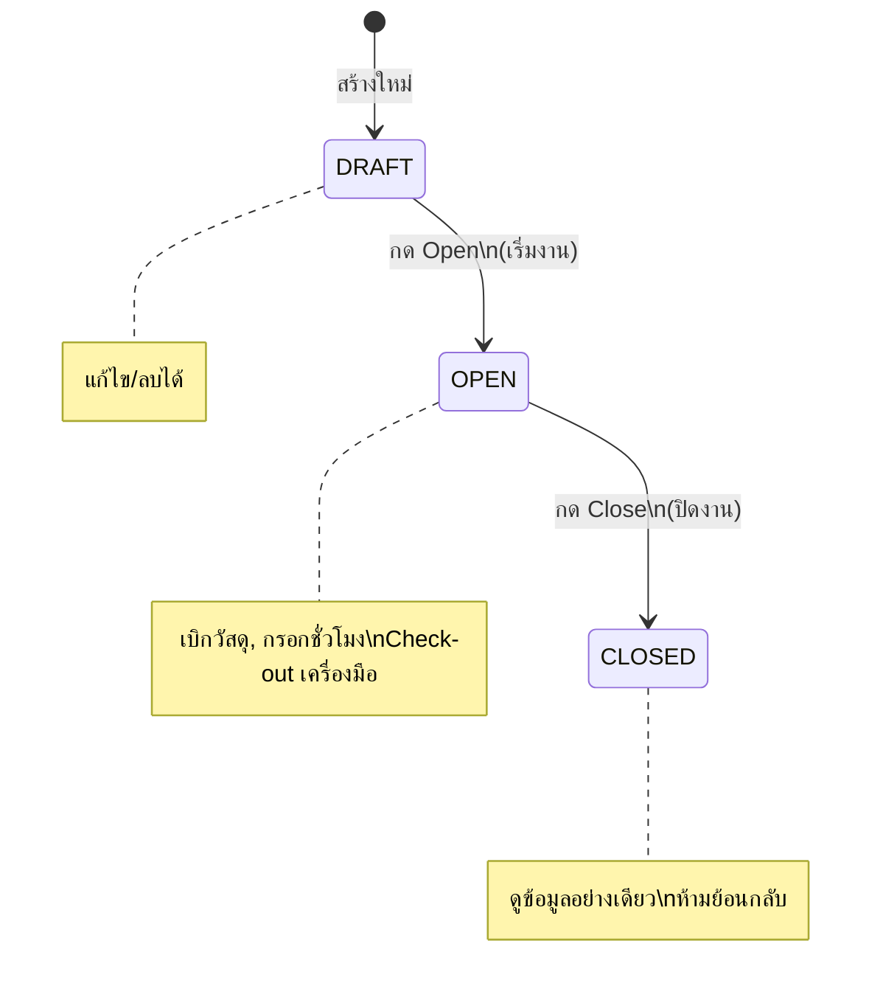
```mermaid
stateDiagram-v2
    [*] --> DRAFT : สร้างใหม่
    DRAFT --> OPEN : กด Open\n(เริ่มงาน)
    OPEN --> CLOSED : กด Close\n(ปิดงาน)

    note right of DRAFT : แก้ไข/ลบได้
    note right of OPEN : เบิกวัสดุ, กรอกชั่วโมง\nCheck-out เครื่องมือ
    note right of CLOSED : ดูข้อมูลอย่างเดียว\nห้ามย้อนกลับ
```

## 4.2 Purchase Requisition (ใบขอซื้อ)

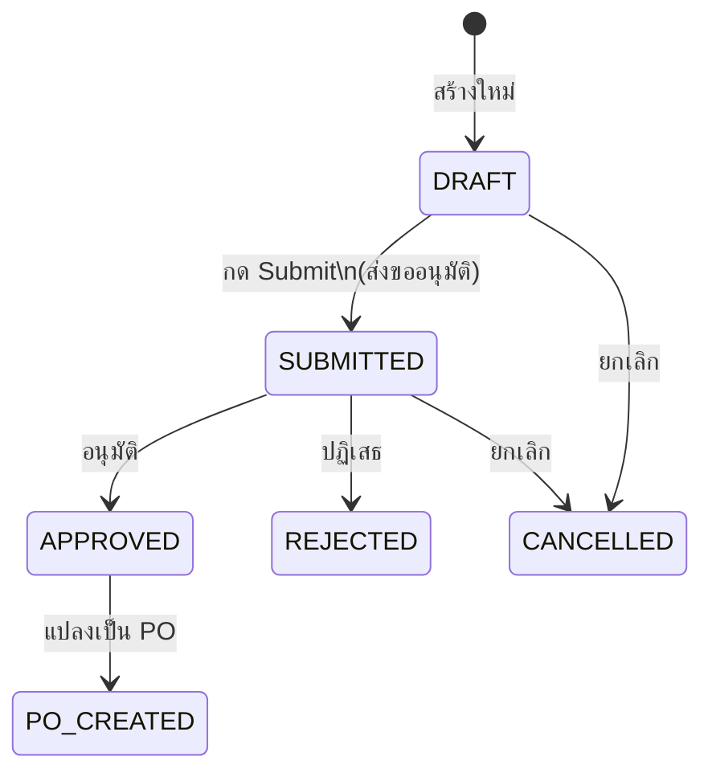
```mermaid
stateDiagram-v2
    [*] --> DRAFT : สร้างใหม่
    DRAFT --> SUBMITTED : กด Submit\n(ส่งขออนุมัติ)
    SUBMITTED --> APPROVED : อนุมัติ
    SUBMITTED --> REJECTED : ปฏิเสธ
    APPROVED --> PO_CREATED : แปลงเป็น PO
    DRAFT --> CANCELLED : ยกเลิก
    SUBMITTED --> CANCELLED : ยกเลิก
```

## 4.3 Purchase Order (ใบสั่งซื้อ)

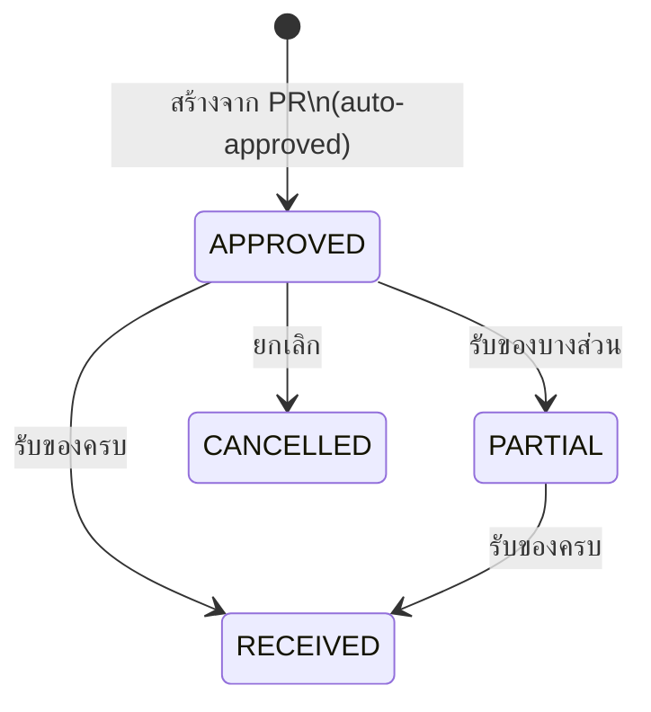
```mermaid
stateDiagram-v2
    [*] --> APPROVED : สร้างจาก PR\n(auto-approved)
    APPROVED --> PARTIAL : รับของบางส่วน
    APPROVED --> RECEIVED : รับของครบ
    PARTIAL --> RECEIVED : รับของครบ
    APPROVED --> CANCELLED : ยกเลิก
```

## 4.4 Sales Order (ใบสั่งขาย)

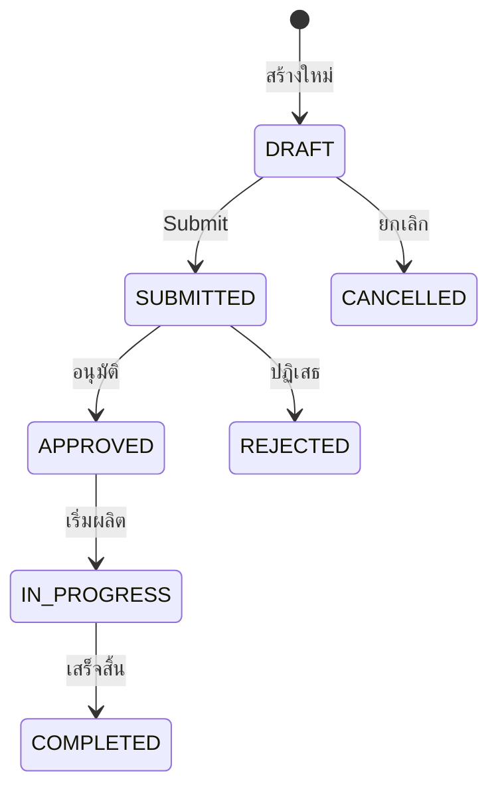
```mermaid
stateDiagram-v2
    [*] --> DRAFT : สร้างใหม่
    DRAFT --> SUBMITTED : Submit
    SUBMITTED --> APPROVED : อนุมัติ
    SUBMITTED --> REJECTED : ปฏิเสธ
    APPROVED --> IN_PROGRESS : เริ่มผลิต
    IN_PROGRESS --> COMPLETED : เสร็จสิ้น
    DRAFT --> CANCELLED : ยกเลิก
```

## 4.5 Timesheet (ใบบันทึกเวลา)

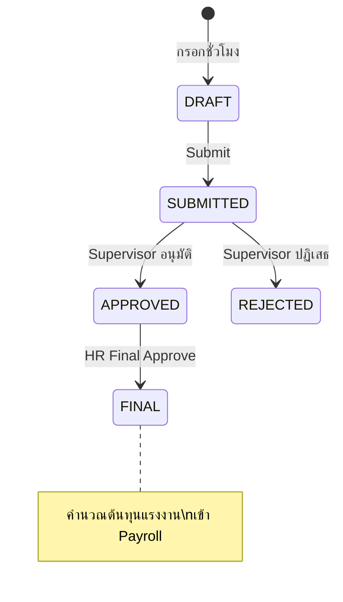
```mermaid
stateDiagram-v2
    [*] --> DRAFT : กรอกชั่วโมง
    DRAFT --> SUBMITTED : Submit
    SUBMITTED --> APPROVED : Supervisor อนุมัติ
    APPROVED --> FINAL : HR Final Approve
    SUBMITTED --> REJECTED : Supervisor ปฏิเสธ

    note right of FINAL : คำนวณต้นทุนแรงงาน\nเข้า Payroll
```

## 4.6 Leave (ใบลา)

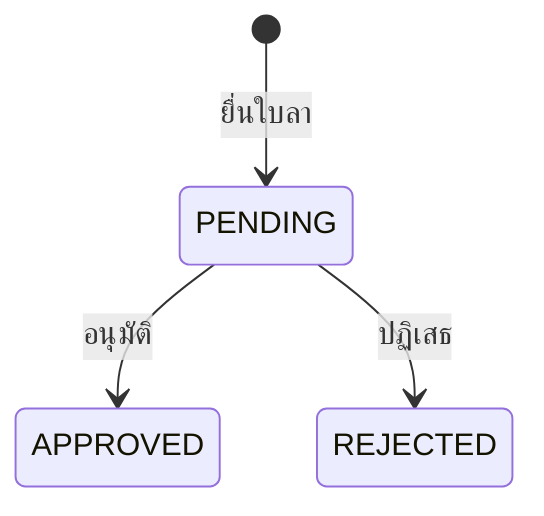
```mermaid
stateDiagram-v2
    [*] --> PENDING : ยื่นใบลา
    PENDING --> APPROVED : อนุมัติ
    PENDING --> REJECTED : ปฏิเสธ
```

## 4.7 Daily Work Report (รายงานประจำวัน)

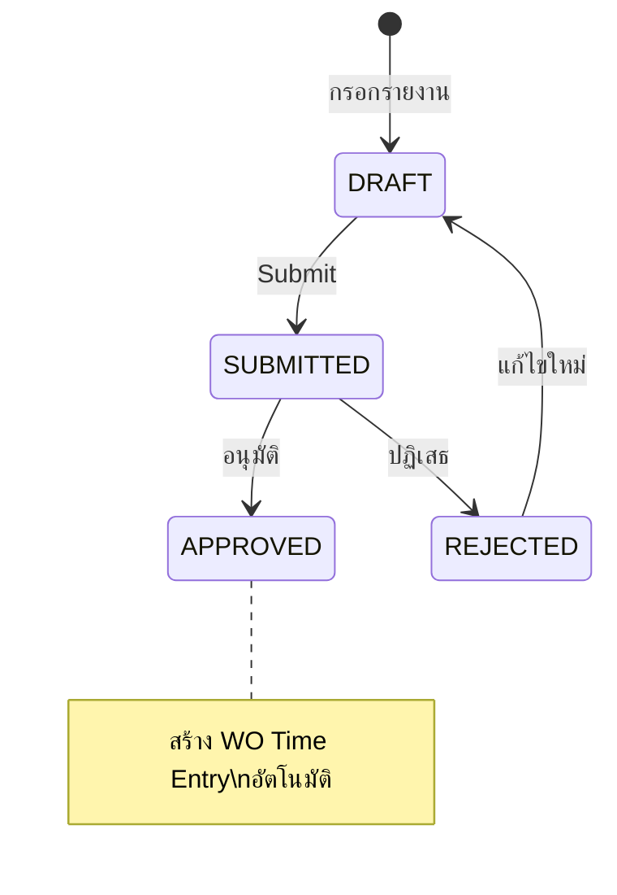
```mermaid
stateDiagram-v2
    [*] --> DRAFT : กรอกรายงาน
    DRAFT --> SUBMITTED : Submit
    SUBMITTED --> APPROVED : อนุมัติ
    SUBMITTED --> REJECTED : ปฏิเสธ
    REJECTED --> DRAFT : แก้ไขใหม่

    note right of APPROVED : สร้าง WO Time Entry\nอัตโนมัติ
```

## 4.8 Withdrawal Slip (ใบเบิกของ)

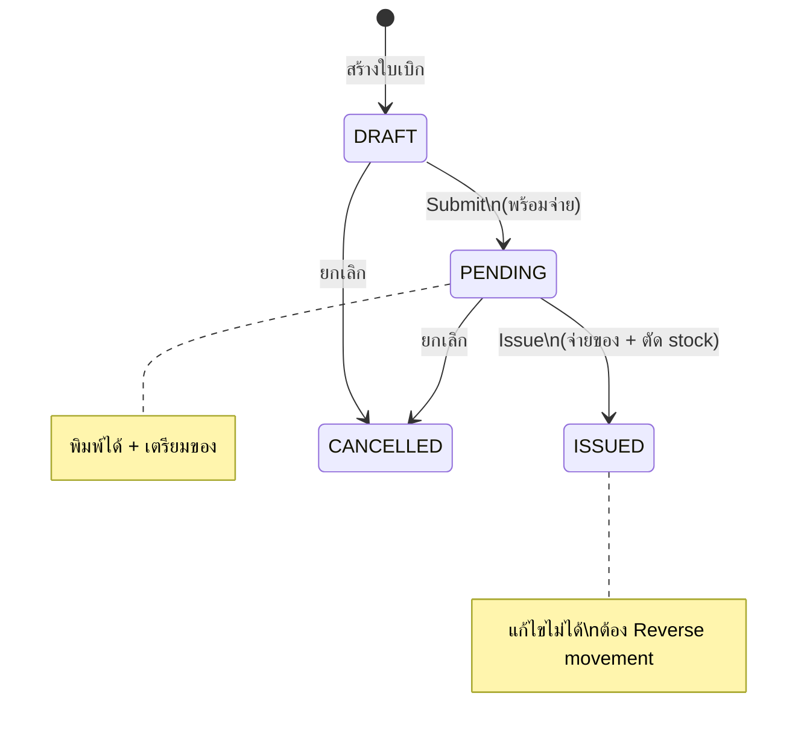
```mermaid
stateDiagram-v2
    [*] --> DRAFT : สร้างใบเบิก
    DRAFT --> PENDING : Submit\n(พร้อมจ่าย)
    PENDING --> ISSUED : Issue\n(จ่ายของ + ตัด stock)
    DRAFT --> CANCELLED : ยกเลิก
    PENDING --> CANCELLED : ยกเลิก

    note right of PENDING : พิมพ์ได้ + เตรียมของ
    note right of ISSUED : แก้ไขไม่ได้\nต้อง Reverse movement
```

## 4.9 Tool (เครื่องมือ)

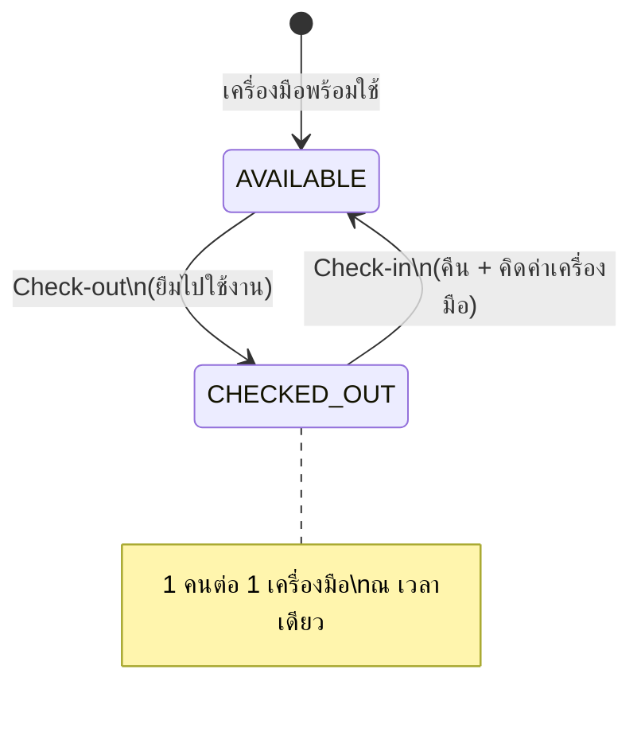
```mermaid
stateDiagram-v2
    [*] --> AVAILABLE : เครื่องมือพร้อมใช้
    AVAILABLE --> CHECKED_OUT : Check-out\n(ยืมไปใช้งาน)
    CHECKED_OUT --> AVAILABLE : Check-in\n(คืน + คิดค่าเครื่องมือ)

    note right of CHECKED_OUT : 1 คนต่อ 1 เครื่องมือ\nณ เวลาเดียว
```

## 4.10 Payroll (เงินเดือน)

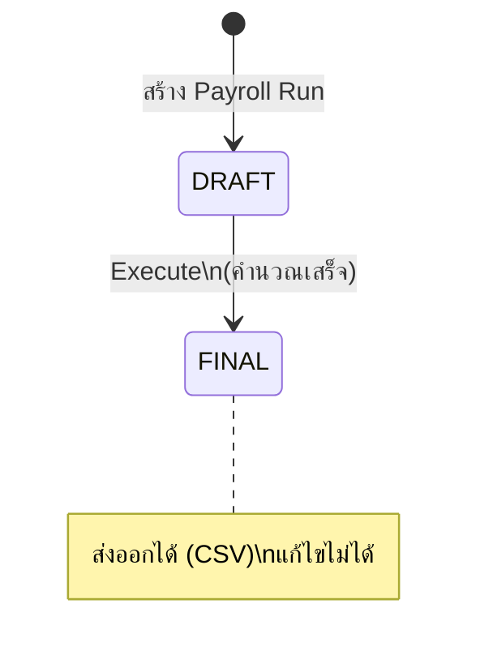
```mermaid
stateDiagram-v2
    [*] --> DRAFT : สร้าง Payroll Run
    DRAFT --> FINAL : Execute\n(คำนวณเสร็จ)

    note right of FINAL : ส่งออกได้ (CSV)\nแก้ไขไม่ได้
```

---

# 5. แผนที่หน้าจอ

## เมนูหลัก (Sidebar)

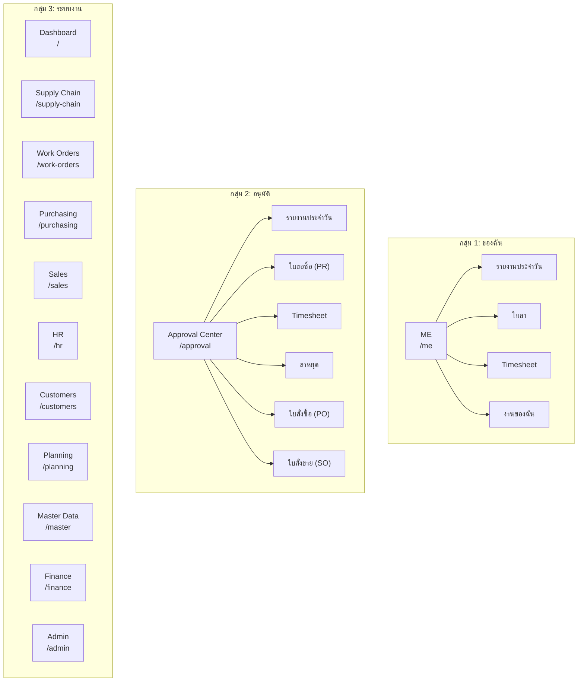
```mermaid
graph TD
    subgraph "กลุ่ม 1: ของฉัน"
        ME["ME<br/>/me"]
        ME --> ME1["รายงานประจำวัน"]
        ME --> ME2["ใบลา"]
        ME --> ME3["Timesheet"]
        ME --> ME4["งานของฉัน"]
    end

    subgraph "กลุ่ม 2: อนุมัติ"
        APR["Approval Center<br/>/approval"]
        APR --> APR1["รายงานประจำวัน"]
        APR --> APR2["ใบขอซื้อ (PR)"]
        APR --> APR3["Timesheet"]
        APR --> APR4["ลาหยุด"]
        APR --> APR5["ใบสั่งซื้อ (PO)"]
        APR --> APR6["ใบสั่งขาย (SO)"]
    end

    subgraph "กลุ่ม 3: ระบบงาน"
        D["Dashboard<br/>/"]
        SC["Supply Chain<br/>/supply-chain"]
        WO2["Work Orders<br/>/work-orders"]
        PUR["Purchasing<br/>/purchasing"]
        SAL["Sales<br/>/sales"]
        HR2["HR<br/>/hr"]
        CUST2["Customers<br/>/customers"]
        PLN["Planning<br/>/planning"]
        MST["Master Data<br/>/master"]
        FIN2["Finance<br/>/finance"]
        ADM["Admin<br/>/admin"]
    end
```

## หน้าจอแบบมีแท็บ (Tabbed Pages)

| หน้า | เส้นทาง | จำนวนแท็บ | แท็บ |
|------|---------|----------|------|
| Supply Chain | `/supply-chain` | 6 | Inventory, Stock Movements, Warehouse, Locations, เครื่องมือ, ใบเบิกของ |
| Purchasing | `/purchasing` | 2 | ใบขอซื้อ (PR), ใบสั่งซื้อ (PO) |
| HR | `/hr` | 9 | พนักงาน, Timesheet, กรอกชั่วโมง WO, Standard Timesheet, ลาหยุด, โควต้าลา, Payroll, ตารางกะ, อนุมัติรายงาน |
| Master Data | `/master` | 8 | แผนก, Cost Center, Cost Element, ประเภท OT, ประเภทลา, ประเภทกะ, ตารางกะ, ซัพพลายเออร์ |
| Approval Center | `/approval` | 6 | รายงานประจำวัน, ใบขอซื้อ, Timesheet, ลาหยุด, ใบสั่งซื้อ, ใบสั่งขาย |
| ME | `/me` | 4 | รายงานประจำวัน, ใบลา, Timesheet, งานของฉัน |

## หน้ารายละเอียด (Detail Pages)

| หน้า | เส้นทาง | เข้าจาก |
|------|---------|---------|
| Work Order Detail | `/work-orders/:id` | รายการ WO |
| PR Detail | `/purchasing/pr/:id` | รายการ PR |
| PO Detail | `/purchasing/po/:id` | รายการ PO |
| SO Detail | `/sales/:id` | รายการ SO |
| Withdrawal Slip Detail | `/withdrawal-slips/:id` | รายการใบเบิก |

---

# 6. ภาพร่างหน้าจอหลัก

## 6.1 Dashboard (หน้าหลัก)

```
┌─────────────────────────────────────────────────────────┐
│  SSS Corp ERP                          [User] [Logout]  │
├────────┬────────────────────────────────────────────────┤
│        │                                                │
│  MENU  │  Dashboard                                     │
│        │                                                │
│ ของฉัน  │  ┌──────────┐ ┌──────────┐ ┌──────────┐       │
│  ME    │  │ WO เปิด   │ │ PR รอ    │ │ Stock    │       │
│        │  │    12     │ │ อนุมัติ 3  │ │ ต่ำ  5  │       │
│ อนุมัติ  │  └──────────┘ └──────────┘ └──────────┘       │
│ Approval│                                               │
│        │  ┌──────────┐ ┌──────────┐ ┌──────────┐       │
│ ระบบงาน │  │ PO รอรับ  │ │ Timesheet│ │ ใบเบิก   │       │
│ Dashboard│ │ ของ  4   │ │ รอ  8   │ │ PENDING 2│       │
│ Supply..│  └──────────┘ └──────────┘ └──────────┘       │
│ Work O..│                                               │
│ Purcha..│  [ตาราง: รายการล่าสุด / กิจกรรมวันนี้]          │
│ Sales   │                                               │
│ HR      │                                               │
│ Customer│                                               │
│ Planning│                                               │
│ Master  │                                               │
│ Finance │                                               │
│ Admin   │                                               │
│        │                                                │
└────────┴────────────────────────────────────────────────┘
```

## 6.2 Supply Chain (คลังสินค้า)

```
┌────────────────────────────────────────────────────────┐
│  Supply Chain                                          │
│                                                        │
│  ┌─────────┐ ┌─────────┐ ┌─────────┐ ┌─────────┐     │
│  │สินค้า 25 │ │เคลื่อนไหว│ │คลัง  1  │ │Stock ต่ำ│     │
│  └─────────┘ └─────────┘ └─────────┘ └─────────┘     │
│                                                        │
│  [Inventory] [Movements] [Warehouse] [Locations]       │
│  [เครื่องมือ] [ใบเบิกของ]                                │
│  ─────────────────────────────────────────────         │
│                                                        │
│  ┌─ Inventory Tab ────────────────────────────┐        │
│  │ [+ สร้างสินค้า]        [ค้นหา...]  [Export] │        │
│  │                                            │        │
│  │ SKU    | ชื่อ      | ประเภท | on_hand | ราคา │        │
│  │ MAT-001| เหล็กแผ่น  | MATERIAL|  500   | 150  │        │
│  │ MAT-002| น็อต M8   | MATERIAL|  1000  | 5    │        │
│  │ CON-001| ลวดเชื่อม  | CONSUM. |  ⚠ 20  | 80   │        │
│  │ SVC-001| ค่าขนส่ง   | SERVICE |   -    | 500  │        │
│  │                                            │        │
│  │ [< 1 2 3 ... >]                            │        │
│  └────────────────────────────────────────────┘        │
└────────────────────────────────────────────────────────┘
⚠ = Low stock highlight (on_hand <= min_stock)
```

## 6.3 Work Order Detail (รายละเอียดใบสั่งงาน)

```
┌────────────────────────────────────────────────────────┐
│  ← Work Order: WO-2026-0015          [StatusBadge:OPEN]│
│                                                        │
│  ┌─ ข้อมูลทั่วไป ───────────────────────────────┐       │
│  │ เลขที่: WO-2026-0015    ลูกค้า: ABC Co.       │       │
│  │ ชื่องาน: ผลิตชิ้นส่วน A   สถานะ: OPEN          │       │
│  │ วันเปิด: 01/03/2026     Cost Center: ผลิต-1   │       │
│  └──────────────────────────────────────────────┘       │
│                                                        │
│  ┌─ สรุปต้นทุน ─────────────────────────────────┐       │
│  │ ค่าวัสดุ:    15,000.00  ค่าแรง:    42,500.00  │       │
│  │ ค่าเครื่องมือ: 3,200.00  ค่าบริหาร:  8,500.00  │       │
│  │                                              │       │
│  │                     รวม:  69,200.00 บาท       │       │
│  └──────────────────────────────────────────────┘       │
│                                                        │
│  ┌─ วัสดุที่เบิก ─────────────────────────────────┐      │
│  │ [+ เบิกวัสดุ]  [+ คืนวัสดุ]                     │      │
│  │                                              │      │
│  │ วันที่  | สินค้า  | ประเภท  | จำนวน | ต้นทุน    │      │
│  │ 01/03 | เหล็ก   | CONSUME | 50   | 7,500    │      │
│  │ 02/03 | น็อต    | CONSUME | 100  | 500      │      │
│  │ 02/03 | เหล็ก   | RETURN  | -5   | -750     │      │
│  └──────────────────────────────────────────────┘      │
│                                                        │
│  [กดปิดงาน]                                            │
└────────────────────────────────────────────────────────┘
```

## 6.4 Purchasing (จัดซื้อ)

```
┌────────────────────────────────────────────────────────┐
│  Purchasing                                            │
│                                                        │
│  ┌─────────┐ ┌─────────┐ ┌─────────┐ ┌─────────┐     │
│  │PR ทั้งหมด│ │PR รอ    │ │PO ทั้งหมด│ │PO รอรับ  │     │
│  │   15    │ │อนุมัติ 3  │ │   10    │ │ ของ  4  │     │
│  └─────────┘ └─────────┘ └─────────┘ └─────────┘     │
│                                                        │
│  [ใบขอซื้อ (PR)]  [ใบสั่งซื้อ (PO)]                     │
│  ─────────────────────────────────────────────         │
│                                                        │
│  ┌─ PR Tab ───────────────────────────────────┐        │
│  │ [+ สร้าง PR]        [ค้นหา...] [สถานะ: ▼]  │        │
│  │                                            │        │
│  │ เลขที่   | วันที่  | CC    | สถานะ  | ยอดรวม │        │
│  │ PR-0001 | 01/03 | ผลิต-1 | APPROVED| 25,000│        │
│  │ PR-0002 | 02/03 | ผลิต-2 | SUBMITTED| 8,000│        │
│  │ PR-0003 | 02/03 | ซ่อม   | DRAFT   | 3,500 │        │
│  │                                            │        │
│  │ คลิกแถว → หน้ารายละเอียด PR                  │        │
│  └────────────────────────────────────────────┘        │
└────────────────────────────────────────────────────────┘
```

## 6.5 HR (ทรัพยากรบุคคล)

```
┌────────────────────────────────────────────────────────┐
│  HR                                                    │
│                                                        │
│  [พนักงาน] [Timesheet] [กรอกชั่วโมง WO]                 │
│  [Standard Timesheet] [ลาหยุด] [โควต้าลา]               │
│  [Payroll] [ตารางกะ] [อนุมัติรายงาน]                      │
│  ─────────────────────────────────────────────         │
│                                                        │
│  ScopeBadge: [ทั้งองค์กร] หรือ [แผนกของฉัน] หรือ [ข้อมูลส่วนตัว]│
│  EmployeeContextSelector: [เลือกพนักงาน ▼]              │
│                                                        │
│  ┌─ Timesheet Tab ────────────────────────────┐        │
│  │                                            │        │
│  │ วันที่  | พนักงาน | WO      | ปกติ | OT  | สถานะ│        │
│  │ 01/03 | สมชาย  | WO-015  | 8   | 2  | FINAL│        │
│  │ 01/03 | สมหญิง | WO-015  | 8   | 0  | APPR │        │
│  │ 02/03 | สมชาย  | WO-016  | 8   | 3  | SUBM │        │
│  │                                            │        │
│  └────────────────────────────────────────────┘        │
│                                                        │
│  *ขอบเขตข้อมูลขึ้นอยู่กับบทบาท:                         │
│   Staff = เห็นเฉพาะของตัวเอง                            │
│   Supervisor = เห็นทั้งแผนก                              │
│   Manager/Owner = เห็นทั้งองค์กร                         │
└────────────────────────────────────────────────────────┘
```

## 6.6 Approval Center (ศูนย์อนุมัติ)

```
┌────────────────────────────────────────────────────────┐
│  Approval Center                                       │
│                                                        │
│  [รายงาน(3)] [PR(2)] [Timesheet(5)] [ลา(1)]            │
│  [PO(0)] [SO(1)]                                      │
│  ─────────────────────────────────────────────         │
│  (ตัวเลข = จำนวนรออนุมัติ)                               │
│                                                        │
│  ┌─ PR Approval Tab ─────────────────────────┐         │
│  │                                            │        │
│  │ เลขที่   | ผู้ขอ   | CC    | ยอด   | Action │        │
│  │ PR-0002 | สมชาย  | ผลิต-1| 8,000 | [อนุมัติ]│        │
│  │ PR-0004 | สมหญิง | ซ่อม  | 3,500 | [อนุมัติ]│        │
│  │                                            │        │
│  │ คลิก [อนุมัติ] → Confirm → สถานะเปลี่ยนทันที  │        │
│  │ คลิก [ปฏิเสธ] → กรอกเหตุผล → สถานะเปลี่ยน     │        │
│  └────────────────────────────────────────────┘        │
└────────────────────────────────────────────────────────┘
```

## 6.7 Withdrawal Slip Detail (รายละเอียดใบเบิก)

```
┌────────────────────────────────────────────────────────┐
│  ← ใบเบิกของ: SW-2026-0001         [StatusBadge:PENDING]│
│                                                        │
│  ┌─ ข้อมูลใบเบิก ──────────────────────────────┐        │
│  │ เลขที่: SW-2026-0001   ประเภท: เบิกเข้า WO    │        │
│  │ WO: WO-2026-0015       ผู้เบิก: สมชาย ใจดี     │        │
│  │ วันที่: 02/03/2026      หมายเหตุ: เบิกวัสดุชุด 2│        │
│  └──────────────────────────────────────────────┘       │
│                                                        │
│  ┌─ รายการ ──────────────────────────────────────┐      │
│  │ #  | สินค้า    | จำนวนขอ | จำนวนจ่าย | ตำแหน่ง  │      │
│  │ 1  | เหล็กแผ่น  |   50    |    -     | STORAGE │      │
│  │ 2  | น็อต M8   |   200   |    -     | STORAGE │      │
│  │ 3  | ลวดเชื่อม  |   10    |    -     | STORAGE │      │
│  └──────────────────────────────────────────────┘      │
│                                                        │
│  ┌─ Actions (ตามสถานะ) ──────────────────────────┐      │
│  │ DRAFT:   [แก้ไข] [Submit] [ยกเลิก]             │      │
│  │ PENDING: [พิมพ์] [Issue (จ่ายของ)] [ยกเลิก]     │      │
│  │ ISSUED:  [พิมพ์] (อ่านอย่างเดียว)               │      │
│  └──────────────────────────────────────────────┘      │
└────────────────────────────────────────────────────────┘
```

## 6.8 Master Data (ข้อมูลหลัก)

```
┌────────────────────────────────────────────────────────┐
│  Master Data                                           │
│                                                        │
│  [แผนก] [Cost Center] [Cost Element] [ประเภท OT]       │
│  [ประเภทลา] [ประเภทกะ] [ตารางกะ] [ซัพพลายเออร์]          │
│  ─────────────────────────────────────────────         │
│                                                        │
│  ┌─ Cost Center Tab ──────────────────────────┐        │
│  │ [+ สร้าง]                     [ค้นหา...]    │        │
│  │                                            │        │
│  │ รหัส    | ชื่อ          | Overhead% | สถานะ  │        │
│  │ CC-001 | แผนกผลิต-1    |    15%   | Active │        │
│  │ CC-002 | แผนกผลิต-2    |    12%   | Active │        │
│  │ CC-003 | แผนกซ่อมบำรุง   |    10%   | Active │        │
│  │                                            │        │
│  │ *Overhead Rate ใช้คำนวณค่าบริหาร              │        │
│  │  ใน Job Costing ของ Work Order               │        │
│  └────────────────────────────────────────────┘        │
└────────────────────────────────────────────────────────┘
```

---

# 7. ตารางสิทธิ์ผู้ใช้

## 5 บทบาทในระบบ

| บทบาท | คำอธิบาย | จำนวนสิทธิ์ | ทำอะไรได้ |
|--------|---------|-----------|---------|
| **Owner** | เจ้าของ/Admin | 133 (ทั้งหมด) | ทำได้ทุกอย่าง + จัดการ user/role + ปรับ stock |
| **Manager** | ผู้จัดการ | ~81 | ดู+แก้ไข+อนุมัติทุก module (ยกเว้น admin) |
| **Supervisor** | หัวหน้างาน | ~65 | ดู+แก้ไข+อนุมัติในแผนก |
| **Staff** | พนักงาน | ~39 | ดู+สร้าง (ของตัวเอง) |
| **Viewer** | ผู้ดูข้อมูล | ~26 | ดู + export บางส่วน |

## สิทธิ์ต่อ Module (ภาพรวม)

| Module | Owner | Manager | Supervisor | Staff | Viewer |
|--------|:-----:|:-------:|:----------:|:-----:|:------:|
| Inventory (สินค้า) | CRUD+Export | CRU+Export | CRU+Export | R | R+Export |
| Stock Movement | CRD+Export | CR+Export | CR+Export | CR+Export | R |
| Withdrawal (ใบเบิก) | CRUD+Approve+Export | CR+Approve+Export | CR+Approve+Export | CR | R+Export |
| Warehouse (คลัง) | CRUD | CRU | CRU | CR | R |
| Work Order | CRUD+Approve+Export | CRU+Approve+Export | CRU+Approve+Export | CRU+Export | R |
| Planning (แผนงาน) | CRUD | CRU | R | R | R |
| Purchasing PR | CRUD+Approve | CRU+Approve | CRU+Approve | CR | R |
| Purchasing PO | CRUD+Approve+Export | CRU+Approve | CRU+Approve | CR | R+Export |
| Sales (ขาย) | CRUD+Approve+Export | CRU+Approve+Export | CRU+Approve+Export | CR | R+Export |
| HR (บุคคล) | Full | Most | Dept scope | Own data | - |
| Tools (เครื่องมือ) | CRUD+Execute+Export | CRU+Execute+Export | CRU+Execute+Export | R+Execute | R+Export |
| Master Data | CRUD | CRU | CRU | R | R |
| Customer | CRUD+Export | CRU+Export | CRU+Export | R | R+Export |
| Finance | R+Export | R | R | R | R |
| Admin | Full | - | - | - | - |

*C=Create, R=Read, U=Update, D=Delete*

## ขอบเขตข้อมูลตามบทบาท (Data Scope)

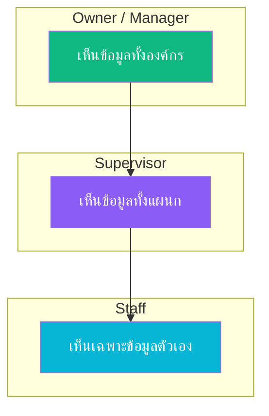
```mermaid
graph TB
    subgraph "Owner / Manager"
        ALL["เห็นข้อมูลทั้งองค์กร"]
    end

    subgraph "Supervisor"
        DEPT["เห็นข้อมูลทั้งแผนก"]
    end

    subgraph "Staff"
        OWN["เห็นเฉพาะข้อมูลตัวเอง"]
    end

    ALL --> DEPT --> OWN

    style ALL fill:#10b981,color:#fff
    style DEPT fill:#8b5cf6,color:#fff
    style OWN fill:#06b6d4,color:#fff
```

| ข้อมูล | Staff | Supervisor | Manager/Owner |
|--------|-------|------------|---------------|
| Timesheet | ของตัวเอง | ทั้งแผนก | ทั้งองค์กร |
| ใบลา | ของตัวเอง | ทั้งแผนก | ทั้งองค์กร |
| รายงานประจำวัน | ของตัวเอง | ทั้งแผนก | ทั้งองค์กร |
| พนักงาน | ไม่มีสิทธิ์ | ทั้งแผนก | ทั้งองค์กร |
| ใบขอซื้อ (PR) | ของตัวเอง | ทั้งแผนก | ทั้งองค์กร |
| Inventory/WO/อื่นๆ | ทั้งองค์กร | ทั้งองค์กร | ทั้งองค์กร |

---

# 8. กฎธุรกิจสำคัญ

กฎที่ระบบบังคับใช้อัตโนมัติ — เรียงตาม module (ภาษาที่เข้าใจง่าย):

## สต็อก (Inventory)

| กฎ | อธิบาย |
|-----|--------|
| ห้ามติดลบ | จำนวนสินค้าในสต็อกต้อง >= 0 เสมอ |
| เบิกไม่เกิน | เบิกหรือจ่ายสินค้าได้ไม่เกินจำนวนที่มี (ทั้ง product level และ location level) |
| ห้ามแก้ movement | การเคลื่อนไหว stock แก้ไขไม่ได้ ต้องทำ "กลับรายการ" (Reversal) |
| SKU ห้ามซ้ำ | รหัสสินค้าต้องไม่ซ้ำกัน ถ้ามี movement แล้วห้ามเปลี่ยน |
| SERVICE ไม่มี stock | สินค้าประเภท "บริการ" ไม่นับ stock, ห้ามสร้าง movement |
| Stock ต่ำ | ถ้า on_hand <= min_stock → แจ้งเตือน (แถวเหลือง + นับบน stat card) |
| ราคาวัสดุ | สินค้าประเภท MATERIAL ต้องมีราคา >= 1.00 บาท |

## ใบสั่งงาน (Work Order)

| กฎ | อธิบาย |
|-----|--------|
| สถานะไปข้างหน้าเท่านั้น | DRAFT → OPEN → CLOSED ห้ามย้อนกลับ |
| ปิดงานต้องมีสิทธิ์ | ต้องเป็น Supervisor+ ถึงปิด WO ได้ |
| ลบได้เฉพาะ DRAFT | ลบ WO ได้เฉพาะสถานะ DRAFT + ไม่มี movement + เจ้าของเท่านั้น |
| เบิกวัสดุต้อง WO เปิด | CONSUME/RETURN ได้เฉพาะ WO ที่สถานะ OPEN |
| เบิกได้เฉพาะวัสดุ | CONSUME/RETURN ได้เฉพาะสินค้าประเภท MATERIAL หรือ CONSUMABLE |
| ต้นทุนรวม 4 ส่วน | Material + ManHour + Tools Recharge + Admin Overhead |
| ค่าวัสดุ = เบิก - คืน | Material Cost = CONSUME - RETURN (ต่ำสุด = 0) |

## เบิกของ (Stock Movement — 6 ประเภท)

| กฎ | อธิบาย |
|-----|--------|
| CONSUME ต้องมี WO | ต้องระบุ Work Order ที่สถานะ OPEN |
| RETURN ต้องมี WO | ต้องระบุ Work Order ที่สถานะ OPEN |
| ISSUE ต้องมี Cost Center | ต้องระบุ Cost Center ที่ active |
| TRANSFER ต้องคนละที่ | ต้องมีตำแหน่งต้นทาง + ปลายทาง และต้องต่างกัน |
| TRANSFER stock คงที่ | ต้นทาง -qty, ปลายทาง +qty, จำนวนรวมไม่เปลี่ยน |
| ADJUST Owner เท่านั้น | เฉพาะ Owner ปรับ stock ได้ (เพิ่ม/ลด) |

## ใบเบิกของ (Withdrawal Slip)

| กฎ | อธิบาย |
|-----|--------|
| สถานะ: DRAFT → PENDING → ISSUED | ห้ามย้อน, Cancel ได้จาก DRAFT/PENDING |
| แก้ไขได้เฉพาะ DRAFT | PENDING ขึ้นไปแก้ไม่ได้ |
| ลบได้เฉพาะ DRAFT + Owner | เจ้าของใบเบิกที่สถานะ DRAFT เท่านั้น |
| จ่ายน้อยกว่าขอได้ | issued_qty สามารถ < quantity (จ่ายตามของจริง) |
| issued_qty = 0 = ข้าม | รายการที่จ่าย 0 จะไม่ตัด stock |
| WO ต้อง OPEN | ถ้าเบิกเข้า WO, WO ต้องสถานะ OPEN ตอน Issue |
| ห้ามสินค้า SERVICE | ทุกรายการต้องเป็น MATERIAL หรือ CONSUMABLE |
| ISSUED แก้ไม่ได้ | ถ้าผิดต้อง Reverse movement ทีละรายการ |

## ชั่วโมงทำงาน (Timesheet)

| กฎ | อธิบาย |
|-----|--------|
| 1 ชั่วโมง = 1 งาน | ชั่วโมงเดียวกันกรอกให้ WO ได้แค่ 1 ใบ (ห้ามซ้อน) |
| กรอกย้อนหลังได้ 7 วัน | เกิน 7 วัน ต้องให้ HR ปลดล็อคก่อน |
| ชั่วโมงไม่เกินวัน | ชั่วโมงรวมต่อวัน ≤ ชั่วโมงทำงานปกติของวันนั้น |
| หัวหน้ากรอกแทนได้ | ถ้าพนักงานไม่กรอก Supervisor กรอกแทนได้ |
| 3 ขั้นอนุมัติ | กรอก → Supervisor อนุมัติ → HR Final (ก่อนเข้า Payroll) |

## OT (ล่วงเวลา)

| กฎ | อธิบาย |
|-----|--------|
| อัตรา OT ตาม Master Data | วันธรรมดา 1.5x, วันหยุด 2.0x, นักขัตฤกษ์ 3.0x |
| Factor ห้ามเกิน Ceiling | OT Factor พิเศษต้อง ≤ ค่าสูงสุดที่ Admin กำหนด |
| Admin ปรับได้ | Owner/Manager ปรับ Factor + Maximum Ceiling ได้ใน Master Data |

## ลางาน (Leave)

| กฎ | อธิบาย |
|-----|--------|
| ลาเกินโควต้าไม่ได้ | จำนวนวันลาใช้ + ขอลาใหม่ ≤ โควต้า |
| ลาได้เงิน = 8 ชม. | วันลาที่ได้เงิน → Timesheet คิด 8 ชม. ปกติ |
| ลาไม่ได้เงิน = 0 ชม. | วันลาไม่ได้เงิน → Timesheet คิด 0 ชม. (หัก payroll) |
| วันลาห้ามกรอก WO | วันที่ลา ห้ามกรอกชั่วโมงให้ Work Order |

## เครื่องมือ (Tools)

| กฎ | อธิบาย |
|-----|--------|
| 1 คน ต่อ 1 เครื่อง | เครื่องมือถูก checkout ได้ 1 คน ณ เวลาเดียว |
| คิดเงินตอน check-in | ค่าเครื่องมือคำนวณเมื่อคืน (ชั่วโมง x อัตรา) ไม่ใช่ตอนยืม |

## จัดซื้อ (Purchasing)

| กฎ | อธิบาย |
|-----|--------|
| PO ต้องมา PR ก่อน | ห้ามสร้าง PO ตรง ต้องผ่าน PR ก่อนเสมอ |
| 1 PR = 1 PO | แต่ละ PR แปลงเป็น PO ได้ 1 ใบ |
| PR ต้องมี Cost Center | ทุก PR ต้องระบุ Cost Center |
| PR line ต้องมี Cost Element | ทุกรายการใน PR ต้องระบุ Cost Element |
| GOODS ต้องมีสินค้า | รายการประเภท GOODS ต้องเลือกสินค้า |
| SERVICE ต้องมีคำอธิบาย | รายการประเภท SERVICE ต้องกรอกคำอธิบาย |
| BLANKET ต้องมีวันที่ | PR แบบสัญญาระยะยาวต้องกำหนดวันเริ่ม-สิ้นสุด |
| รับของ GOODS = stock เพิ่ม | รับของสินค้า → สร้าง RECEIVE movement อัตโนมัติ |
| รับงาน SERVICE = ยืนยัน | รับงานบริการ → แค่ยืนยันรับ (ไม่มี stock) |

## การวางแผน (Planning)

| กฎ | อธิบาย |
|-----|--------|
| 1 คน = 1 งาน/วัน | จัดคนเข้างานได้ 1 WO ต่อวัน |
| 1 เครื่องมือ = 1 งาน/วัน | จัดเครื่องมือเข้างานได้ 1 WO ต่อวัน |
| คนลาจัดงานไม่ได้ | วันที่พนักงานลา ห้ามจัดลงงาน |
| จองวัสดุหัก stock | Available = on_hand - จำนวนจองแล้ว |
| จองเครื่องมือห้ามซ้อน | ห้ามจองเครื่องมือซ้อนช่วงวันเดียวกัน |

## ระบบ (Admin)

| กฎ | อธิบาย |
|-----|--------|
| Owner ลดตัวเองไม่ได้ | เจ้าของระบบห้ามลด role ตัวเอง |
| สิทธิ์ต้องอยู่ในรายการ | Permission ต้องอยู่ในรายการที่กำหนด (133 ตัว) |
| Action ต้องถูกต้อง | ต้องเป็น 1 ใน 7: create/read/update/delete/approve/export/execute |
| ทุก query ต้อง filter org | Multi-tenant: ข้อมูลแยกตามองค์กร |
| เงินห้ามใช้ Float | ตัวเลขเงินต้องใช้ Numeric(12,2) เท่านั้น |

---

# สรุปภาพรวม

| หัวข้อ | จำนวน |
|--------|-------|
| Modules (โมดูล) | 12 |
| Permissions (สิทธิ์) | 133 |
| Roles (บทบาท) | 5 |
| Business Rules (กฎธุรกิจ) | 88 |
| State Machines (สถานะ) | 10 |
| Frontend Pages (หน้าจอ) | 29+ routes |
| Frontend Tabs (แท็บ) | 35+ tabs |
| Backend Routers (API) | 19 routers |
| Database Tables | 35+ tables |
| Database Migrations | 16 versions |

---

*สร้างจาก CLAUDE.md v15 + codebase analysis | อัปเดต: 2026-03-02*
