# SSS Corp ERP — System Overview V2

> **เอกสารภาพรวมระบบฉบับสมบูรณ์** สำหรับเจ้าของธุรกิจ + ทีมงาน
> อ่านแล้วเข้าใจว่าระบบทำอะไรได้ ทำงานอย่างไร เชื่อมต่อกันอย่างไร และจะไปทางไหนต่อ
>
> **Version:** 2.0 | **วันที่:** 2 มีนาคม 2026
> **ใช้ร่วมกันระหว่าง:** Product Owner (คุณ), Claude Code (Dev), VS Code Copilot (QA), Manus (Reviewer)

---

## วิธีใช้เอกสารนี้

เอกสารนี้แบ่งเป็น **4 ส่วน** — อ่านแล้วตอบ "ใช่/ไม่ใช่" ได้ทุกข้อ:

| ส่วน | เนื้อหา | คุณทำอะไร |
|------|---------|----------|
| **ส่วน A** | ระบบที่มีอยู่ตอนนี้ (ทำเสร็จแล้ว) | ตรวจว่าถูกต้องไหม — ใช่/ไม่ใช่ |
| **ส่วน B** | สิ่งที่วางแผนไว้แล้ว (Phase 8-14) | ตรวจว่ายังต้องการไหม — ใช่/ไม่ใช่/ปรับ |
| **ส่วน C** | สิ่งที่ยังไม่ได้วางแผน แต่ควรมี | ตรวจว่าต้องการไหม — ใช่/ไม่ใช่/ไว้ทีหลัง |
| **ส่วน D** | ลำดับความสำคัญที่แนะนำ | เห็นด้วย/ไม่เห็นด้วย |

---

## สารบัญ

**ส่วน A — ระบบที่ทำเสร็จแล้ว**
- [A1. ภาพรวม + สถิติ](#a1-ภาพรวม--สถิติ)
- [A2. สถาปัตยกรรมระบบ](#a2-สถาปัตยกรรมระบบ)
- [A3. แผนที่โมดูล + สถานะ + จุดเชื่อมต่อ](#a3-แผนที่โมดูล--สถานะ--จุดเชื่อมต่อ)
- [A4. แผนภาพการไหลของข้อมูล (5 Flows)](#a4-แผนภาพการไหลของข้อมูล)
- [A5. สถานะเอกสาร (10 State Machines)](#a5-สถานะเอกสาร)
- [A6. แผนที่หน้าจอ + ภาพร่าง (Wireframes)](#a6-แผนที่หน้าจอ--ภาพร่าง)
- [A7. ตารางสิทธิ์ผู้ใช้ (Permission Matrix)](#a7-ตารางสิทธิ์ผู้ใช้)
- [A8. กฎธุรกิจสำคัญ (88 ข้อ)](#a8-กฎธุรกิจสำคัญ)
- [A9. ข้อบังคับเด็ดขาด (Hard Constraints)](#a9-ข้อบังคับเด็ดขาด)

**ส่วน B — สิ่งที่วางแผนไว้แล้ว (Phase 8-14)**
- [B1. Dashboard & Analytics](#b1-dashboard--analytics-phase-8)
- [B2. Notification Center](#b2-notification-center-phase-9)
- [B3. Export & Print](#b3-export--print-phase-10)
- [B4. Inventory Enhancement](#b4-inventory-enhancement-phase-11--ส่วนที่เหลือ)
- [B5. Mobile Responsive](#b5-mobile-responsive-phase-12)
- [B6. Audit & Security](#b6-audit--security-phase-13)
- [B7. AI Performance Monitoring](#b7-ai-powered-performance-monitoring-phase-14)

**ส่วน C — สิ่งที่ยังไม่ได้วางแผน**
- [C1-C8: Invoice, DO, AP, Budget, Tax, Multi-currency, Gantt, Self-service](#ส่วน-c--สิ่งที่ยังไม่ได้วางแผน-แต่ควรพิจารณา)

**ส่วน D — ลำดับความสำคัญ**
- [ลำดับที่แนะนำ](#ส่วน-d--ลำดับความสำคัญที่แนะนำ)
- [คำศัพท์ (Glossary)](#คำศัพท์-glossary)

---

# ส่วน A — ระบบที่ทำเสร็จแล้ว

---

## A1. ภาพรวม + สถิติ

SSS Corp ERP คือระบบบริหารจัดการธุรกิจ Manufacturing/Trading ครบวงจร ประกอบด้วย 12 โมดูลที่ทำงานเชื่อมต่อกัน ตั้งแต่การจัดซื้อวัตถุดิบ, การผลิต (Work Order), การจัดการคลังสินค้า, การบริหารบุคคล (HR), ไปจนถึงการวิเคราะห์ต้นทุน (Job Costing) และรายงานการเงิน

**ขนาดของ Project ณ ปัจจุบัน:**

| หัวข้อ | จำนวน |
|--------|-------|
| Lines of Code | ~40,300 (Frontend ~19,800 + Backend ~20,500) |
| Frontend Files (.jsx) | 106 ไฟล์ |
| Backend Files (.py) | 71 ไฟล์ |
| API Endpoints | ~120+ endpoints |
| Database Migrations | 20 revisions |
| Database Tables | 35+ tables |
| Git Commits | 44 commits |
| Permissions (สิทธิ์) | 133 ตัว |
| Business Rules (กฎธุรกิจ) | 88 ข้อ |
| Modules (โมดูล) | 12 |
| Roles (บทบาท) | 5 |
| State Machines (สถานะเอกสาร) | 10 |
| Frontend Routes | 29+ |
| Frontend Tabs | 35+ |
| Backend Routers | 19 |

> **[ x] ใช่ / [ ] ไม่ใช่** — ตัวเลขข้างต้นถูกต้อง

---

## A2. สถาปัตยกรรมระบบ

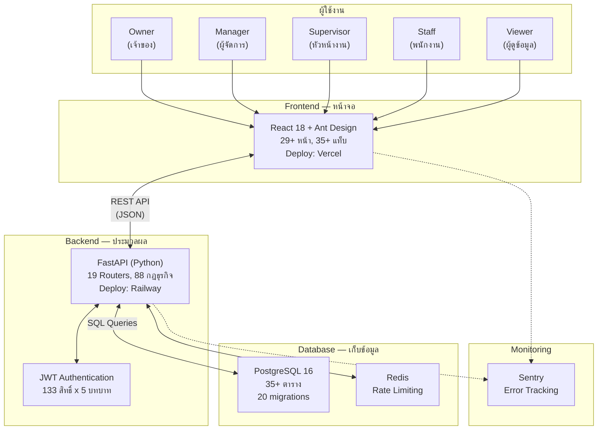

### เทคโนโลยีที่ใช้

| ชั้น | เทคโนโลยี | หน้าที่ |
|------|----------|--------|
| หน้าจอ (Frontend) | React 18 + Vite + Ant Design | แสดงผล + รับข้อมูลจากผู้ใช้ |
| ไอคอน | Lucide React | ไอคอนทั้งระบบ (ห้ามใช้ emoji / Ant Design Icons) |
| State Management | Zustand | จัดการ state ฝั่ง frontend |
| ประมวลผล (Backend) | FastAPI (Python 3.12) | ตรวจสอบกฎ + คำนวณ + จัดการข้อมูล |
| ฐานข้อมูล | PostgreSQL 16 + SQLAlchemy 2.0 (async) | เก็บข้อมูลทั้งหมด |
| Cache | Redis | Rate limiting + session cache |
| ยืนยันตัวตน | JWT Token (Access 15min + Refresh 7d) | Login + สิทธิ์การเข้าถึง |
| Deploy หน้าจอ | Vercel | เว็บไซต์ออนไลน์ |
| Deploy ประมวลผล | Railway | เซิร์ฟเวอร์ออนไลน์ |

> **[ ] ใช่ / [ ] ไม่ใช่** — Tech stack ถูกต้อง

---

## A3. แผนที่โมดูล + สถานะ + จุดเชื่อมต่อ

### แผนภาพความสัมพันธ์ 12 โมดูล

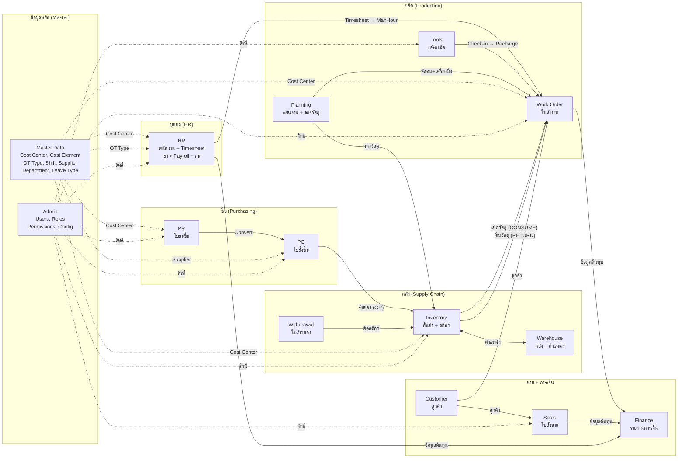

### สถานะแต่ละโมดูล

| # | โมดูล | สถานะ | สิ่งที่ทำได้ |
|---|--------|--------|-----------|
| 1 | **Inventory** | ✅ เสร็จ | Product CRUD, Stock Movement 6 ประเภท, Stock-by-Location, Low Stock Alert |
| 2 | **Warehouse** | ✅ เสร็จ | Warehouse + Zone + Location CRUD |
| 3 | **Withdrawal Slip** | ✅ เสร็จ | ใบเบิกของ (WO_CONSUME / CC_ISSUE), Multi-line, Print View |
| 4 | **Work Order** | ✅ เสร็จ | CRUD, Job Costing 4 ส่วน, Material Consume/Return |
| 5 | **Planning** | ✅ เสร็จ | Master Plan, Daily Plan, Material/Tool Reservation, Conflict Check |
| 6 | **Tools** | ✅ เสร็จ | CRUD, Check-out/Check-in, Auto Recharge |
| 7 | **Purchasing** | ✅ เสร็จ | PR→PO→GR flow, STANDARD/BLANKET PR, Supplier, QR Code, Data Scope |
| 8 | **Sales** | ⚠️ พื้นฐาน | SO CRUD + Approve (ยังไม่มี Invoice, Delivery Order) |
| 9 | **HR** | ✅ เสร็จ | Employee, Timesheet 3-tier, Leave, Daily Report, Payroll, Shift/Roster |
| 10 | **Finance** | ⚠️ พื้นฐาน | Summary Report + CSV Export (ยังไม่มี charts, P&L, Budget) |
| 11 | **Customer** | ✅ เสร็จ | CRUD |
| 12 | **Admin** | ✅ เสร็จ | Roles, Users, Permissions 133 ตัว, Audit Log, Org/Work/Approval Config |

**Features เสริม (ไม่ใช่โมดูล แต่ทำเสร็จแล้ว):**

| Feature | สถานะ | รายละเอียด |
|---------|--------|-----------|
| Staff Portal (ของฉัน) | ✅ เสร็จ | My Daily Report, My Leave, My Timesheet, My Tasks |
| Approval Center | ✅ เสร็จ | 6 tabs: Daily Report, PR, Timesheet, Leave, PO, SO + Badge Count |
| Data Scope | ✅ เสร็จ | Staff=ตัวเอง, Supervisor=แผนก, Manager/Owner=ทั้งองค์กร |
| Multi-tenant | ✅ เสร็จ | org_id filter ทุก query + Setup Wizard |
| Approval Bypass | ✅ เสร็จ | OrgApprovalConfig: ปิด/เปิด approval per module |

### ตารางจุดเชื่อมต่อ

| จาก | ไป | ประเภทการเชื่อม | ตัวอย่าง |
|------|-----|----------------|---------|
| PR | PO | เปลี่ยนสถานะ | PR อนุมัติแล้ว → กดแปลงเป็น PO |
| PO | Inventory | สร้าง movement | รับของ (GR) → สร้าง RECEIVE movement → stock เพิ่ม |
| Inventory | Work Order | เบิก/คืนวัสดุ | CONSUME → stock ลด + cost เข้า WO / RETURN → stock เพิ่ม |
| Withdrawal | Inventory | ตัดสต็อก | Issue ใบเบิก → สร้าง CONSUME/ISSUE movement ต่อรายการ |
| Inventory | Warehouse | ตำแหน่งจัดเก็บ | สินค้าอยู่ location ไหน, stock ต่อ location |
| HR (Timesheet) | Work Order | ค่าแรง | HR final approve → ManHour Cost เข้า WO |
| Tools | Work Order | ค่าเครื่องมือ | Check-in → คำนวณชั่วโมง x อัตรา → Tools Recharge เข้า WO |
| Planning | Work Order | จัดคน/เครื่องมือ | Daily Plan → จัดพนักงาน + เครื่องมือ ลง WO ต่อวัน |
| Planning | Inventory | จองวัสดุ | Material Reservation → กัน stock ไว้ให้ WO |
| Master Data | ทุก module | ข้อมูลอ้างอิง | Cost Center, Cost Element, OT Type, Supplier, Department |
| Customer | Sales + WO | ลูกค้า | SO ต้องมีลูกค้า, WO อ้างอิง SO |
| WO + Sales + HR | Finance | ต้นทุน/รายได้ | รายงานการเงินรวมจากทุกแหล่ง |

> **[ ] ใช่ / [ ] ไม่ใช่** — สถานะโมดูล + จุดเชื่อมต่อถูกต้อง (ถ้าไม่ใช่ ระบุว่าข้อไหนผิด)

---

## A4. แผนภาพการไหลของข้อมูล

### Flow 1: ซื้อของ → เข้าสต็อก (PR → PO → GR → Inventory)

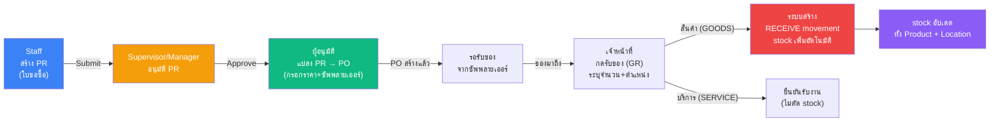

**สรุป:** Staff ขอซื้อ → หัวหน้าอนุมัติ → แปลงเป็นใบสั่งซื้อ → ของมา → กดรับของ → stock เพิ่มอัตโนมัติ

PR มี 2 ประเภท: **STANDARD** (ขอซื้อปกติ) และ **BLANKET** (สัญญาซื้อระยะยาว มี validity period)
แต่ละรายการใน PR ระบุ: **GOODS** (สินค้า → รับเข้าคลัง) หรือ **SERVICE** (บริการ → ยืนยันรับงาน ไม่มี stock)

> **[ ] ใช่ / [ ] ไม่ใช่** — Flow การจัดซื้อถูกต้อง

---

### Flow 2: คำนวณต้นทุนงาน (Job Costing — 4 องค์ประกอบ)

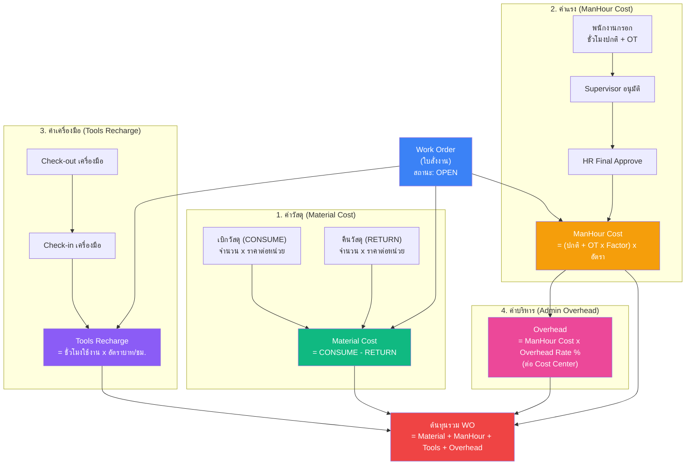

**สรุป:** ต้นทุนงาน = วัสดุ (เบิก-คืน) + แรงงาน (ชม. x อัตรา) + เครื่องมือ (ชม. x อัตรา) + ค่าบริหาร (% ของค่าแรง)

> **[ ] ใช่ / [ ] ไม่ใช่** — สูตร Job Costing ถูกต้อง

---

### Flow 3: รายงานประจำวัน → Timesheet → Payroll

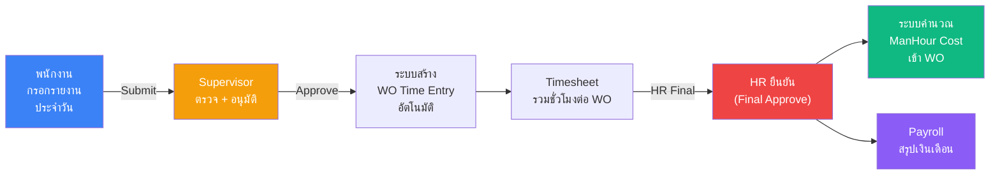

**สรุป:** พนักงานกรอก → หัวหน้าอนุมัติ → สร้าง Timesheet อัตโนมัติ → HR ตรวจ → คำนวณต้นทุนแรงงาน + Payroll

> **[ ] ใช่ / [ ] ไม่ใช่** — Flow Timesheet/Payroll ถูกต้อง

---

### Flow 4: ใบเบิกของ (Stock Withdrawal Slip)

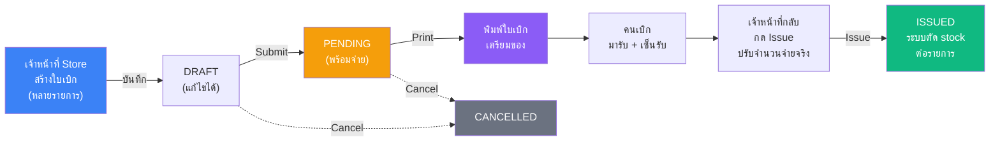

มี 2 ประเภท: **WO_CONSUME** (เบิกเข้า Work Order → สร้าง CONSUME movement) และ **CC_ISSUE** (เบิกจ่ายตาม Cost Center → สร้าง ISSUE movement)
จำนวนจ่ายจริง (issued_qty) อาจน้อยกว่าจำนวนขอ (quantity) ได้

> **[ ] ใช่ / [ ] ไม่ใช่** — Flow ใบเบิกของถูกต้อง

---

### Flow 5: การเคลื่อนไหวสต็อก (6 ประเภท)

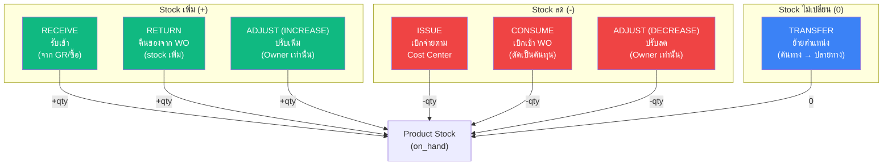

| ประเภท | ทิศทาง | ต้องระบุ | ใครทำได้ |
|--------|--------|---------|---------|
| RECEIVE | +stock | Product + จำนวน + ราคา | Staff+ |
| RETURN | +stock | Work Order (OPEN) + Product (วัสดุ) | Staff+ |
| ISSUE | -stock | Cost Center + Product + จำนวน | Staff+ |
| CONSUME | -stock | Work Order (OPEN) + Product (วัสดุ) | Staff+ |
| TRANSFER | 0 | ตำแหน่งต้นทาง + ปลายทาง (ต่างกัน) | Staff+ |
| ADJUST | +/- | ทิศทาง (เพิ่ม/ลด) + Product + จำนวน | **Owner เท่านั้น** |

กฎสำคัญ: Stock movements **แก้ไขไม่ได้** (immutable) — ถ้าผิดต้องทำ **REVERSAL** (กลับรายการ) เท่านั้น

> **[ ] ใช่ / [ ] ไม่ใช่** — ประเภท Stock Movement ถูกต้อง

---

## A5. สถานะเอกสาร

### ตารางสรุป 10 ประเภท

| เอกสาร | สถานะที่เป็นไปได้ | ย้อนกลับได้ไหม |
|--------|-----------------|--------------|
| Work Order | DRAFT → OPEN → CLOSED | ❌ ห้ามย้อน |
| PR (ใบขอซื้อ) | DRAFT → SUBMITTED → APPROVED → PO_CREATED (+ REJECTED / CANCELLED) | REJECTED กลับแก้ไขได้ |
| PO (ใบสั่งซื้อ) | APPROVED → PARTIAL → RECEIVED (+ CANCELLED) | ❌ |
| SO (ใบสั่งขาย) | DRAFT → SUBMITTED → APPROVED → IN_PROGRESS → COMPLETED (+ REJECTED / CANCELLED) | ❌ |
| Timesheet | DRAFT → SUBMITTED → APPROVED → FINAL (+ REJECTED) | ❌ |
| Leave (ใบลา) | PENDING → APPROVED / REJECTED | ❌ |
| Daily Work Report | DRAFT → SUBMITTED → APPROVED / REJECTED | REJECTED → DRAFT ได้ |
| Withdrawal Slip | DRAFT → PENDING → ISSUED (+ CANCELLED) | ❌ |
| Tool | AVAILABLE ↔ CHECKED_OUT | ✅ สลับได้ |
| Payroll | DRAFT → FINAL | ❌ |

### State Diagrams (Mermaid)

**Work Order:**
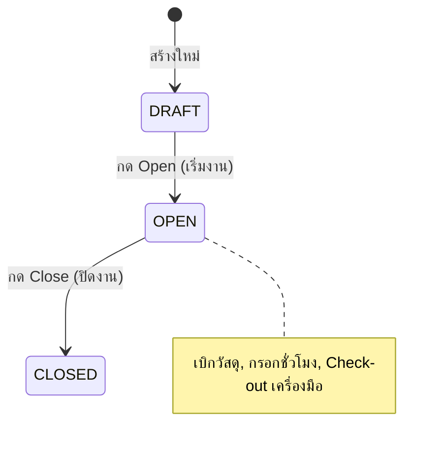

**Purchase Requisition:**
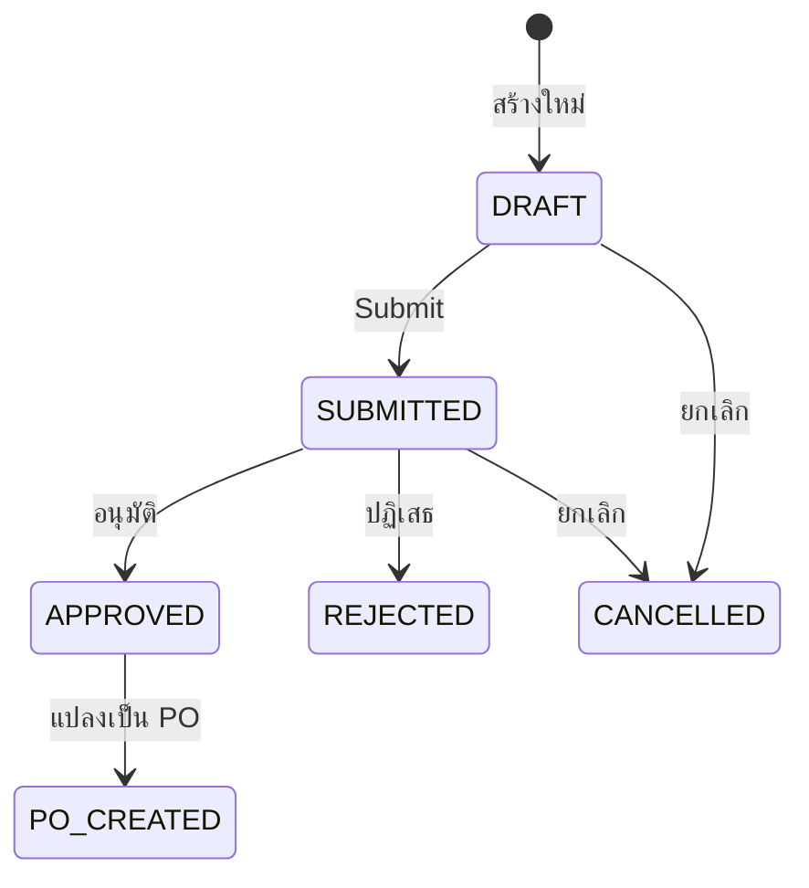

**Withdrawal Slip:**
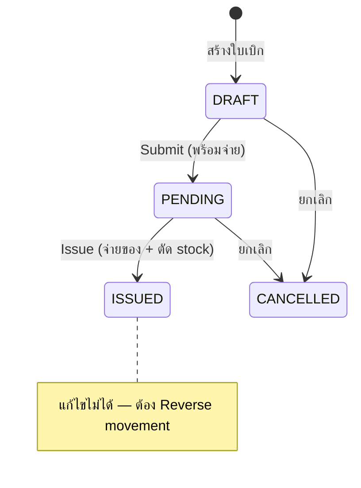

**Timesheet:**
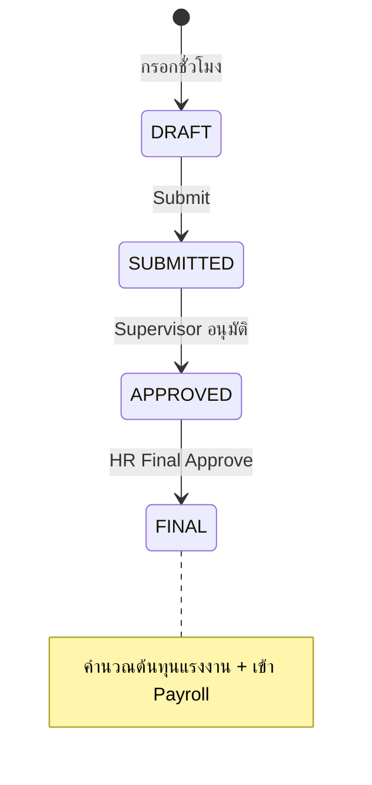

> **[ ] ใช่ / [ ] ไม่ใช่** — สถานะเอกสารถูกต้อง

---

## A6. แผนที่หน้าจอ + ภาพร่าง

### Sidebar — 3 กลุ่ม

**กลุ่ม 1: ของฉัน (ME)**

| เมนู | Route | แท็บย่อย |
|------|-------|---------|
| ของฉัน | /me | รายงานประจำวัน, ใบลา, Timesheet, งานของฉัน |

**กลุ่ม 2: อนุมัติ**

| เมนู | Route | แท็บย่อย |
|------|-------|---------|
| อนุมัติ | /approval | รายงาน(N), PR(N), Timesheet(N), ลา(N), PO(N), SO(N) |

**กลุ่ม 3: ระบบงาน**

| เมนู | Route | แท็บย่อย |
|------|-------|---------|
| Dashboard | / | — (stat cards + recent activity) |
| Supply Chain | /supply-chain | Inventory, Stock Movements, Warehouse, Locations, เครื่องมือ, ใบเบิกของ |
| Work Orders | /work-orders | — (list + detail page) |
| Purchasing | /purchasing | ใบขอซื้อ (PR), ใบสั่งซื้อ (PO) |
| Sales | /sales | — (list + detail page) |
| HR | /hr | พนักงาน, Timesheet, กรอกชั่วโมง WO, Standard Timesheet, ลาหยุด, โควต้าลา, Payroll, ตารางกะ, อนุมัติรายงาน |
| Customer | /customers | — (list) |
| Planning | /planning | Daily Plan, Reservation |
| Master Data | /master | แผนก, Cost Center, Cost Element, ประเภท OT, ประเภทลา, ประเภทกะ, ตารางกะ, ซัพพลายเออร์ |
| Finance | /finance | — (summary report) |
| Admin | /admin | Roles, Users, Audit Log, Org Config |

**Detail Pages:**

| หน้า | Route | เข้าจาก |
|------|-------|---------|
| Work Order Detail | /work-orders/:id | รายการ WO |
| PR Detail | /purchasing/pr/:id | รายการ PR |
| PO Detail | /purchasing/po/:id | รายการ PO |
| SO Detail | /sales/:id | รายการ SO |
| Withdrawal Slip Detail | /withdrawal-slips/:id | รายการใบเบิก |

### ภาพร่างหน้าจอหลัก (Wireframes)

**Dashboard:**
```
┌─────────────────────────────────────────────────────────┐
│  SSS Corp ERP                          [User] [Logout]  │
├────────┬────────────────────────────────────────────────┤
│  MENU  │  Dashboard                                     │
│        │  ┌──────────┐ ┌──────────┐ ┌──────────┐       │
│ ของฉัน  │  │ WO เปิด   │ │ PR รอ    │ │ Stock    │       │
│ อนุมัติ  │  │    12     │ │ อนุมัติ 3  │ │ ต่ำ  5  │       │
│        │  └──────────┘ └──────────┘ └──────────┘       │
│ ระบบงาน │  ┌──────────┐ ┌──────────┐ ┌──────────┐       │
│ Dashboard│ │ PO รอรับ  │ │ Timesheet│ │ ใบเบิก   │       │
│ Supply..│  │ ของ  4   │ │ รอ  8   │ │ PENDING 2│       │
│ Work O..│  └──────────┘ └──────────┘ └──────────┘       │
│ Purcha..│  [ตาราง: รายการล่าสุด / กิจกรรมวันนี้]          │
│ ...     │                                               │
└────────┴────────────────────────────────────────────────┘
```

**Work Order Detail:**
```
┌────────────────────────────────────────────────────────┐
│  ← Work Order: WO-2026-0015          [StatusBadge:OPEN]│
│  ┌─ ข้อมูลทั่วไป ───────────────────────────────┐       │
│  │ เลขที่: WO-2026-0015    ลูกค้า: ABC Co.       │       │
│  │ ชื่องาน: ผลิตชิ้นส่วน A   Cost Center: ผลิต-1   │       │
│  └──────────────────────────────────────────────┘       │
│  ┌─ สรุปต้นทุน ─────────────────────────────────┐       │
│  │ ค่าวัสดุ:    15,000    ค่าแรง:    42,500      │       │
│  │ ค่าเครื่องมือ: 3,200    ค่าบริหาร:  8,500      │       │
│  │                     รวม:  69,200 บาท          │       │
│  └──────────────────────────────────────────────┘       │
│  ┌─ วัสดุที่เบิก ─────────────────────────────────┐      │
│  │ [+ เบิกวัสดุ]  [+ คืนวัสดุ]                     │      │
│  │ วันที่ | สินค้า  | ประเภท  | จำนวน | ต้นทุน       │      │
│  │ 01/03 | เหล็ก  | CONSUME | 50   | 7,500       │      │
│  │ 02/03 | เหล็ก  | RETURN  | -5   | -750        │      │
│  └──────────────────────────────────────────────┘      │
│  [กดปิดงาน]                                            │
└────────────────────────────────────────────────────────┘
```

**Approval Center:**
```
┌────────────────────────────────────────────────────────┐
│  Approval Center                                       │
│  [รายงาน(3)] [PR(2)] [Timesheet(5)] [ลา(1)]            │
│  [PO(0)] [SO(1)]          (ตัวเลข = จำนวนรออนุมัติ)     │
│  ─────────────────────────────────────────────         │
│  ┌─ PR Approval Tab ─────────────────────────┐         │
│  │ เลขที่   | ผู้ขอ   | CC    | ยอด   | Action │        │
│  │ PR-0002 | สมชาย  | ผลิต-1| 8,000 | [อนุมัติ]│        │
│  │ PR-0004 | สมหญิง | ซ่อม  | 3,500 | [อนุมัติ]│        │
│  │ คลิก [อนุมัติ] → Confirm → สถานะเปลี่ยนทันที  │        │
│  │ คลิก [ปฏิเสธ] → กรอกเหตุผล → สถานะเปลี่ยน     │        │
│  └────────────────────────────────────────────┘        │
└────────────────────────────────────────────────────────┘
```

> **[ ] ใช่ / [ ] ไม่ใช่** — โครงสร้างหน้าจอถูกต้อง

---

## A7. ตารางสิทธิ์ผู้ใช้

### 5 บทบาทในระบบ

| บทบาท | คำอธิบาย | จำนวนสิทธิ์ | ทำอะไรได้ |
|--------|---------|-----------|---------|
| **Owner** | เจ้าของ/Admin | 133 (ทั้งหมด) | ทำได้ทุกอย่าง + จัดการ user/role + ปรับ stock |
| **Manager** | ผู้จัดการ | ~81 | ดู+แก้ไข+อนุมัติทุก module (ยกเว้น admin) |
| **Supervisor** | หัวหน้างาน | ~65 | ดู+แก้ไข+อนุมัติในแผนก |
| **Staff** | พนักงาน | ~39 | ดู+สร้าง (ของตัวเอง) |
| **Viewer** | ผู้ดูข้อมูล | ~26 | ดู + export บางส่วน |

### สิทธิ์ต่อ Module

| Module | Owner | Manager | Supervisor | Staff | Viewer |
|--------|:-----:|:-------:|:----------:|:-----:|:------:|
| Inventory (สินค้า) | CRUD+Export | CRU+Export | CRU+Export | R | R+Export |
| Stock Movement | CRD+Export | CR+Export | CR+Export | CR+Export | R |
| Withdrawal (ใบเบิก) | CRUD+Approve+Export | CR+Approve+Export | CR+Approve+Export | CR | R+Export |
| Warehouse (คลัง) | CRUD | CRU | CRU | CR | R |
| Work Order | CRUD+Approve+Export | CRU+Approve+Export | CRU+Approve+Export | CRU+Export | R |
| Planning (แผนงาน) | CRUD | CRU | R | R | R |
| Purchasing PR | CRUD+Approve | CRU+Approve | CRU+Approve | CR | R |
| Purchasing PO | CRUD+Approve+Export | CRU+Approve | CRU+Approve | CR | R+Export |
| Sales (ขาย) | CRUD+Approve+Export | CRU+Approve+Export | CRU+Approve+Export | CR | R+Export |
| HR (บุคคล) | Full | Most | Dept scope | Own data | - |
| Tools (เครื่องมือ) | CRUD+Execute+Export | CRU+Execute+Export | CRU+Execute+Export | R+Execute | R+Export |
| Master Data | CRUD | CRU | CRU | R | R |
| Customer | CRUD+Export | CRU+Export | CRU+Export | R | R+Export |
| Finance | R+Export | R | R | R | R |
| Admin | Full | - | - | - | - |

*C=Create, R=Read, U=Update, D=Delete*

### ขอบเขตข้อมูลตามบทบาท (Data Scope)

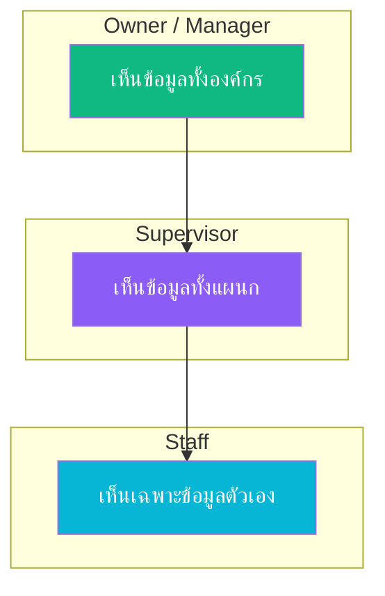

| ข้อมูล | Staff | Supervisor | Manager/Owner |
|--------|-------|------------|---------------|
| Timesheet, ใบลา, รายงานประจำวัน | ของตัวเอง | ทั้งแผนก | ทั้งองค์กร |
| พนักงาน | ไม่มีสิทธิ์ | ทั้งแผนก | ทั้งองค์กร |
| ใบขอซื้อ (PR) | ของตัวเอง | ทั้งแผนก | ทั้งองค์กร |
| Inventory, WO, อื่นๆ | ทั้งองค์กร | ทั้งองค์กร | ทั้งองค์กร |
| Payroll, Finance | ไม่มีสิทธิ์ | ไม่มีสิทธิ์ | ทั้งองค์กร |

> **[ ] ใช่ / [ ] ไม่ใช่** — ระบบสิทธิ์ถูกต้อง

---

## A8. กฎธุรกิจสำคัญ

กฎที่ระบบบังคับใช้อัตโนมัติ — 88 ข้อ สรุปเป็นภาษาคน:

### สต็อก (Inventory)

| กฎ | อธิบาย |
|-----|--------|
| ห้ามติดลบ | จำนวนสินค้าในสต็อกต้อง >= 0 เสมอ |
| เบิกไม่เกิน | เบิกหรือจ่ายสินค้าได้ไม่เกินจำนวนที่มี (ทั้ง product level และ location level) |
| ห้ามแก้ movement | การเคลื่อนไหว stock แก้ไขไม่ได้ ต้องทำ "กลับรายการ" (Reversal) |
| SKU ห้ามซ้ำ | รหัสสินค้าต้องไม่ซ้ำกัน ถ้ามี movement แล้วห้ามเปลี่ยน |
| SERVICE ไม่มี stock | สินค้าประเภท "บริการ" ไม่นับ stock, ห้ามสร้าง movement |
| Stock ต่ำ | ถ้า on_hand <= min_stock → แจ้งเตือน (แถวเหลือง + นับบน stat card) |
| ราคาวัสดุ | สินค้าประเภท MATERIAL ต้องมีราคา >= 1.00 บาท |

### ใบสั่งงาน (Work Order)

| กฎ | อธิบาย |
|-----|--------|
| สถานะไปข้างหน้าเท่านั้น | DRAFT → OPEN → CLOSED ห้ามย้อนกลับ |
| ปิดงานต้องมีสิทธิ์ | ต้องเป็น Supervisor+ ถึงปิด WO ได้ |
| ลบได้เฉพาะ DRAFT | ลบ WO ได้เฉพาะสถานะ DRAFT + ไม่มี movement + เจ้าของเท่านั้น |
| เบิกวัสดุต้อง WO เปิด | CONSUME/RETURN ได้เฉพาะ WO ที่สถานะ OPEN |
| เบิกได้เฉพาะวัสดุ | CONSUME/RETURN ได้เฉพาะสินค้าประเภท MATERIAL หรือ CONSUMABLE |
| ต้นทุนรวม 4 ส่วน | Material + ManHour + Tools Recharge + Admin Overhead |
| ค่าวัสดุ = เบิก - คืน | Material Cost = CONSUME - RETURN (ต่ำสุด = 0) |

### เบิกของ (Stock Movement — 6 ประเภท)

| กฎ | อธิบาย |
|-----|--------|
| CONSUME ต้องมี WO | ต้องระบุ Work Order ที่สถานะ OPEN |
| RETURN ต้องมี WO | ต้องระบุ Work Order ที่สถานะ OPEN |
| ISSUE ต้องมี Cost Center | ต้องระบุ Cost Center ที่ active |
| TRANSFER ต้องคนละที่ | ต้องมีตำแหน่งต้นทาง + ปลายทาง และต้องต่างกัน |
| TRANSFER stock คงที่ | ต้นทาง -qty, ปลายทาง +qty, จำนวนรวมไม่เปลี่ยน |
| ADJUST Owner เท่านั้น | เฉพาะ Owner ปรับ stock ได้ (เพิ่ม/ลด) |

### ใบเบิกของ (Withdrawal Slip)

| กฎ | อธิบาย |
|-----|--------|
| สถานะ: DRAFT → PENDING → ISSUED | ห้ามย้อน, Cancel ได้จาก DRAFT/PENDING |
| จ่ายน้อยกว่าขอได้ | issued_qty สามารถ < quantity (จ่ายตามของจริง) |
| WO ต้อง OPEN | ถ้าเบิกเข้า WO, WO ต้องสถานะ OPEN ตอน Issue |
| ห้ามสินค้า SERVICE | ทุกรายการต้องเป็น MATERIAL หรือ CONSUMABLE |
| ISSUED แก้ไม่ได้ | ถ้าผิดต้อง Reverse movement ทีละรายการ |

### ชั่วโมงทำงาน (Timesheet)

| กฎ | อธิบาย |
|-----|--------|
| 1 ชั่วโมง = 1 งาน | ชั่วโมงเดียวกันกรอกให้ WO ได้แค่ 1 ใบ (ห้ามซ้อน) |
| กรอกย้อนหลังได้ 7 วัน | เกิน 7 วัน ต้องให้ HR ปลดล็อคก่อน |
| ชั่วโมงไม่เกินวัน | ชั่วโมงรวมต่อวัน ≤ ชั่วโมงทำงานปกติของวันนั้น |
| หัวหน้ากรอกแทนได้ | ถ้าพนักงานไม่กรอก Supervisor กรอกแทนได้ |
| 3 ขั้นอนุมัติ | กรอก → Supervisor อนุมัติ → HR Final (ก่อนเข้า Payroll) |
| OT Factor ห้ามเกิน Ceiling | OT Factor พิเศษต้อง ≤ ค่าสูงสุดที่ Admin กำหนด |
| OT อัตราตาม Master Data | วันธรรมดา 1.5x, วันหยุด 2.0x, นักขัตฤกษ์ 3.0x |

### ลางาน (Leave)

| กฎ | อธิบาย |
|-----|--------|
| ลาเกินโควต้าไม่ได้ | จำนวนวันลาใช้ + ขอลาใหม่ ≤ โควต้า |
| ลาได้เงิน = 8 ชม. | วันลาที่ได้เงิน → Timesheet คิด 8 ชม. ปกติ |
| ลาไม่ได้เงิน = 0 ชม. | วันลาไม่ได้เงิน → Timesheet คิด 0 ชม. (หัก payroll) |
| วันลาห้ามกรอก WO | วันที่ลา ห้ามกรอกชั่วโมงให้ Work Order |

### เครื่องมือ (Tools)

| กฎ | อธิบาย |
|-----|--------|
| 1 คน ต่อ 1 เครื่อง | เครื่องมือถูก checkout ได้ 1 คน ณ เวลาเดียว |
| คิดเงินตอน check-in | ค่าเครื่องมือคำนวณเมื่อคืน (ชั่วโมง x อัตรา) ไม่ใช่ตอนยืม |

### จัดซื้อ (Purchasing)

| กฎ | อธิบาย |
|-----|--------|
| PO ต้องมา PR ก่อน | ห้ามสร้าง PO ตรง ต้องผ่าน PR ก่อนเสมอ |
| 1 PR = 1 PO | แต่ละ PR แปลงเป็น PO ได้ 1 ใบ |
| PR ต้องมี Cost Center | ทุก PR ต้องระบุ Cost Center |
| PR line ต้องมี Cost Element | ทุกรายการใน PR ต้องระบุ Cost Element |
| GOODS ต้องมีสินค้า | รายการประเภท GOODS ต้องเลือกสินค้า |
| SERVICE ต้องมีคำอธิบาย | รายการประเภท SERVICE ต้องกรอกคำอธิบาย |
| BLANKET ต้องมีวันที่ | PR แบบสัญญาระยะยาวต้องกำหนดวันเริ่ม-สิ้นสุด |
| รับของ GOODS = stock เพิ่ม | รับของสินค้า → สร้าง RECEIVE movement อัตโนมัติ |
| รับงาน SERVICE = ยืนยัน | รับงานบริการ → แค่ยืนยันรับ (ไม่มี stock) |

### การวางแผน (Planning)

| กฎ | อธิบาย |
|-----|--------|
| 1 คน = 1 งาน/วัน | จัดคนเข้างานได้ 1 WO ต่อวัน |
| 1 เครื่องมือ = 1 งาน/วัน | จัดเครื่องมือเข้างานได้ 1 WO ต่อวัน |
| คนลาจัดงานไม่ได้ | วันที่พนักงานลา ห้ามจัดลงงาน |
| จองวัสดุหัก stock | Available = on_hand - จำนวนจองแล้ว |
| จองเครื่องมือห้ามซ้อน | ห้ามจองเครื่องมือซ้อนช่วงวันเดียวกัน |

### ระบบ (Admin)

| กฎ | อธิบาย |
|-----|--------|
| Owner ลดตัวเองไม่ได้ | เจ้าของระบบห้ามลด role ตัวเอง |
| สิทธิ์ต้องอยู่ในรายการ | Permission ต้องอยู่ในรายการที่กำหนด (133 ตัว) |
| Action ต้องถูกต้อง | ต้องเป็น 1 ใน 7: create/read/update/delete/approve/export/execute |
| ทุก query ต้อง filter org | Multi-tenant: ข้อมูลแยกตามองค์กร |
| เงินห้ามใช้ Float | ตัวเลขเงินต้องใช้ Numeric(12,2) เท่านั้น |

> **[ ] ใช่ / [ ] ไม่ใช่** — กฎธุรกิจถูกต้อง (ถ้าไม่ใช่ ระบุว่าข้อไหนผิด)

---

## A9. ข้อบังคับเด็ดขาด (Hard Constraints)

ข้อบังคับเหล่านี้ต้องรักษาไว้ตลอด ไม่ว่าจะ implement อะไรเพิ่ม:

| # | ข้อบังคับ |
|---|----------|
| 1 | Permission format: `module.resource.action` (3 ส่วนเสมอ) |
| 2 | Stock movements เป็น immutable — แก้ผ่าน REVERSAL เท่านั้น |
| 3 | Financial fields ใช้ Numeric(12,2) — ห้ามใช้ Float |
| 4 | on_hand >= 0 ตลอดเวลา |
| 5 | Multi-tenant: ทุก query ต้องมี org_id filter |
| 6 | Data Scope: HR endpoints ต้อง filter ตาม role |
| 7 | WO Status: DRAFT→OPEN→CLOSED ห้ามย้อน |
| 8 | Timesheet: 1 employee/WO/date = unique (ห้าม overlap) |
| 9 | OT Factor ≤ Maximum Ceiling ที่ Admin กำหนด |
| 10 | PO ต้องสร้างจาก PR เท่านั้น |
| 11 | Icons: ใช้ Lucide React เท่านั้น — ห้ามใช้ emoji / Ant Design Icons |
| 12 | Token: เก็บใน Zustand (memory) เท่านั้น — ห้าม localStorage |

> **[ ] ใช่ / [ ] ไม่ใช่** — ข้อบังคับถูกต้อง

---

# ส่วน B — สิ่งที่วางแผนไว้แล้ว (ยังไม่ได้ทำ)

ส่วนนี้คือ Phase 8-14 ที่เขียนไว้ใน TODO.md แต่ยังไม่ได้เริ่ม implement — ตรวจสอบว่ายังต้องการหรือไม่

---

## B1. Dashboard & Analytics (Phase 8)

**เป้าหมาย:** สร้าง Dashboard ที่มี KPI cards, charts, และ analytics สำหรับทุก role

| Feature | รายละเอียด |
|---------|-----------|
| KPI Dashboard | Stat cards: ยอดขาย, ต้นทุน WO, สถานะ stock, pending approvals |
| Charts | WO Cost Trend, Inventory Turnover, Revenue (Recharts/Ant Charts) |
| Manager Dashboard v2 | Department comparison, cost center breakdown, employee productivity |
| Staff Dashboard v2 | Personal KPIs: WO assigned, hours logged, leave balance |
| Finance Dashboard | P&L summary, cost analysis, budget vs actual |
| Aggregation APIs | Backend endpoints สำหรับ aggregate data |

> **[ ] ต้องการ / [ ] ไม่ต้องการ / [ ] ปรับ** (ถ้าปรับ ระบุว่าอยากเปลี่ยนอะไร)

---

## B2. Notification Center (Phase 9)

**เป้าหมาย:** ระบบแจ้งเตือน In-app + Email

| Feature | รายละเอียด |
|---------|-----------|
| Notification Model | user_id, type, title, message, is_read, link |
| Event Triggers | แจ้งเตือนเมื่อ: มีงานรออนุมัติ, สถานะเปลี่ยน, stock ต่ำ |
| Bell Icon | Header dropdown + unread badge count |
| Real-time Push | WebSocket/SSE หรือ polling |
| Email Channel | ส่ง email ควบคู่กับ in-app |
| User Preferences | เลือกได้ว่าจะรับแจ้งเตือนช่องทางไหน |

> **[ ] ต้องการ / [ ] ไม่ต้องการ / [ ] ปรับ**

---

## B3. Export & Print (Phase 10)

**เป้าหมาย:** PDF generation + Excel export + Print-friendly layouts

| Feature | รายละเอียด |
|---------|-----------|
| PDF Engine | สร้าง PDF จากข้อมูลในระบบ |
| WO Report PDF | Cost summary, material list, manhour breakdown |
| PO/SO PDF | Document header, line items, totals, approval signatures |
| Payroll PDF | Employee payslip |
| Excel Export | ทุก list page สามารถ export Excel ได้ |
| Print CSS | @media print styles สำหรับหน้าสำคัญ |
| Report Templates | Admin กำหนด header (logo, ที่อยู่บริษัท) |

> **[ ] ต้องการ / [ ] ไม่ต้องการ / [ ] ปรับ**

---

## B4. Inventory Enhancement (Phase 11 — ส่วนที่เหลือ)

| Feature | รายละเอียด |
|---------|-----------|
| Stock Aging Report | รายงานมูลค่าสินค้าตามอายุ (0-30, 31-60, 61-90, 90+ วัน) |
| Batch/Lot Tracking | batch_number บน StockMovement, FIFO/LIFO costing |
| Barcode/QR for SKU | Generate barcode สำหรับ SKU + print label |
| Stock Take | Cycle count workflow: count → variance → adjust |
| Multi-warehouse Transfer | TRANSFER ระหว่าง warehouse พร้อม approval |

> **[ ] ต้องการ / [ ] ไม่ต้องการ / [ ] ปรับ**

---

## B5. Mobile Responsive (Phase 12)

**เป้าหมาย:** ทำให้ระบบใช้งานบนมือถือได้สะดวก

| Feature | รายละเอียด |
|---------|-----------|
| Responsive Layout | Ant Design Grid breakpoints, collapsible sidebar |
| Mobile Staff Portal | Daily Report create/edit จากมือถือ |
| Mobile Tool Check-in/out | Simplified form สำหรับ field workers |
| Mobile Approval | Swipe approve/reject |
| PWA | Offline-first สำหรับ read |

> **[ ] ต้องการ / [ ] ไม่ต้องการ / [ ] ปรับ**

---

## B6. Audit & Security (Phase 13)

| Feature | รายละเอียด |
|---------|-----------|
| Enhanced Audit Trail | Model-level event logging (who, what, when, before/after values) |
| Login History | Device, IP, location, timestamp per user |
| Session Management | Active sessions list, remote logout |
| Password Policy | Min length, complexity, expiry, history |
| Two-Factor Auth (2FA) | TOTP (Google Authenticator) |
| Per-user Rate Limiting | Different limits per role |
| Data Export Audit | Log all export/download actions |

> **[ ] ต้องการ / [ ] ไม่ต้องการ / [ ] ปรับ**

---

## B7. AI-Powered Performance Monitoring (Phase 14)

**เป้าหมาย:** ใช้ AI วิเคราะห์ Performance ทุกชั้น (Frontend/Backend/Database)

| Feature | รายละเอียด |
|---------|-----------|
| Performance Middleware | Response time tracking, slow request detection |
| DB Query Profiler | Slow query logging, N+1 detection |
| Frontend Performance | Web Vitals (LCP/FID/CLS) |
| AI Analysis Engine | Claude API วิเคราะห์ + แนะนำเป็นภาษาไทย |
| Performance Dashboard | Stat cards + AI card + charts |
| Natural Language Query | ถามเป็นภาษาคน → AI ตอบ |
| Scheduled AI Report | Daily background job + email digest |

> **[ ] ต้องการ / [ ] ไม่ต้องการ / [ ] ปรับ**

---

# ส่วน C — สิ่งที่ยังไม่ได้วางแผน แต่ควรพิจารณา

จากการวิเคราะห์ codebase ทั้งหมด พบว่ามีสิ่งที่ระบบยังขาดและไม่ได้อยู่ใน Phase 8-14:

---

## C1. Invoice / Billing (ใบแจ้งหนี้)

**ปัญหา:** SO ที่ approved แล้ว ไม่มีทางสร้าง Invoice — ขาด revenue tracking ทั้งหมด

| Feature | รายละเอียด |
|---------|-----------|
| Invoice จาก SO | สร้าง Invoice จาก Sales Order ที่ approved |
| Invoice Status | DRAFT → SENT → PAID → CANCELLED |
| Payment Tracking | บันทึกการชำระเงิน (partial/full) |
| Accounts Receivable | ลูกหนี้การค้า — ยอดค้างชำระ per customer |

> **[ ] ต้องการ / [ ] ไม่ต้องการ / [ ] ไว้ทีหลัง**

---

## C2. Delivery Order (ใบส่งของ)

**ปัญหา:** SO ที่ approved แล้ว ไม่มีทางสร้างใบส่งของ — ขาด fulfillment flow

| Feature | รายละเอียด |
|---------|-----------|
| DO จาก SO | สร้าง Delivery Order จาก SO |
| DO Status | DRAFT → SHIPPED → DELIVERED |
| Stock Deduction | ตัด stock เมื่อ ship |

> **[ ] ต้องการ / [ ] ไม่ต้องการ / [ ] ไว้ทีหลัง**

---

## C3. Accounts Payable (เจ้าหนี้การค้า)

**ปัญหา:** PO ที่รับของแล้ว ไม่มีที่ track ว่าจ่ายเงินแล้วหรือยัง

| Feature | รายละเอียด |
|---------|-----------|
| Payment Record | บันทึกการจ่ายเงินต่อ PO |
| AP Aging | รายงานเจ้าหนี้ตามอายุ |
| Payment Status on PO | UNPAID → PARTIAL → PAID |

> **[ ] ต้องการ / [ ] ไม่ต้องการ / [ ] ไว้ทีหลัง**

---

## C4. Budget Management (งบประมาณ)

**ปัญหา:** Cost Center มี overhead_rate แต่ยังไม่มี budget allocation

| Feature | รายละเอียด |
|---------|-----------|
| Budget per Cost Center | กำหนดงบประมาณต่อ Cost Center ต่อปี/ไตรมาส |
| Budget vs Actual | เปรียบเทียบงบกับค่าใช้จ่ายจริง |
| Budget Alert | แจ้งเตือนเมื่อใช้งบเกิน threshold |

> **[ ] ต้องการ / [ ] ไม่ต้องการ / [ ] ไว้ทีหลัง**

---

## C5. Tax Calculation (ภาษี)

**ปัญหา:** ปัจจุบันไม่มีการคำนวณ VAT 7% บน PO/SO/Invoice

| Feature | รายละเอียด |
|---------|-----------|
| VAT 7% | คำนวณ VAT อัตโนมัติบน PO, SO, Invoice |
| Tax Report | รายงานภาษีซื้อ-ภาษีขาย |
| Withholding Tax | หัก ณ ที่จ่าย |

> **[ ] ต้องการ / [ ] ไม่ต้องการ / [ ] ไว้ทีหลัง**

---

## C6. Multi-currency (หลายสกุลเงิน)

**ปัจจุบัน:** รองรับเฉพาะ THB

| Feature | รายละเอียด |
|---------|-----------|
| Currency Master | สกุลเงิน + อัตราแลกเปลี่ยน |
| PO/SO Currency | เลือกสกุลเงินต่อ document |
| Auto Convert | แปลงเป็น THB ตามอัตราแลกเปลี่ยน |

> **[ ] ต้องการ / [ ] ไม่ต้องการ / [ ] ไว้ทีหลัง**

---

## C7. WO Gantt Chart / Visual Timeline

**ปัจจุบัน:** Planning มี Daily Plan แต่ไม่มี visual timeline

| Feature | รายละเอียด |
|---------|-----------|
| Gantt Chart | แสดง WO timeline แบบ visual |
| Drag & Drop | ลาก WO เพื่อเปลี่ยนวันที่ |
| Resource View | ดูว่าพนักงาน/เครื่องมือถูกจัดที่ไหน |

> **[ ] ต้องการ / [ ] ไม่ต้องการ / [ ] ไว้ทีหลัง**

---

## C8. Employee Self-service

**ปัจจุบัน:** พนักงานเปลี่ยนรหัสผ่าน/แก้ไขข้อมูลส่วนตัวไม่ได้

| Feature | รายละเอียด |
|---------|-----------|
| Change Password | เปลี่ยนรหัสผ่านเอง |
| Edit Profile | แก้ไขข้อมูลส่วนตัว (เบอร์โทร, ที่อยู่) |
| View Payslip | ดู payslip ของตัวเอง |

> **[ ] ต้องการ / [ ] ไม่ต้องการ / [ ] ไว้ทีหลัง**

---

# ส่วน D — ลำดับความสำคัญที่แนะนำ

จากสิ่งที่มีอยู่และสิ่งที่ขาด แนะนำลำดับดังนี้:

| ลำดับ | Feature | เหตุผล |
|-------|---------|--------|
| 1 | **Dashboard & Analytics (B1)** | ระบบมีข้อมูลครบแล้ว แต่ยังไม่มี visualization — เป็น quick win |
| 2 | **Export & Print (B3)** | ผู้ใช้ต้องการ print PO/SO/Payslip — เป็น daily need |
| 3 | **Notification Center (B2)** | ลดการ "เข้าไปดู" ว่ามีอะไรรอ — เพิ่ม productivity |
| 4 | **Mobile Responsive (B5)** | Staff ต้องกรอก Daily Report จากหน้างาน |
| 5 | **Stock Take (B4 บางส่วน)** | สำคัญสำหรับ inventory accuracy |
| 6 | **Invoice/Billing (C1)** | ปิด revenue cycle ให้ครบ |
| 7 | **Tax Calculation (C5)** | จำเป็นก่อน production ถ้ามี VAT |
| 8 | **Security (B6)** | สำคัญก่อน production scale |
| 9 | **AI Performance (B7)** | Nice-to-have, ทำทีหลังได้ |

> **[ ] เห็นด้วย / [ ] ไม่เห็นด้วย** — ถ้าไม่เห็นด้วย ระบุลำดับที่คุณต้องการ

---

# คำศัพท์ (Glossary)

| คำ | ความหมาย |
|----|----------|
| PR | Purchase Requisition — ใบขอซื้อ |
| PO | Purchase Order — ใบสั่งซื้อ |
| SO | Sales Order — ใบสั่งขาย |
| GR | Goods Receipt — การรับของ |
| WO | Work Order — ใบสั่งงาน/ใบสั่งผลิต |
| DO | Delivery Order — ใบส่งของ |
| BR | Business Rule — กฎเกณฑ์ทางธุรกิจ |
| RBAC | Role-Based Access Control — การควบคุมสิทธิ์ตามบทบาท |
| Data Scope | ขอบเขตข้อมูลที่แต่ละ role เห็น |
| Job Costing | การคำนวณต้นทุนต่อ Work Order |
| Approval Bypass | ข้ามขั้นตอนอนุมัติ (auto-approve) ตาม OrgApprovalConfig |
| Standard Timesheet | Timesheet ที่ระบบ generate อัตโนมัติตาม Shift Roster |
| Shift Roster | ตารางกะการทำงานรายวันต่อพนักงาน |
| CC | Cost Center — ศูนย์ต้นทุน |
| CE | Cost Element — หมวดต้นทุน |
| VAT | Value Added Tax — ภาษีมูลค่าเพิ่ม 7% |
| AP | Accounts Payable — เจ้าหนี้การค้า |
| AR | Accounts Receivable — ลูกหนี้การค้า |
| PWA | Progressive Web App — เว็บแอปที่ทำงานคล้าย native app |

---

*End of SYSTEM_OVERVIEW_V2.md — SSS Corp ERP | Merged from SYSTEM_OVERVIEW + SSS_CORP_ERP_MASTER | 2026-03-02*
