# SSS Corp ERP — Product Requirements Document

> **เอกสารนี้คือ "ความจริงเดียว" (Single Source of Truth) ของ project**
> ตรวจสอบกับ codebase จริง commit `bc1e092` เมื่อ 2026-03-02
> หน้าที่ของคุณ (Product Owner) คือ **ให้ความเห็น, ถามคำถาม, เพิ่มความต้องการ**

---

## วิธีใช้เอกสารนี้

เอกสารนี้ออกแบบมาเพื่อให้ทั้งคนและ AI เข้าใจตรงกัน แบ่งเป็น 4 ส่วน:

| ส่วน | ชื่อ | เนื้อหา | ฉัน (P Hot) ทำอะไรกับส่วนนี้ |
|------|------|---------|---------------------------|
| **A** | ระบบปัจจุบัน | สิ่งที่ทำเสร็จแล้ว + สถานะ UX | ให้ความเห็น, ถามคำถาม, บอกสิ่งที่อยากปรับ |
| **B** | แผนที่วางไว้ | Phase 8-14 ที่ยังไม่ได้เริ่ม | บอกว่าอยากได้อะไร, ไม่อยากได้อะไร, อยากเพิ่มอะไร |
| **C** | ช่องว่างที่พบ | สิ่งที่ระบบยังขาด | บอกว่าสนใจอะไร, อะไรไว้ทีหลัง |
| **D** | ลำดับความสำคัญ | แนะนำลำดับการทำงาน | บอกว่าเห็นด้วยไหม, อยากปรับลำดับอย่างไร |

**ตัวอย่างวิธีตอบของ ฉัน (P Hot):**
- "Module HR — อยากให้พนักงานดู payslip ได้เอง"
- "Flow จัดซื้อ — ทำไมต้อง PR ก่อน PO? บางทีอยากสร้าง PO ตรงได้"
- "Dashboard ไม่สำคัญตอนนี้ — อยากได้ Export PDF ก่อน"
- "เรื่อง mobile ไม่ต้อง — ใช้แค่ desktop"

---

## สารบัญ

**ส่วน A — ระบบที่ทำเสร็จแล้ว**
- [A1. ภาพรวม + สถิติ](#a1-ภาพรวม--สถิติ)
- [A2. สถาปัตยกรรมระบบ](#a2-สถาปัตยกรรมระบบ)
- [A3. สถานะแต่ละ Module + UX Assessment](#a3-สถานะแต่ละ-module--ux-assessment)
- [A4. จุดเชื่อมต่อระหว่าง Module](#a4-จุดเชื่อมต่อระหว่าง-module)
- [A5. ปัญหา UX ทั่วทั้งระบบ (Cross-cutting)](#a5-ปัญหา-ux-ทั่วทั้งระบบ)
- [A6. Business Flows หลัก (5 Flows)](#a6-business-flows-หลัก)
- [A7. สถานะเอกสาร (10 State Machines)](#a7-สถานะเอกสาร)
- [A8. แผนที่หน้าจอ + ภาพร่าง](#a8-แผนที่หน้าจอ--ภาพร่าง)
- [A9. ระบบสิทธิ์ (RBAC + Data Scope)](#a9-ระบบสิทธิ์)
- [A10. กฎธุรกิจสำคัญ (88 ข้อ)](#a10-กฎธุรกิจสำคัญ)
- [A11. ข้อบังคับเด็ดขาด (Hard Constraints)](#a11-ข้อบังคับเด็ดขาด)
- [A12. Progress Summary](#a12-progress-summary)

**ส่วน B — แผนที่วางไว้แล้ว (Phase 8-14)**
- [B1. Dashboard & Analytics](#b1-dashboard--analytics-phase-8)
- [B2. Notification Center](#b2-notification-center-phase-9)
- [B3. Export & Print](#b3-export--print-phase-10)
- [B4. Inventory Enhancement](#b4-inventory-enhancement-phase-11--ส่วนที่เหลือ)
- [B5. Mobile Responsive](#b5-mobile-responsive-phase-12)
- [B6. Audit & Security](#b6-audit--security-phase-13)
- [B7. AI Performance Monitoring](#b7-ai-powered-performance-monitoring-phase-14)

**ส่วน C — ช่องว่างที่พบ (ยังไม่ได้วางแผน)**
- [C1-C8: Invoice, DO, AP, Budget, Tax, Multi-currency, Gantt, Self-service](#ส่วน-c--ช่องว่างที่พบ)

**ส่วน D — ลำดับความสำคัญ**
- [ลำดับที่แนะนำ](#ส่วน-d--ลำดับความสำคัญที่แนะนำ)
- [คำศัพท์ (Glossary)](#คำศัพท์-glossary)

---

# ส่วน A — ระบบปัจจุบัน

---

## A1. ภาพรวม + สถิติ

SSS Corp ERP คือระบบบริหารจัดการสำหรับธุรกิจ Manufacturing/Trading ขนาดเล็ก-กลาง ครอบคลุมตั้งแต่คลังสินค้า, สั่งงาน, จัดซื้อ, ขาย, บุคคล, ไปจนถึงการคิดต้นทุนงาน (Job Costing) ระบบรองรับหลายองค์กรในฐานข้อมูลเดียว (Multi-tenant) โดยแยกข้อมูลด้วย org_id

| รายการ | ตัวเลข |
|--------|--------|
| Modules | 12 |
| DB Tables | 47 |
| API Endpoints | 182 |
| Frontend Pages | 96 JSX files |
| Backend Files (.py) | 71 ไฟล์ |
| Permissions | 133 |
| Business Rules | 88+ |
| Roles | 5 (Owner, Manager, Supervisor, Staff, Viewer) |
| Total LOC | ~40,300 (Frontend ~19,800 + Backend ~20,500) |
| Database Migrations | 20 revisions |
| Git Commits | 44 commits |
| State Machines | 10 |
| Frontend Routes | 29+ |
| Frontend Tabs | 35+ |
| Backend Routers | 19 |

**Tech Stack:** FastAPI + SQLAlchemy (Backend) | React 18 + Vite + Ant Design + Zustand (Frontend) | PostgreSQL 16 + Redis 7 | JWT Auth | Lucide Icons

> **คุณมีความเห็นอะไรไหม? ตัวเลขข้างต้นสะท้อนขนาดระบบที่คุณต้องการหรือไม่?**
---

## A2. สถาปัตยกรรมระบบ

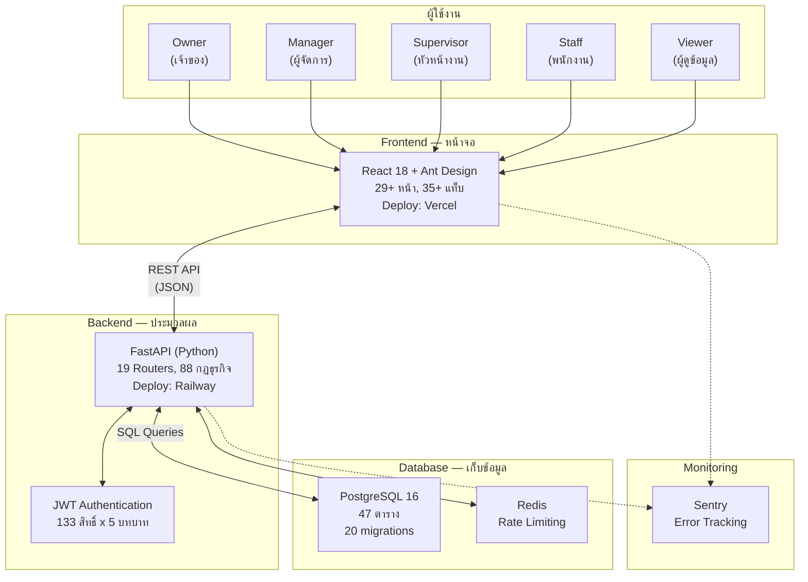

### เทคโนโลยีที่ใช้

| ชั้น | เทคโนโลยี | หน้าที่ |
|------|----------|--------|
| หน้าจอ (Frontend) | React 18 + Vite + Ant Design | แสดงผล + รับข้อมูลจากผู้ใช้ |
| ไอคอน | Lucide React | ไอคอนทั้งระบบ (ห้ามใช้ emoji / Ant Design Icons) |
| State Management | Zustand | จัดการ state ฝั่ง frontend |
| ประมวลผล (Backend) | FastAPI (Python 3.12) | ตรวจสอบกฎ + คำนวณ + จัดการข้อมูล |
| ฐานข้อมูล | PostgreSQL 16 + SQLAlchemy 2.0 (async) | เก็บข้อมูลทั้งหมด |
| Cache | Redis | Rate limiting + session cache |
| ยืนยันตัวตน | JWT Token (Access 15min + Refresh 7d) | Login + สิทธิ์การเข้าถึง |
| Deploy หน้าจอ | Vercel | เว็บไซต์ออนไลน์ |
| Deploy ประมวลผล | Railway | เซิร์ฟเวอร์ออนไลน์ |

> **คุณมีความเห็นอะไรเกี่ยวกับ tech stack ไหม?**

---

## A3. สถานะแต่ละ Module + UX Assessment

### แผนภาพความสัมพันธ์ 12 โมดูล

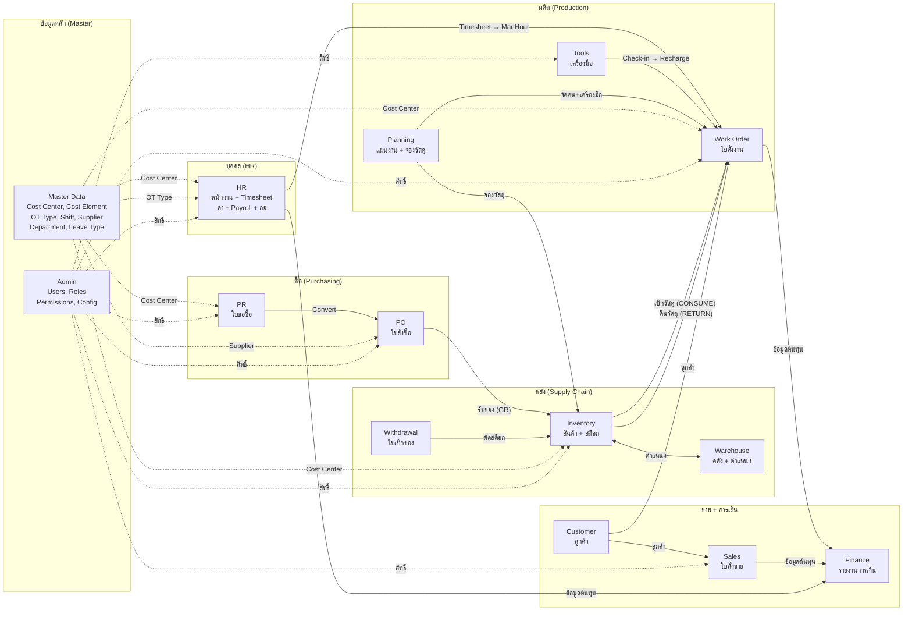

---

### Module 1: Inventory (สินค้า + Stock) — ✅ Feature Complete

ระบบจัดการสินค้า 3 ประเภท (MATERIAL, CONSUMABLE, SERVICE) พร้อม stock tracking แบบ real-time ที่ระดับ product และ location รองรับ 6 ประเภท movement (CONSUME, RETURN, RECEIVE, ADJUST, REVERSAL, TRANSFER) โดย stock movement เป็น immutable — แก้ไขได้ผ่าน REVERSAL เท่านั้น มีการแจ้งเตือนเมื่อ stock ต่ำกว่า min_stock (แถวเหลือง + stat card)

**UX ที่ดี:** มี search/filter, stock quantity display ชัดเจน, low stock alert ด้วยสีเหลือง

**UX ที่ควรปรับปรุง:**
- ไม่มี Stock Count/Adjustment UI — ต้องทำผ่าน movement ซึ่งไม่ตรงกับ workflow จริงของคลัง
- ไม่มี Stock Transfer ระหว่าง warehouse — ต้องทำ manual (ADJUST ออก + ADJUST เข้า)
- ไม่มี Reorder Point alert — มีแค่ low stock แต่ไม่แนะนำว่าควรสั่งซื้อเท่าไหร่
- ไม่มี Import/Export สำหรับ bulk update สินค้า

> **คุณใช้การนับ stock จริง (Stock Count) บ่อยไหม? ต้องการ Reorder Point ไหม?**

---

### Module 2: Warehouse (คลัง + ตำแหน่ง) — ✅ Feature Complete

ระบบจัดการคลังสินค้าแบบ 2 ระดับ (Warehouse → Location) รองรับ zone type (STORAGE, RECEIVING, SHIPPING, QUARANTINE) โดย zone type ต้องไม่ซ้ำภายใน warehouse เดียวกัน

**UX ที่ดี:** โครงสร้าง hierarchical ชัดเจน, CRUD ครบ

**UX ที่ควรปรับปรุง:**
- ไม่มี visual map ของ warehouse layout — เป็นแค่ list
- ไม่มี stock summary per location — ต้องไปดูที่ Inventory

> **คุณต้องการเห็น stock summary ต่อ location ไหม? หรือ list ก็เพียงพอ?**

---

### Module 3: Work Order (ใบสั่งงาน) — ✅ Feature Complete  

ระบบใบสั่งงานพร้อม Job Costing 4 ส่วน (Material + ManHour + Tools Recharge + Admin Overhead) รองรับ Master Plan (manpower + material + tools) สถานะ DRAFT → OPEN → CLOSED ไปข้างหน้าเท่านั้น เบิก/คืนวัสดุได้เฉพาะ WO ที่ OPEN  

**UX ที่ดี:** Popconfirm ก่อน action สำคัญ, summary cards แสดงต้นทุนรวม, status flow ชัดเจน
  >PH "บาง WO เราต้องออก PO เพื่อสั่งของพิเศษ โดยไม่ผ่าน คลัง  รวมถึง service PO ด้วย"
  >PH " manhour อาจจะมีผู้รับเหมาช่วง ที่ไม่อยู่ใน องค์การ  แต่เราออก PO ให้ จะบันทึกกันอย่างไร"
**UX ที่ควรปรับปรุง:**
- Select สินค้า/คลัง โหลดทั้งหมด (limit:500) — จะช้ามากเมื่อมีข้อมูลจริงเยอะ ควรเปลี่ยนเป็น search-as-you-type
- WOConsumeModal กับ WOReturnModal มี code ซ้ำกัน — ควรรวมเป็น component เดียว
- total_manhours ใน Master Plan เป็น manual input — ควรคำนวณจาก manpower lines อัตโนมัติ
- ไม่มี bulk actions — ต้องทำทีละ WO
- ไม่มี print view สำหรับ WO detail/cost summary
   >ph"ปุ่มเบิก/ คืนวัสดุ เล็ก สังเกคุได้อยาก"
> **คุณต้องการ print WO cost summary ไหม? ส่งให้ลูกค้าดูต้นทุนไหม?**

---

### Module 4: Supply Chain (ใบเบิกของ) — ✅ Feature Complete

ระบบใบเบิกของ (Withdrawal Slip) แบบ multi-line พร้อม status flow (DRAFT → PENDING → ISSUED → CANCELLED) เมื่อจ่ายของจะสร้าง StockMovement อัตโนมัติ จ่ายน้อยกว่าขอได้ ถ้าเบิกเข้า WO ต้อง OPEN หน้า Supply Chain รวม 4 tabs: Products, Warehouse, Tools, Withdrawal Slips

**UX ที่ดี:** Print view สำหรับใบเบิก, Issue modal สำหรับคลังจ่ายของ, status flow ชัดเจน

**UX ที่ควรปรับปรุง:**
- ไม่มี Barcode/QR scanning สำหรับจ่ายของ — ต้อง manual select
- ไม่มี bulk return — ต้องคืนทีละรายการ
- Complex multi-step process — อาจสับสนสำหรับผู้ใช้ใหม่
 >PH " การค้นห้า ด้วย SKU Model SN ก็สำคัญ และรวมไปุึง การ Filter sort ข้อมูลที่ available"

  >PH "ส่วนนี้ควรเป็น module เฉพาะสำหรับเจ้าหน้าที่ แผนกคลังสินค้า  คนแผนกอื่น เบิกของ ยืมเครื่องมือ ควรทำจาก UI หน้าอื่น"
  >PH "การเขียน ใบเบิกของ ใบยืมเครื่องมือ ที่เป็น hardcopy ต้องมีการเก็บหลักฐานไว้ ในระบบต้องบัยทึกหมายเลขใบเบิกใบยืม ที่สามารถย้นกลับมาได้"
  >PH "การนำเครื่องมือมาคืน ไม่จำเป็นต้องมี Hardcopy เป็นความรับผิดชองของเจ้าหน้าที่คลังในการ ทำในระบบ"
  >PH "เครื่องมือที่เสีย จะต้องถูกออก WO เพื่อซ่อม ส่วนจะ Charge cost center ไครแล้วแต่ตกลงกัน ระหว่างผู้ยืมกับคลัง"
  >PH "สินค้าควรมี บรรทึก Model SN และบางครั้งอาจจะอยู่ SKU เดียวกัน แต่นึกไม่ออกว่าจะทำอย่างไร"
  >PH "ข้อข้างต้นอาจจะต้องแยก MAT , Consume , sparepart เพื่อแยกง่าย"
  >PH "นอกจากมี warehose, location แล้ว เราต้องมี Bin เป้น ตำแหน่ง rack ด้วยหรือไม่"
  >PH "คลังสินค้า อาจมีหลาย site ทั้ง fix site และ tempo  เราจะทำอย่างไรให้คนเบิกไม่หลง site"
  >PH "การทำ GR สินค้าไม่ควรวิ่งมาที่คลังเท่านั้น เว้นแต่ซื้อมาไว้ที่คลังให้คนเบิก" "ดังนั้นการทำ GR จึงไม่ควรวิ่งมาอยู่ใน Stock Movement"
  >PH "การทำ GR ที่ไม่ได้ระบุคลัง เก็บ ตรงนี้ practical แต่ถ้าเป็นของต้องนำเข้าคลัง อันนี้จะนำเข้าอย่างไรตอนไหน"
  >PH "จะทำอย่างไรกับการฝากของไว้ที่คลัง"
> **พนักงานคลังใช้ Barcode Scanner ไหม? ขั้นตอนเบิกของปัจจุบันซับซ้อนเกินไปไหม?** >PH "รอคุยต่อรอบถัดไป"

---

### Module 5: Purchasing (จัดซื้อ) — ✅ Feature Complete

ระบบจัดซื้อแบบ 2 ขั้น: PR (ใบขอซื้อ) → PO (ใบสั่งซื้อ) → Goods Receipt (รับของ) PO ต้องสร้างจาก PR เท่านั้น (1 PR = 1 PO) รองรับ 3 ประเภท PR (STANDARD, BLANKET, CONTRACT) ทุก PR ต้องมี Cost Center + Cost Element เมื่อรับของ GOODS จะสร้าง RECEIVE movement อัตโนมัติ มี Supplier master, PO QR code, delivery note
 
 >PH"บางครั้งแผนกอื่นๆ อยากจะซื้อของเอง โดยไม่ผ่าน Supply chain จึงไม่ควรต้อง เลือกรายสินค้าจาก SKU List เท่านั้น"
 >PH "คนออก PR ควรต้องลงข้อมูล supplier ที่อยู่ใน vendorlist ได้ แต่ไม่บังคับ สุดท้ายอยู่ที่จัดซื้อจะเลือกไคร"
 >PH"การทำ GR ควรเป็นบุคคลที่ 3 ที่ไม่ใช้คนออก PR PO ให้คนแผนกอื่นช่วยได้ (สามารถกำหนดเป็น option ของระบบได้) "
 >PH"การอนุมัติ หมายถึง การอนุมัติ PR โดยผู้จัดการแผนก หรือคนสูงกว่า เพื่อให้ซื้อของได้ ฝ่ายจัดซื้อเท่านั้นจะทำหน้าที่ Converse PR to PO, แต่กระบวนการนี้ มันควรต้องมีผู้ทำหน้าที่จัดหา และนำข้อมูลที่เกือบจะ Final ทั้ง vendor และ pricing ก่อนส่งอนุมัติ PR และ Convert to PO" > .คนทำหน้าที่จัดหา และ convert Approved PR to PO อาจเป้นคนเดียวกันก็ได้ เพราะแต่ละองค์กรอาจไม่เหมือนกัน แต่ระบบต้องบันทึกและย้อนกลับได้ว่าไครทำอะไร" ข้อนี้สำคัญเพราะมันจะ track performance ได้

**UX ที่ดี:** Status progression ชัดเจน, PR detail page มี timeline/history, QR Code สำหรับ PO

**UX ที่ควรปรับปรุง:**
- ConvertToPOModal โหลด supplier ทั้งหมด (limit:500) — ควรเปลี่ยนเป็น search
- ไม่มี partial conversion — ต้อง convert ทั้ง PR (all-or-nothing)
- ไม่สามารถสร้าง PO ตรงได้ — ต้องผ่าน PR เสมอ (อาจไม่เหมาะกับทุกสถานการณ์)
- ไม่มี PO amendment/revision flow — ถ้า PO ผิดต้องยกเลิกแล้วสร้างใหม่
- ไม่มีการส่ง PO ให้ supplier (email/print)
- ไม่มี print view สำหรับ PR/PO

> **ทำไมต้อง PR ก่อน PO? บางทีอยากสร้าง PO ตรงได้ไหม? ต้อง print PO ส่ง supplier ไหม?** >PH"ตำตอบอยู่ที่รายละเอียดด้านบน"

---

### Module 6: Sales (ขาย) — ⚠️ พื้นฐาน

ระบบขายมี SO (Sales Order) CRUD + approve เท่านั้น ยังไม่มี flow หลัง approve (ไม่มี Invoice, Delivery Order, Payment tracking)

**UX ที่ดี:** Customer selection, line items management

**UX ที่ควรปรับปรุง:**
- SO ที่ approved แล้วไม่มี next step — เป็น dead-end
- ไม่มี Invoice generation จาก SO
- ไม่มี Delivery Order / ใบส่งของ
- ไม่มี Payment tracking
- เรียบง่ายเกินไปเมื่อเทียบกับ Purchasing module

> **ธุรกิจคุณใช้ Sales Order บ่อยไหม? ต้องการ Invoice + ใบส่งของ + Payment tracking ด้วยไหม?**

---

### Module 7: HR (บุคคล) — ✅ Feature Complete

ระบบ HR ครบทุก sub-module: Employee management, Timesheet (3-step approve: กรอก → Supervisor → HR Final), Leave (quota-based + approve), Payroll (คำนวณอัตโนมัติ), Daily Report, Shift Management (ShiftType, WorkSchedule, ShiftRoster — รองรับ FIXED + ROTATING), Standard Timesheet generation จาก Shift Roster

**UX ที่ดี:** Comprehensive employee management, leave balance tracking, payroll calculation with OT/deductions

**UX ที่ควรปรับปรุง:**
- Modal ซ้อน Modal — บาง flow มี form ลึกหลายชั้น ทำให้สับสน
- RosterTab สร้าง schedule ได้ แต่ UX สำหรับดู/แก้ไข roster รายคนยังจำกัด >PH"อันนี้อยากทำให้ง่ายกับคนใช้งาน โดยเขาไม่ต้องมานั่ง ทำฟอร์มทีละวัน ดังนั้น จึง Available ให้แก้ไขได้"
- พนักงานดู Payslip ของตัวเองไม่ได้ — ต้องให้ HR ดูให้
- พนักงานแก้ไขข้อมูลส่วนตัวไม่ได้ (เบอร์โทร, ที่อยู่)
- Timesheet stat card ใน MePage แสดง "—" แทนที่จะดึงข้อมูลจริง
- MyTimesheetPage ซับซ้อน — มีหลาย state และ action บนหน้าเดียว >HP "อันนี้ objective คือการ trackmanhour เข้า WO จึงอยากใช้ Dailywork report เพื่อบันทึก timesheet ไปด้วย"

> **พนักงานควรดู Payslip เองได้ไหม? >HP"ใช่ควรดูได้"   ต้องการให้แก้ไขข้อมูลส่วนตัวเองได้ไหม?** >HP"ใช้ควรแก้ไขเองได้"

---

### Module 8: Tools (เครื่องมือ) — ✅ Feature Complete

ระบบจัดการเครื่องมือ/อุปกรณ์ พร้อม checkout/checkin tracking, recharge rate (ค่าเสื่อม), คำนวณ cost เข้า WO อัตโนมัติเมื่อคืน

**UX ที่ดี:** Checkout/return tracking ชัดเจน, status tracking (available/checked-out/maintenance)

**UX ที่ควรปรับปรุง:**
- ไม่มี maintenance scheduling — ต้อง track manual
- ไม่มี tool history per tool — ต้องดูจาก movement

> **ต้องการระบบ maintenance scheduling สำหรับเครื่องมือไหม?** >HP "ควรมี แต่มันควรไปฝากไว้กับ Model Maintennace"

---

### Module 9: Planning (วางแผน) — ✅ Feature Complete
>HP" WO plan หรือ project plan มีใว้เพื่อ forecast resources" "เป้น perfomance indicator เทียบกับ result"
>HP" Dail Plan มีไว้เพื่อจัดการ resources ให้มีประสิทธิ์ภาพ"

ระบบวางแผนงาน: Daily Plan (มอบหมายพนักงาน+เครื่องมือ+วัสดุ ให้ WO ตามวัน) + Reservation (จองวัสดุ/เครื่องมือล่วงหน้า)

**UX ที่ดี:** Date-based planning, links to WO and products
 
**UX ที่ควรปรับปรุง:**
- Daily Plan เป็นแค่ตาราง — ไม่มี drag-and-drop หรือ calendar view
- ไม่มี Gantt chart หรือ visual timeline สำหรับดูภาพรวม
- ไม่มี auto-reservation จาก WO Master Plan — ต้อง reserve manual
>HP "ตารางสร้างแผนงานรายวัน ใันควรดูภาพได้ 14 วันข้างหน้า ทำให้ง่ายเหมือน excel อันนี้ยอมรับว่ามันเป็นความท้ายของการออกแบบเลยทีเดียว"
 >HP" อย่าลืมว่า ERP ต้อง Support ทั้งธุรกิจ Servcie และ produce product"
 >HP"ทำอย่างไรก็ได้ที่สะท้อนภาพรวม คาดการณ์ล่วงหน้าได้ ลด conflict ภายในองค์กร และ system "

> **ต้องการเห็นแผนงานแบบ Gantt chart ไหม? หรือตารางก็เพียงพอ?** >HP "ฉันยังนึกไม่ออก"

---

### Module 10: Customer (ลูกค้า) — ✅ Feature Complete

ระบบจัดการข้อมูลลูกค้า CRUD + export

**UX ที่ควรปรับปรุง:**
- ไม่มี contact management — ผู้ติดต่อหลายคนต่อลูกค้า
- ไม่มี communication history
- ไม่มี customer dashboard (ยอดสั่งซื้อรวม, SO history)

> **ต้องการเก็บผู้ติดต่อหลายคนต่อลูกค้าไหม? ต้องการ customer dashboard ไหม?**

---

### Module 11: Finance (การเงิน) — ⚠️ พื้นฐานมาก

มีเพียง summary report + CSV export เท่านั้น ยังไม่มี financial reports จริง (P&L, Balance Sheet), ไม่มี AP/AR, ไม่มี chart visualization

**UX ที่ควรปรับปรุง:**
- หน้าจอแทบว่างเปล่า — แค่ตัวเลขรวม
- ไม่มี chart หรือ graph
- ไม่มี drill-down จากตัวเลขรวมไปรายการ
- ไม่มี date range filter ที่ยืดหยุ่น

> **ต้องการ Financial Reports แบบไหน? P&L? AP/AR Aging? Budget vs Actual?**

---

### Module 12: Admin (จัดการระบบ) — ✅ Feature Complete

ระบบจัดการ Users, Roles (view-only — roles hardcoded), Org Settings, Approval Bypass config, Setup Wizard (first-time setup)

**UX ที่ดี:** User management with role assignment, audit log, setup wizard 3 ขั้นตอน

**UX ที่ควรปรับปรุง:**
- Role management เป็น view-only — ไม่สามารถ customize permission per role ได้
- ไม่มี login history / session management
- ไม่มี password policy configuration

> **ต้องการ custom roles ไหม? หรือ 5 roles ที่มีอยู่เพียงพอ?**

---

### Cross-cutting Features (ทำเสร็จแล้ว)

| Feature | สถานะ | หมายเหตุ |
|---------|--------|----------|
| RBAC (133 permissions, 5 roles) | ✅ | ทุกหน้าตรวจสิทธิ์ |
| Data Scope (Staff=own, Supervisor=dept, Manager/Owner=all) | ✅ | HR + Purchasing endpoints |
| Staff Portal (ของฉัน) | ✅ | My Daily Report, My Leave, My Timesheet, My Tasks |
| Approval Center (6 tabs) | ✅ | DailyReport, PR, Timesheet, Leave, PO, SO + Badge Count |
| Approval Bypass | ✅ | OrgApprovalConfig — auto-approve เมื่อเปิด |
| Setup Wizard | ✅ | First-time org setup |
| Multi-tenant | ✅ | org_id filter ทุก query |

>HP "***สำคัญมาก ฉันกำลังคิดว่า เราอาจจะจ้อง ออกแบบ UI UX เป็นกลุ่มแผนก แต่ละกลุ่มมี Menu ไม่เหมือนกัน และ และการเข้าถึงเป็นไปตาม permission ในแผน***"---

## A4. จุดเชื่อมต่อระหว่าง Module

| จาก | ไป | ประเภทการเชื่อม | ตัวอย่าง |
|------|-----|----------------|---------|
| PR | PO | เปลี่ยนสถานะ | PR อนุมัติแล้ว → กดแปลงเป็น PO |
| PO | Inventory | สร้าง movement | รับของ (GR) → สร้าง RECEIVE movement → stock เพิ่ม |
| Inventory | Work Order | เบิก/คืนวัสดุ | CONSUME → stock ลด + cost เข้า WO / RETURN → stock เพิ่ม |
| Withdrawal | Inventory | ตัดสต็อก | Issue ใบเบิก → สร้าง CONSUME/ISSUE movement ต่อรายการ |
| Inventory | Warehouse | ตำแหน่งจัดเก็บ | สินค้าอยู่ location ไหน, stock ต่อ location |
| HR (Timesheet) | Work Order | ค่าแรง | HR final approve → ManHour Cost เข้า WO |
| Tools | Work Order | ค่าเครื่องมือ | Check-in → คำนวณชั่วโมง x อัตรา → Tools Recharge เข้า WO |
| Planning | Work Order | จัดคน/เครื่องมือ | Daily Plan → จัดพนักงาน + เครื่องมือ ลง WO ต่อวัน |
| Planning | Inventory | จองวัสดุ | Material Reservation → กัน stock ไว้ให้ WO |
| Master Data | ทุก module | ข้อมูลอ้างอิง | Cost Center, Cost Element, OT Type, Supplier, Department |
| Customer | Sales + WO | ลูกค้า | SO ต้องมีลูกค้า, WO อ้างอิง SO |
| WO + Sales + HR | Finance | ต้นทุน/รายได้ | รายงานการเงินรวมจากทุกแหล่ง |

> **คุณมีความเห็นเกี่ยวกับจุดเชื่อมต่อไหม? มีจุดไหนที่ควรเชื่อมเพิ่ม?**

---

## A5. ปัญหา UX ทั่วทั้งระบบ

ปัญหา UX เหล่านี้พบ **ทั่วทั้งระบบ** ไม่ใช่เฉพาะ module ใด module หนึ่ง:

| ปัญหา | ผลกระทบ | ระดับ |
|--------|---------|-------|
| **Select โหลดข้อมูลทั้งหมด (limit:500)** | หน้าจอจะช้ามากเมื่อมีสินค้า/supplier/พนักงานเยอะ ต้องเปลี่ยนเป็น search-as-you-type | สูง |
| **ไม่มี Mobile Responsive** | ใช้งานจากมือถือไม่ได้เลย — desktop only | สูง |
| **ไม่มี Notification** | ต้อง "เข้าไปดู" เองว่ามีอะไรรออนุมัติ ไม่มีการแจ้งเตือน | สูง |
| **Error handling เงียบ** | หลายหน้า catch error แล้วไม่แสดงอะไร — ผู้ใช้ไม่รู้ว่าเกิดอะไรขึ้น | กลาง |
| **Bulk actions จำกัด** | มีแค่ Daily Report approval ที่ทำ batch ได้ — module อื่นต้องทำทีละรายการ | กลาง |
| **Search ไม่สม่ำเสมอ** | บางหน้ามี search, บางหน้าไม่มี — ไม่มี pattern ชัดเจน | กลาง |
| **ไม่มี Print view** | มีแค่ Withdrawal Slip ที่ print ได้ — PO, SO, WO, Payslip ยังไม่มี | กลาง |
| **Loading state ไม่สม่ำเสมอ** | บางหน้าแสดง Spin, บางหน้าไม่แสดง — ผู้ใช้ไม่รู้ว่ากำลังโหลด | ต่ำ |
| **ไม่มี Keyboard shortcuts** | ทุกอย่างต้องใช้เมาส์ — ช้าสำหรับ power user | ต่ำ |
| **Login page แสดง test accounts** | ต้องเอาออกก่อน production | ต่ำ |

> **ปัญหาไหนกระทบการทำงานของคุณมากที่สุด? มีปัญหาอื่นที่ไม่ได้อยู่ในรายการนี้ไหม?**

---

## A6. Business Flows หลัก

ระบบมี 5 flow หลักที่เชื่อมโยงข้ามหลาย module:

### Flow 1: จัดซื้อ (Procurement)

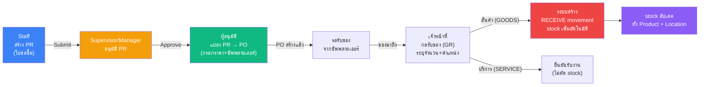

**สรุป:** Staff ขอซื้อ → หัวหน้าอนุมัติ → แปลงเป็นใบสั่งซื้อ → ของมา → กดรับของ → stock เพิ่มอัตโนมัติ

PR มี 2 ประเภท: **STANDARD** (ขอซื้อปกติ) และ **BLANKET** (สัญญาซื้อระยะยาว มี validity period)
แต่ละรายการใน PR ระบุ: **GOODS** (สินค้า → รับเข้าคลัง) หรือ **SERVICE** (บริการ → ยืนยันรับงาน ไม่มี stock)

**กฎสำคัญ:** PO ต้องมาจาก PR เท่านั้น, 1 PR = 1 PO, ทุก PR ต้องมี Cost Center + Cost Element

> **Flow นี้ถูกต้องไหม? มีอะไรอยากปรับไหม?**

---

### Flow 2: คำนวณต้นทุนงาน (Job Costing — 4 องค์ประกอบ)

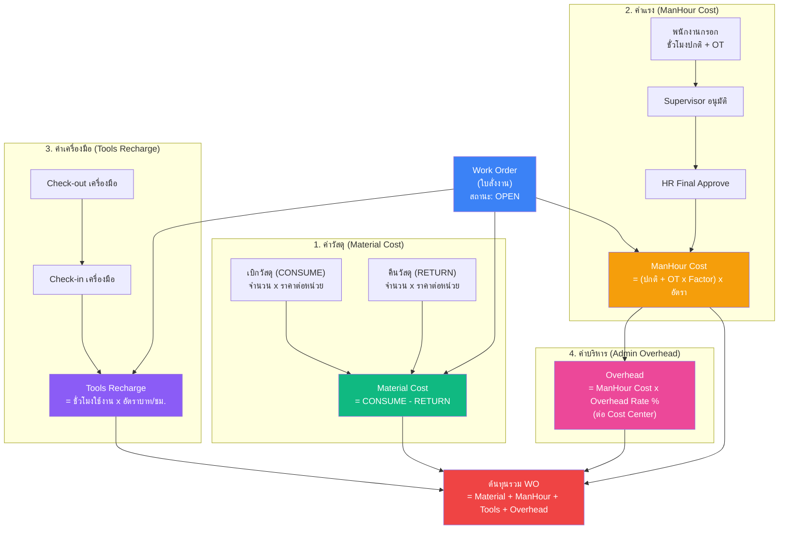

**สรุป:** ต้นทุนงาน = วัสดุ (เบิก-คืน) + แรงงาน (ชม. x อัตรา) + เครื่องมือ (ชม. x อัตรา) + ค่าบริหาร (% ของค่าแรง)

> **สูตร Job Costing ถูกต้องไหม? มี cost element อื่นที่ต้องเพิ่มไหม?**

---

### Flow 3: รายงานประจำวัน → Timesheet → Payroll

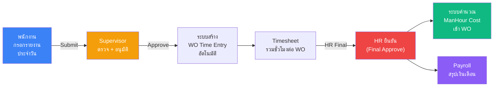

**สรุป:** พนักงานกรอก → หัวหน้าอนุมัติ → สร้าง Timesheet อัตโนมัติ → HR ตรวจ → คำนวณต้นทุนแรงงาน + Payroll

**กฎสำคัญ:** 1 ชั่วโมง = 1 WO (ห้ามซ้อน), กรอกย้อนหลังได้ 7 วัน, OT Factor ≤ Max Ceiling

> **Flow Timesheet/Payroll ถูกต้องไหม?**

---

### Flow 4: ใบเบิกของ (Stock Withdrawal Slip)

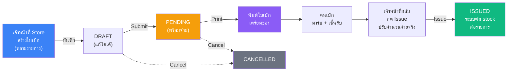

มี 2 ประเภท: **WO_CONSUME** (เบิกเข้า Work Order → สร้าง CONSUME movement) และ **CC_ISSUE** (เบิกจ่ายตาม Cost Center → สร้าง ISSUE movement)
จำนวนจ่ายจริง (issued_qty) อาจน้อยกว่าจำนวนขอ (quantity) ได้

> **Flow ใบเบิกของถูกต้องไหม?**

---

### Flow 5: การเคลื่อนไหวสต็อก (6 ประเภท)

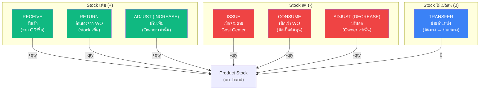

| ประเภท | ทิศทาง | ต้องระบุ | ใครทำได้ |
|--------|--------|---------|---------|
| RECEIVE | +stock | Product + จำนวน + ราคา | Staff+ |
| RETURN | +stock | Work Order (OPEN) + Product (วัสดุ) | Staff+ |
| ISSUE | -stock | Cost Center + Product + จำนวน | Staff+ |
| CONSUME | -stock | Work Order (OPEN) + Product (วัสดุ) | Staff+ |
| TRANSFER | 0 | ตำแหน่งต้นทาง + ปลายทาง (ต่างกัน) | Staff+ |
| ADJUST | +/- | ทิศทาง (เพิ่ม/ลด) + Product + จำนวน | **Owner เท่านั้น** |

กฎสำคัญ: Stock movements **แก้ไขไม่ได้** (immutable) — ถ้าผิดต้องทำ **REVERSAL** (กลับรายการ) เท่านั้น

> **ประเภท Stock Movement ถูกต้องไหม? มีประเภทอื่นที่ต้องเพิ่มไหม?**

---

## A7. สถานะเอกสาร

### ตารางสรุป 10 ประเภท

| เอกสาร | สถานะที่เป็นไปได้ | ย้อนกลับได้ไหม |
|--------|-----------------|--------------|
| Work Order | DRAFT → OPEN → CLOSED | ❌ ห้ามย้อน |
| PR (ใบขอซื้อ) | DRAFT → SUBMITTED → APPROVED → PO_CREATED (+ REJECTED / CANCELLED) | REJECTED กลับแก้ไขได้ |
| PO (ใบสั่งซื้อ) | APPROVED → PARTIAL → RECEIVED (+ CANCELLED) | ❌ |
| SO (ใบสั่งขาย) | DRAFT → SUBMITTED → APPROVED → IN_PROGRESS → COMPLETED (+ REJECTED / CANCELLED) | ❌ |
| Timesheet | DRAFT → SUBMITTED → APPROVED → FINAL (+ REJECTED) | ❌ |
| Leave (ใบลา) | PENDING → APPROVED / REJECTED | ❌ |
| Daily Work Report | DRAFT → SUBMITTED → APPROVED / REJECTED | REJECTED → DRAFT ได้ |
| Withdrawal Slip | DRAFT → PENDING → ISSUED (+ CANCELLED) | ❌ |
| Tool | AVAILABLE ↔ CHECKED_OUT | ✅ สลับได้ |
| Payroll | DRAFT → FINAL | ❌ |

### State Diagrams (4 เอกสารหลัก)

**Work Order:**
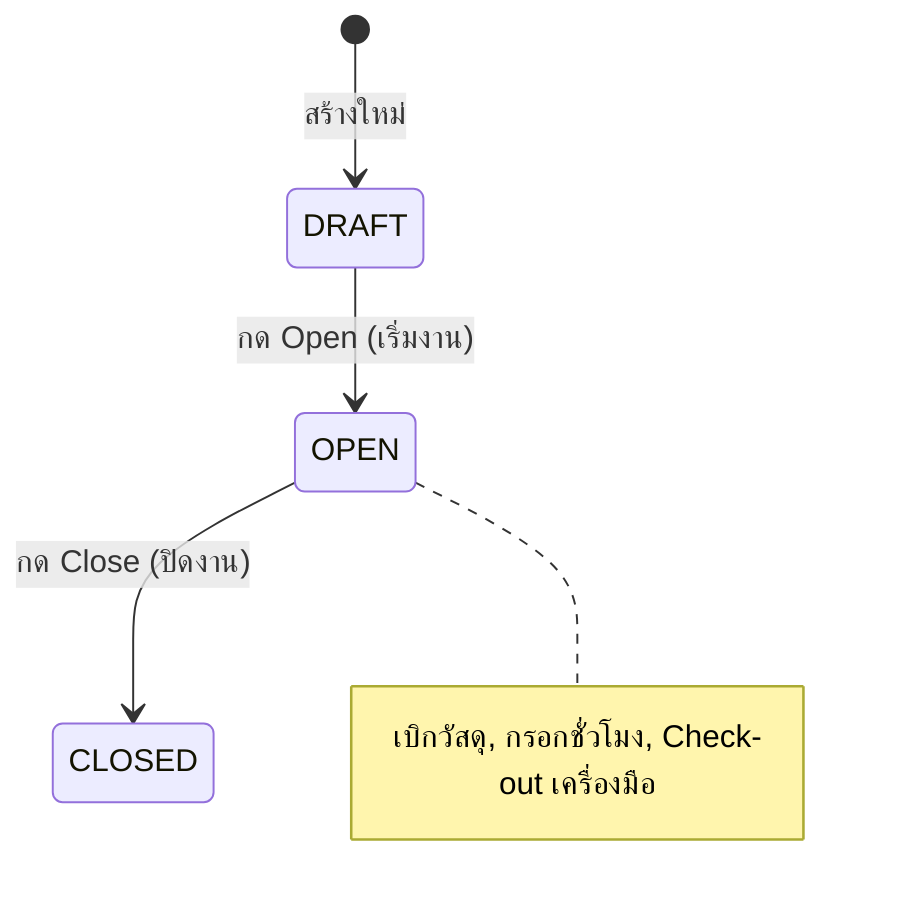

**Purchase Requisition:**
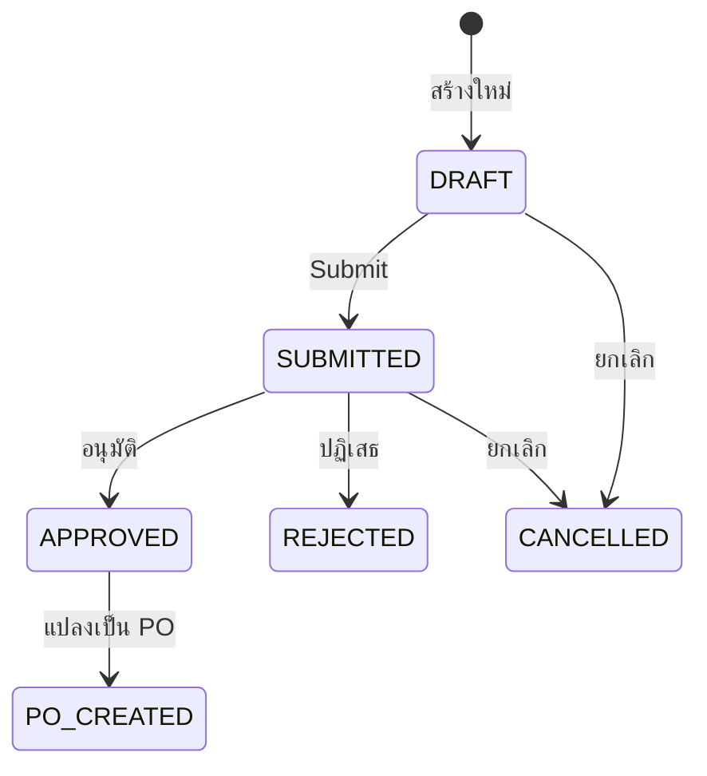

**Withdrawal Slip:**
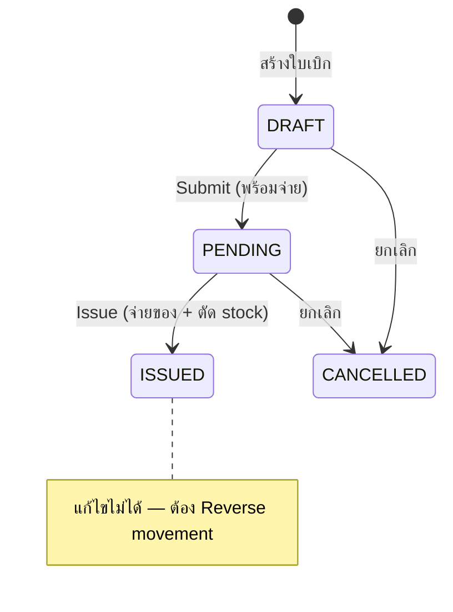

**Timesheet:**
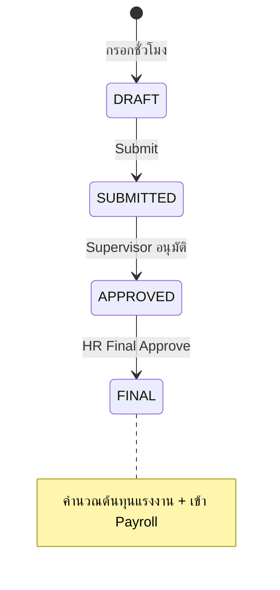

> **สถานะเอกสารถูกต้องไหม? มี flow ไหนที่ต้องเปลี่ยนไหม?**

---

## A8. แผนที่หน้าจอ + ภาพร่าง

### Sidebar — 3 กลุ่ม

**กลุ่ม 1: ของฉัน (ME)**

| เมนู | Route | แท็บย่อย |
|------|-------|---------|
| ของฉัน | /me | รายงานประจำวัน, ใบลา, Timesheet, งานของฉัน |

**กลุ่ม 2: อนุมัติ**

| เมนู | Route | แท็บย่อย |
|------|-------|---------|
| อนุมัติ | /approval | รายงาน(N), PR(N), Timesheet(N), ลา(N), PO(N), SO(N) |

**กลุ่ม 3: ระบบงาน**

| เมนู | Route | แท็บย่อย |
|------|-------|---------|
| Dashboard | / | — (stat cards + recent activity) |
| Supply Chain | /supply-chain | Inventory, Stock Movements, Warehouse, Locations, เครื่องมือ, ใบเบิกของ |
| Work Orders | /work-orders | — (list + detail page) |
| Purchasing | /purchasing | ใบขอซื้อ (PR), ใบสั่งซื้อ (PO) |
| Sales | /sales | — (list + detail page) |
| HR | /hr | พนักงาน, Timesheet, กรอกชั่วโมง WO, Standard Timesheet, ลาหยุด, โควต้าลา, Payroll, ตารางกะ, อนุมัติรายงาน |
| Customer | /customers | — (list) |
| Planning | /planning | Daily Plan, Reservation |
| Master Data | /master | แผนก, Cost Center, Cost Element, ประเภท OT, ประเภทลา, ประเภทกะ, ตารางกะ, ซัพพลายเออร์ |
| Finance | /finance | — (summary report) |
| Admin | /admin | Roles, Users, Audit Log, Org Config |

**Detail Pages:**

| หน้า | Route | เข้าจาก |
|------|-------|---------|
| Work Order Detail | /work-orders/:id | รายการ WO |
| PR Detail | /purchasing/pr/:id | รายการ PR |
| PO Detail | /purchasing/po/:id | รายการ PO |
| SO Detail | /sales/:id | รายการ SO |
| Withdrawal Slip Detail | /withdrawal-slips/:id | รายการใบเบิก |

### ภาพร่างหน้าจอหลัก

**Dashboard:**
```
┌─────────────────────────────────────────────────────────┐
│  SSS Corp ERP                          [User] [Logout]  │
├────────┬────────────────────────────────────────────────┤
│  MENU  │  Dashboard                                     │
│        │  ┌──────────┐ ┌──────────┐ ┌──────────┐       │
│ ของฉัน  │  │ WO เปิด   │ │ PR รอ    │ │ Stock    │       │
│ อนุมัติ  │  │    12     │ │ อนุมัติ 3  │ │ ต่ำ  5  │       │
│        │  └──────────┘ └──────────┘ └──────────┘       │
│ ระบบงาน │  ┌──────────┐ ┌──────────┐ ┌──────────┐       │
│ Dashboard│ │ PO รอรับ  │ │ Timesheet│ │ ใบเบิก   │       │
│ Supply..│  │ ของ  4   │ │ รอ  8   │ │ PENDING 2│       │
│ Work O..│  └──────────┘ └──────────┘ └──────────┘       │
│ Purcha..│  [ตาราง: รายการล่าสุด / กิจกรรมวันนี้]          │
│ ...     │                                               │
└────────┴────────────────────────────────────────────────┘
```

**Work Order Detail:**
```
┌────────────────────────────────────────────────────────┐
│  ← Work Order: WO-2026-0015          [StatusBadge:OPEN]│
│  ┌─ ข้อมูลทั่วไป ───────────────────────────────┐       │
│  │ เลขที่: WO-2026-0015    ลูกค้า: ABC Co.       │       │
│  │ ชื่องาน: ผลิตชิ้นส่วน A   Cost Center: ผลิต-1   │       │
│  └──────────────────────────────────────────────┘       │
│  ┌─ สรุปต้นทุน ─────────────────────────────────┐       │
│  │ ค่าวัสดุ:    15,000    ค่าแรง:    42,500      │       │
│  │ ค่าเครื่องมือ: 3,200    ค่าบริหาร:  8,500      │       │
│  │                     รวม:  69,200 บาท          │       │
│  └──────────────────────────────────────────────┘       │
│  ┌─ วัสดุที่เบิก ─────────────────────────────────┐      │
│  │ [+ เบิกวัสดุ]  [+ คืนวัสดุ]                     │      │
│  │ วันที่ | สินค้า  | ประเภท  | จำนวน | ต้นทุน       │      │
│  │ 01/03 | เหล็ก  | CONSUME | 50   | 7,500       │      │
│  │ 02/03 | เหล็ก  | RETURN  | -5   | -750        │      │
│  └──────────────────────────────────────────────┘      │
│  [กดปิดงาน]                                            │
└────────────────────────────────────────────────────────┘
```

**Approval Center:**
```
┌────────────────────────────────────────────────────────┐
│  Approval Center                                       │
│  [รายงาน(3)] [PR(2)] [Timesheet(5)] [ลา(1)]            │
│  [PO(0)] [SO(1)]          (ตัวเลข = จำนวนรออนุมัติ)     │
│  ─────────────────────────────────────────────         │
│  ┌─ PR Approval Tab ─────────────────────────┐         │
│  │ เลขที่   | ผู้ขอ   | CC    | ยอด   | Action │        │
│  │ PR-0002 | สมชาย  | ผลิต-1| 8,000 | [อนุมัติ]│        │
│  │ PR-0004 | สมหญิง | ซ่อม  | 3,500 | [อนุมัติ]│        │
│  │ คลิก [อนุมัติ] → Confirm → สถานะเปลี่ยนทันที  │        │
│  │ คลิก [ปฏิเสธ] → กรอกเหตุผล → สถานะเปลี่ยน     │        │
│  └────────────────────────────────────────────┘        │
└────────────────────────────────────────────────────────┘
```

> **หน้าจอเป็นอย่างที่ต้องการไหม? มีหน้าไหนที่อยากเปลี่ยน layout?**

---

## A9. ระบบสิทธิ์

### 5 บทบาทในระบบ

| บทบาท | คำอธิบาย | จำนวนสิทธิ์ | ขอบเขตข้อมูล |
|--------|---------|-----------|-------------|
| **Owner** | เจ้าของ/Admin | 133 (ทั้งหมด) | ทั้งองค์กร |
| **Manager** | ผู้จัดการ | ~81 | ทั้งองค์กร |
| **Supervisor** | หัวหน้างาน | ~65 | ทั้งแผนก |
| **Staff** | พนักงาน | ~39 | ของตัวเอง |
| **Viewer** | ผู้ดูข้อมูล | ~26 | ทั้งองค์กร |

### สิทธิ์ต่อ Module

| Module | Owner | Manager | Supervisor | Staff | Viewer |
|--------|:-----:|:-------:|:----------:|:-----:|:------:|
| Inventory (สินค้า) | CRUD+Export | CRU+Export | CRU+Export | R | R+Export |
| Stock Movement | CRD+Export | CR+Export | CR+Export | CR+Export | R |
| Withdrawal (ใบเบิก) | CRUD+Approve+Export | CR+Approve+Export | CR+Approve+Export | CR | R+Export |
| Warehouse (คลัง) | CRUD | CRU | CRU | CR | R |
| Work Order | CRUD+Approve+Export | CRU+Approve+Export | CRU+Approve+Export | CRU+Export | R |
| Planning (แผนงาน) | CRUD | CRU | R | R | R |
| Purchasing PR | CRUD+Approve | CRU+Approve | CRU+Approve | CR | R |
| Purchasing PO | CRUD+Approve+Export | CRU+Approve | CRU+Approve | CR | R+Export |
| Sales (ขาย) | CRUD+Approve+Export | CRU+Approve+Export | CRU+Approve+Export | CR | R+Export |
| HR (บุคคล) | Full | Most | Dept scope | Own data | - |
| Tools (เครื่องมือ) | CRUD+Execute+Export | CRU+Execute+Export | CRU+Execute+Export | R+Execute | R+Export |
| Master Data | CRUD | CRU | CRU | R | R |
| Customer | CRUD+Export | CRU+Export | CRU+Export | R | R+Export |
| Finance | R+Export | R | R | R | R |
| Admin | Full | - | - | - | - |

*C=Create, R=Read, U=Update, D=Delete*

### ขอบเขตข้อมูลตามบทบาท (Data Scope)

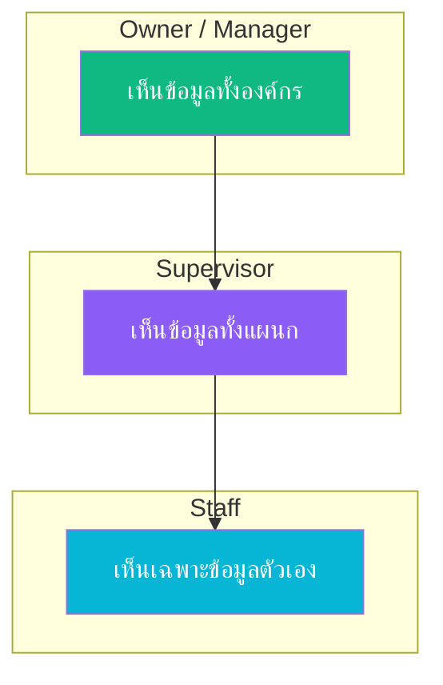

| ข้อมูล | Staff | Supervisor | Manager/Owner |
|--------|-------|------------|---------------|
| Timesheet, ใบลา, รายงานประจำวัน | ของตัวเอง | ทั้งแผนก | ทั้งองค์กร |
| พนักงาน | ไม่มีสิทธิ์ | ทั้งแผนก | ทั้งองค์กร |
| ใบขอซื้อ (PR) | ของตัวเอง | ทั้งแผนก | ทั้งองค์กร |
| Inventory, WO, อื่นๆ | ทั้งองค์กร | ทั้งองค์กร | ทั้งองค์กร |
| Payroll, Finance | ไม่มีสิทธิ์ | ไม่มีสิทธิ์ | ทั้งองค์กร |

> **ระบบสิทธิ์ตรงกับความต้องการไหม? อยากเพิ่ม/ลด สิทธิ์ role ไหนไหม?**

---

## A10. กฎธุรกิจสำคัญ

กฎที่ระบบบังคับใช้อัตโนมัติ — 88 ข้อ สรุปเป็นภาษาคน:

### สต็อก (Inventory)

| กฎ | อธิบาย |
|-----|--------|
| ห้ามติดลบ | จำนวนสินค้าในสต็อกต้อง >= 0 เสมอ |
| เบิกไม่เกิน | เบิกหรือจ่ายสินค้าได้ไม่เกินจำนวนที่มี (ทั้ง product level และ location level) |
| ห้ามแก้ movement | การเคลื่อนไหว stock แก้ไขไม่ได้ ต้องทำ "กลับรายการ" (Reversal) |
| SKU ห้ามซ้ำ | รหัสสินค้าต้องไม่ซ้ำกัน ถ้ามี movement แล้วห้ามเปลี่ยน |
| SERVICE ไม่มี stock | สินค้าประเภท "บริการ" ไม่นับ stock, ห้ามสร้าง movement |
| Stock ต่ำ | ถ้า on_hand <= min_stock → แจ้งเตือน (แถวเหลือง + นับบน stat card) |
| ราคาวัสดุ | สินค้าประเภท MATERIAL ต้องมีราคา >= 1.00 บาท |

### ใบสั่งงาน (Work Order)

| กฎ | อธิบาย |
|-----|--------|
| สถานะไปข้างหน้าเท่านั้น | DRAFT → OPEN → CLOSED ห้ามย้อนกลับ |
| ปิดงานต้องมีสิทธิ์ | ต้องเป็น Supervisor+ ถึงปิด WO ได้ |
| ลบได้เฉพาะ DRAFT | ลบ WO ได้เฉพาะสถานะ DRAFT + ไม่มี movement + เจ้าของเท่านั้น |
| เบิกวัสดุต้อง WO เปิด | CONSUME/RETURN ได้เฉพาะ WO ที่สถานะ OPEN |
| เบิกได้เฉพาะวัสดุ | CONSUME/RETURN ได้เฉพาะสินค้าประเภท MATERIAL หรือ CONSUMABLE |
| ต้นทุนรวม 4 ส่วน | Material + ManHour + Tools Recharge + Admin Overhead |
| ค่าวัสดุ = เบิก - คืน | Material Cost = CONSUME - RETURN (ต่ำสุด = 0) |

### เบิกของ (Stock Movement — 6 ประเภท)

| กฎ | อธิบาย |
|-----|--------|
| CONSUME ต้องมี WO | ต้องระบุ Work Order ที่สถานะ OPEN |
| RETURN ต้องมี WO | ต้องระบุ Work Order ที่สถานะ OPEN |
| ISSUE ต้องมี Cost Center | ต้องระบุ Cost Center ที่ active |
| TRANSFER ต้องคนละที่ | ต้องมีตำแหน่งต้นทาง + ปลายทาง และต้องต่างกัน |
| TRANSFER stock คงที่ | ต้นทาง -qty, ปลายทาง +qty, จำนวนรวมไม่เปลี่ยน |
| ADJUST Owner เท่านั้น | เฉพาะ Owner ปรับ stock ได้ (เพิ่ม/ลด) |

### ใบเบิกของ (Withdrawal Slip)

| กฎ | อธิบาย |
|-----|--------|
| สถานะ: DRAFT → PENDING → ISSUED | ห้ามย้อน, Cancel ได้จาก DRAFT/PENDING |
| จ่ายน้อยกว่าขอได้ | issued_qty สามารถ < quantity (จ่ายตามของจริง) |
| WO ต้อง OPEN | ถ้าเบิกเข้า WO, WO ต้องสถานะ OPEN ตอน Issue |
| ห้ามสินค้า SERVICE | ทุกรายการต้องเป็น MATERIAL หรือ CONSUMABLE |
| ISSUED แก้ไม่ได้ | ถ้าผิดต้อง Reverse movement ทีละรายการ |

### ชั่วโมงทำงาน (Timesheet)

| กฎ | อธิบาย |
|-----|--------|
| 1 ชั่วโมง = 1 งาน | ชั่วโมงเดียวกันกรอกให้ WO ได้แค่ 1 ใบ (ห้ามซ้อน) |
| กรอกย้อนหลังได้ 7 วัน | เกิน 7 วัน ต้องให้ HR ปลดล็อคก่อน |
| ชั่วโมงไม่เกินวัน | ชั่วโมงรวมต่อวัน ≤ ชั่วโมงทำงานปกติของวันนั้น |
| หัวหน้ากรอกแทนได้ | ถ้าพนักงานไม่กรอก Supervisor กรอกแทนได้ |
| 3 ขั้นอนุมัติ | กรอก → Supervisor อนุมัติ → HR Final (ก่อนเข้า Payroll) |
| OT Factor ห้ามเกิน Ceiling | OT Factor พิเศษต้อง ≤ ค่าสูงสุดที่ Admin กำหนด |
| OT อัตราตาม Master Data | วันธรรมดา 1.5x, วันหยุด 2.0x, นักขัตฤกษ์ 3.0x |

### ลางาน (Leave)

| กฎ | อธิบาย |
|-----|--------|
| ลาเกินโควต้าไม่ได้ | จำนวนวันลาใช้ + ขอลาใหม่ ≤ โควต้า |
| ลาได้เงิน = 8 ชม. | วันลาที่ได้เงิน → Timesheet คิด 8 ชม. ปกติ |
| ลาไม่ได้เงิน = 0 ชม. | วันลาไม่ได้เงิน → Timesheet คิด 0 ชม. (หัก payroll) |
| วันลาห้ามกรอก WO | วันที่ลา ห้ามกรอกชั่วโมงให้ Work Order |

### เครื่องมือ (Tools)

| กฎ | อธิบาย |
|-----|--------|
| 1 คน ต่อ 1 เครื่อง | เครื่องมือถูก checkout ได้ 1 คน ณ เวลาเดียว |
| คิดเงินตอน check-in | ค่าเครื่องมือคำนวณเมื่อคืน (ชั่วโมง x อัตรา) ไม่ใช่ตอนยืม |

### จัดซื้อ (Purchasing)

| กฎ | อธิบาย |
|-----|--------|
| PO ต้องมา PR ก่อน | ห้ามสร้าง PO ตรง ต้องผ่าน PR ก่อนเสมอ |
| 1 PR = 1 PO | แต่ละ PR แปลงเป็น PO ได้ 1 ใบ |
| PR ต้องมี Cost Center | ทุก PR ต้องระบุ Cost Center |
| PR line ต้องมี Cost Element | ทุกรายการใน PR ต้องระบุ Cost Element |
| GOODS ต้องมีสินค้า | รายการประเภท GOODS ต้องเลือกสินค้า |
| SERVICE ต้องมีคำอธิบาย | รายการประเภท SERVICE ต้องกรอกคำอธิบาย |
| BLANKET ต้องมีวันที่ | PR แบบสัญญาระยะยาวต้องกำหนดวันเริ่ม-สิ้นสุด |
| รับของ GOODS = stock เพิ่ม | รับของสินค้า → สร้าง RECEIVE movement อัตโนมัติ |
| รับงาน SERVICE = ยืนยัน | รับงานบริการ → แค่ยืนยันรับ (ไม่มี stock) |

### การวางแผน (Planning)

| กฎ | อธิบาย |
|-----|--------|
| 1 คน = 1 งาน/วัน | จัดคนเข้างานได้ 1 WO ต่อวัน |
| 1 เครื่องมือ = 1 งาน/วัน | จัดเครื่องมือเข้างานได้ 1 WO ต่อวัน |
| คนลาจัดงานไม่ได้ | วันที่พนักงานลา ห้ามจัดลงงาน |
| จองวัสดุหัก stock | Available = on_hand - จำนวนจองแล้ว |
| จองเครื่องมือห้ามซ้อน | ห้ามจองเครื่องมือซ้อนช่วงวันเดียวกัน |

### ระบบ (Admin)

| กฎ | อธิบาย |
|-----|--------|
| Owner ลดตัวเองไม่ได้ | เจ้าของระบบห้ามลด role ตัวเอง |
| สิทธิ์ต้องอยู่ในรายการ | Permission ต้องอยู่ในรายการที่กำหนด (133 ตัว) |
| Action ต้องถูกต้อง | ต้องเป็น 1 ใน 7: create/read/update/delete/approve/export/execute |
| ทุก query ต้อง filter org | Multi-tenant: ข้อมูลแยกตามองค์กร |
| เงินห้ามใช้ Float | ตัวเลขเงินต้องใช้ Numeric(12,2) เท่านั้น |

> **กฎธุรกิจถูกต้องไหม? มีกฎไหนที่ต้องเปลี่ยนหรือเพิ่ม?**

---

## A11. ข้อบังคับเด็ดขาด (Hard Constraints)

ข้อบังคับเหล่านี้ต้องรักษาไว้ตลอด ไม่ว่าจะ implement อะไรเพิ่ม:

| # | ข้อบังคับ |
|---|----------|
| 1 | Permission format: `module.resource.action` (3 ส่วนเสมอ) |
| 2 | Stock movements เป็น immutable — แก้ผ่าน REVERSAL เท่านั้น |
| 3 | Financial fields ใช้ Numeric(12,2) — ห้ามใช้ Float |
| 4 | on_hand >= 0 ตลอดเวลา |
| 5 | Multi-tenant: ทุก query ต้องมี org_id filter |
| 6 | Data Scope: HR endpoints ต้อง filter ตาม role |
| 7 | WO Status: DRAFT→OPEN→CLOSED ห้ามย้อน |
| 8 | Timesheet: 1 employee/WO/date = unique (ห้าม overlap) |
| 9 | OT Factor ≤ Maximum Ceiling ที่ Admin กำหนด |
| 10 | PO ต้องสร้างจาก PR เท่านั้น |
| 11 | Icons: ใช้ Lucide React เท่านั้น — ห้ามใช้ emoji / Ant Design Icons |
| 12 | Token: เก็บใน Zustand (memory) เท่านั้น — ห้าม localStorage |

> **ข้อบังคับถูกต้องไหม? มีอะไรที่ต้องเพิ่มหรือลดไหม?**

---

## A12. Progress Summary

| Phase | ชื่อ | สถานะ |
|-------|------|--------|
| 0 | Foundation | ✅ 100% |
| 1 | Core Modules (Inventory, Master, Warehouse) | ✅ 100% |
| 2 | HR + Job Costing | ✅ 100% |
| 3 | Business Flow + Frontend | ✅ 100% |
| 4 | Organization, Planning & Production | ✅ 100% |
| 5 | Staff Portal & Daily Report | ✅ 100% |
| 6 | Data Scope | ✅ 100% |
| 7 | Approval Center + PR/PO Redesign | ✅ 100% |
| 11 (partial) | Stock-Location, Supplier, QR, Withdrawal | ✅ 100% |
| 8 | Dashboard & Analytics | ❌ ยังไม่เริ่ม |
| 9 | Notification Center | ❌ ยังไม่เริ่ม |
| 10 | Export & Print | ❌ ยังไม่เริ่ม |
| 11 (remaining) | Inventory Enhancement | ❌ ยังไม่เริ่ม |
| 12 | Mobile Responsive | ❌ ยังไม่เริ่ม |
| 13 | Audit & Security | ❌ ยังไม่เริ่ม |
| 14 | AI Performance Monitoring | ❌ ยังไม่เริ่ม |

**สรุป: Core operations ครบ 100% — ขาด analytics, export, mobile, security, AI**

> **สรุปนี้ตรงกับที่คุณเข้าใจไหม?**

---

# ส่วน B — แผนที่วางไว้แล้ว (Phase 8-14)

---

## B1. Dashboard & Analytics (Phase 8)

เปลี่ยน Dashboard จาก basic stats เป็น KPI dashboard ที่มี charts, trends, และ actionable insights ปัจจุบัน Admin Dashboard มีแค่ 4 stat cards ซึ่งเรียบง่ายเกินไปเมื่อเทียบกับข้อมูลที่ระบบมี

| Feature | รายละเอียด |
|---------|-----------|
| KPI Dashboard | Stat cards: ยอดขาย, ต้นทุน WO, สถานะ stock, pending approvals |
| Charts | WO Cost Trend, Inventory Turnover, Revenue (Recharts/Ant Charts) |
| Manager Dashboard v2 | Department comparison, cost center breakdown, employee productivity |
| Staff Dashboard v2 | Personal KPIs: WO assigned, hours logged, leave balance |
| Finance Dashboard | P&L summary, cost analysis, budget vs actual |
| Aggregation APIs | Backend endpoints สำหรับ aggregate data |

> **คุณมีความเห็นอย่างไรกับ feature นี้? มี KPI ตัวไหนที่สำคัญที่สุดสำหรับธุรกิจคุณ?**

---

## B2. Notification Center (Phase 9)

ระบบแจ้งเตือน In-app + Email (optional) ปัจจุบันผู้ใช้ต้อง "เข้าไปดู" เองว่ามีอะไรรออนุมัติ ซึ่งทำให้งานช้า

| Feature | รายละเอียด |
|---------|-----------|
| Notification Model | user_id, type, title, message, is_read, link |
| Event Triggers | แจ้งเตือนเมื่อ: มีงานรออนุมัติ, สถานะเปลี่ยน, stock ต่ำ |
| Bell Icon | Header dropdown + unread badge count |
| Real-time Push | WebSocket/SSE หรือ polling |
| Email Channel | ส่ง email ควบคู่กับ in-app |
| User Preferences | เลือกได้ว่าจะรับแจ้งเตือนช่องทางไหน |

> **คุณมีความเห็นอย่างไร? ต้องการ email notification ด้วยไหม หรือแค่ in-app ก็พอ?**

---

## B3. Export & Print (Phase 10)

PDF generation + Excel export + Print-friendly layouts ปัจจุบันมีแค่ Withdrawal Slip ที่ print ได้ และ Finance ที่ export CSV ได้

| Feature | รายละเอียด |
|---------|-----------|
| PDF Engine | สร้าง PDF จากข้อมูลในระบบ |
| WO Report PDF | Cost summary, material list, manhour breakdown |
| PO/SO PDF | Document header, line items, totals, approval signatures |
| Payroll PDF | Employee payslip |
| Excel Export | ทุก list page สามารถ export Excel ได้ |
| Print CSS | @media print styles สำหรับหน้าสำคัญ |
| Report Templates | Admin กำหนด header (logo, ที่อยู่บริษัท) |

> **เอกสารไหนที่ต้อง print บ่อยที่สุดในธุรกิจคุณ? PO? Invoice? Payslip?**

---

## B4. Inventory Enhancement (Phase 11 — ส่วนที่เหลือ)

| Feature | รายละเอียด |
|---------|-----------|
| Stock Aging Report | รายงานมูลค่าสินค้าตามอายุ (0-30, 31-60, 61-90, 90+ วัน) |
| Batch/Lot Tracking | batch_number บน StockMovement, FIFO/LIFO costing |
| Barcode/QR for SKU | Generate barcode สำหรับ SKU + print label |
| Stock Take | Cycle count workflow: count → variance → adjust |
| Multi-warehouse Transfer | TRANSFER ระหว่าง warehouse พร้อม approval |

> **คุณมีความเห็นอย่างไร? มี feature ไหนที่จำเป็นเร่งด่วน?**

---

## B5. Mobile Responsive (Phase 12)

| Feature | รายละเอียด |
|---------|-----------|
| Responsive Layout | Ant Design Grid breakpoints, collapsible sidebar |
| Mobile Staff Portal | Daily Report create/edit จากมือถือ |
| Mobile Tool Check-in/out | Simplified form สำหรับ field workers |
| Mobile Approval | Swipe approve/reject |
| PWA | Offline-first สำหรับ read |

> **พนักงานใช้มือถือกรอกข้อมูลบ่อยไหม? หรือใช้แค่ desktop ก็พอ?**

---

## B6. Audit & Security (Phase 13)

| Feature | รายละเอียด |
|---------|-----------|
| Enhanced Audit Trail | Model-level event logging (who, what, when, before/after values) |
| Login History | Device, IP, location, timestamp per user |
| Session Management | Active sessions list, remote logout |
| Password Policy | Min length, complexity, expiry, history |
| Two-Factor Auth (2FA) | TOTP (Google Authenticator) |
| Per-user Rate Limiting | Different limits per role |
| Data Export Audit | Log all export/download actions |

> **ระบบจะมีผู้ใช้กี่คน? ต้องการ 2FA ไหม?**

---

## B7. AI-Powered Performance Monitoring (Phase 14)

| Feature | รายละเอียด |
|---------|-----------|
| Performance Middleware | Response time tracking, slow request detection |
| DB Query Profiler | Slow query logging, N+1 detection |
| Frontend Performance | Web Vitals (LCP/FID/CLS) |
| AI Analysis Engine | Claude API วิเคราะห์ + แนะนำเป็นภาษาไทย |
| Performance Dashboard | Stat cards + AI card + charts |
| Natural Language Query | ถามเป็นภาษาคน → AI ตอบ |
| Scheduled AI Report | Daily background job + email digest |

> **คุณมีความเห็นอย่างไรกับ feature นี้? จำเป็นไหม หรือไว้ทีหลัง?**

---

# ส่วน C — ช่องว่างที่พบ

จากการวิเคราะห์ codebase พบช่องว่างที่ระบบยังขาดและไม่ได้อยู่ใน Phase 8-14:

| # | Feature | ปัญหาปัจจุบัน | ผลกระทบ |
|---|---------|--------------|---------|
| C1 | **Invoice / Billing** | SO approved แล้วไม่มี Invoice — ขาด revenue tracking | สูง — ไม่สามารถ track รายได้ |
| C2 | **Delivery Order** | SO approved แล้วไม่มีใบส่งของ — ขาด fulfillment flow | สูง — ไม่สามารถ track การส่งของ |
| C3 | **Accounts Payable** | PO รับของแล้วไม่มีที่ track การจ่ายเงิน | กลาง — ต้อง track manual |
| C4 | **Budget Management** | Cost Center มี overhead_rate แต่ไม่มี budget allocation | กลาง — ไม่สามารถควบคุมงบ |
| C5 | **Tax Calculation (VAT 7%)** | ไม่มีการคำนวณ VAT บน PO/SO/Invoice | สูง — จำเป็นก่อน production |
| C6 | **Multi-currency** | รองรับเฉพาะ THB | ต่ำ — ถ้าไม่มีธุรกรรมต่างประเทศ |
| C7 | **WO Gantt Chart** | Planning มี Daily Plan แต่ไม่มี visual timeline | กลาง — ดูภาพรวมยาก |
| C8 | **Employee Self-service** | พนักงานเปลี่ยนรหัสผ่าน/แก้ไขข้อมูลส่วนตัว/ดู payslip ไม่ได้ | กลาง — ต้องให้ HR ทำให้ |

---

## C1. Invoice / Billing (ใบแจ้งหนี้)

**ปัญหา:** SO ที่ approved แล้ว ไม่มีทางสร้าง Invoice — ขาด revenue tracking ทั้งหมด

| Feature | รายละเอียด |
|---------|-----------|
| Invoice จาก SO | สร้าง Invoice จาก Sales Order ที่ approved |
| Invoice Status | DRAFT → SENT → PAID → CANCELLED |
| Payment Tracking | บันทึกการชำระเงิน (partial/full) |
| Accounts Receivable | ลูกหนี้การค้า — ยอดค้างชำระ per customer |

> **ต้องการ Invoice system ไหม? ธุรกิจคุณออก Invoice บ่อยไหม?**

---

## C2. Delivery Order (ใบส่งของ)

**ปัญหา:** SO ที่ approved แล้ว ไม่มีทางสร้างใบส่งของ — ขาด fulfillment flow

| Feature | รายละเอียด |
|---------|-----------|
| DO จาก SO | สร้าง Delivery Order จาก SO |
| DO Status | DRAFT → SHIPPED → DELIVERED |
| Stock Deduction | ตัด stock เมื่อ ship |

> **ต้องการ Delivery Order ไหม? หรือส่งของแล้ว track นอกระบบ?**

---

## C3. Accounts Payable (เจ้าหนี้การค้า)

**ปัญหา:** PO ที่รับของแล้ว ไม่มีที่ track ว่าจ่ายเงินแล้วหรือยัง

| Feature | รายละเอียด |
|---------|-----------|
| Payment Record | บันทึกการจ่ายเงินต่อ PO |
| AP Aging | รายงานเจ้าหนี้ตามอายุ |
| Payment Status on PO | UNPAID → PARTIAL → PAID |

> **ต้องการ track การจ่ายเงินต่อ PO ไหม? หรือ track นอกระบบ?**

---

## C4. Budget Management (งบประมาณ)

**ปัญหา:** Cost Center มี overhead_rate แต่ยังไม่มี budget allocation

| Feature | รายละเอียด |
|---------|-----------|
| Budget per Cost Center | กำหนดงบประมาณต่อ Cost Center ต่อปี/ไตรมาส |
| Budget vs Actual | เปรียบเทียบงบกับค่าใช้จ่ายจริง |
| Budget Alert | แจ้งเตือนเมื่อใช้งบเกิน threshold |

> **มีการตั้งงบประมาณต่อ Cost Center ไหม? ต้องการเปรียบเทียบ budget vs actual ไหม?**

---

## C5. Tax Calculation (ภาษี)

**ปัญหา:** ปัจจุบันไม่มีการคำนวณ VAT 7% บน PO/SO/Invoice

| Feature | รายละเอียด |
|---------|-----------|
| VAT 7% | คำนวณ VAT อัตโนมัติบน PO, SO, Invoice |
| Tax Report | รายงานภาษีซื้อ-ภาษีขาย |
| Withholding Tax | หัก ณ ที่จ่าย |

> **ธุรกิจคุณจด VAT ไหม? ต้องการหัก ณ ที่จ่ายไหม?**

---

## C6. Multi-currency (หลายสกุลเงิน)

**ปัจจุบัน:** รองรับเฉพาะ THB

| Feature | รายละเอียด |
|---------|-----------|
| Currency Master | สกุลเงิน + อัตราแลกเปลี่ยน |
| PO/SO Currency | เลือกสกุลเงินต่อ document |
| Auto Convert | แปลงเป็น THB ตามอัตราแลกเปลี่ยน |

> **มีธุรกรรมต่างประเทศไหม? ซื้อ/ขายเป็น USD หรือสกุลอื่นไหม?**

---

## C7. WO Gantt Chart / Visual Timeline

**ปัจจุบัน:** Planning มี Daily Plan แต่ไม่มี visual timeline

| Feature | รายละเอียด |
|---------|-----------|
| Gantt Chart | แสดง WO timeline แบบ visual |
| Drag & Drop | ลาก WO เพื่อเปลี่ยนวันที่ |
| Resource View | ดูว่าพนักงาน/เครื่องมือถูกจัดที่ไหน |

> **ต้องการ Gantt chart สำหรับวางแผนงานไหม?**

---

## C8. Employee Self-service

**ปัจจุบัน:** พนักงานเปลี่ยนรหัสผ่าน/แก้ไขข้อมูลส่วนตัว/ดู payslip ไม่ได้

| Feature | รายละเอียด |
|---------|-----------|
| Change Password | เปลี่ยนรหัสผ่านเอง |
| Edit Profile | แก้ไขข้อมูลส่วนตัว (เบอร์โทร, ที่อยู่) |
| View Payslip | ดู payslip ของตัวเอง |

> **พนักงานควรเปลี่ยนรหัสผ่านเองได้ไหม? ต้องการดู payslip เองไหม?**

---

# ส่วน D — ลำดับความสำคัญที่แนะนำ

จากสิ่งที่มีอยู่ สิ่งที่ขาด และ UX issues ที่พบ แนะนำลำดับดังนี้:

| ลำดับ | Feature | เหตุผล |
|-------|---------|--------|
| 1 | **Export & Print (B3)** | ผู้ใช้ต้องการ print PO/SO/Payslip ทุกวัน — เป็น daily need ที่ขาดไม่ได้ |
| 2 | **Cross-cutting UX Fix (A5)** | แก้ Select limit:500, error handling, loading states — กระทบทุก module |
| 3 | **Tax Calculation (C5)** | VAT 7% จำเป็นก่อน production — กระทบ PO/SO/Invoice ทั้งหมด |
| 4 | **Dashboard & Analytics (B1)** | ระบบมีข้อมูลครบแล้ว แต่ยังไม่มี visualization — เป็น quick win |
| 5 | **Notification Center (B2)** | ลดการ "เข้าไปดู" ว่ามีอะไรรอ — เพิ่ม productivity |
| 6 | **Employee Self-service (C8)** | พื้นฐานที่ขาด — เปลี่ยนรหัสผ่าน, ดู payslip |
| 7 | **Invoice/Billing (C1) + Delivery Order (C2)** | ปิด revenue cycle ให้ครบ (SO → DO → Invoice → Payment) |
| 8 | **Mobile Responsive (B5)** | Staff ต้องกรอก Daily Report จากหน้างาน |
| 9 | **Security (B6)** | สำคัญก่อน production scale |
| 10 | **AI Performance (B7)** | Nice-to-have, ทำทีหลังได้ |

> **คุณเห็นด้วยกับลำดับนี้ไหม? อยากปรับอะไร?**

---

# คำศัพท์ (Glossary)

| คำ | ความหมาย |
|----|----------|
| PR | Purchase Requisition — ใบขอซื้อ |
| PO | Purchase Order — ใบสั่งซื้อ |
| SO | Sales Order — ใบสั่งขาย |
| GR | Goods Receipt — การรับของ |
| WO | Work Order — ใบสั่งงาน/ใบสั่งผลิต |
| DO | Delivery Order — ใบส่งของ |
| BR | Business Rule — กฎเกณฑ์ทางธุรกิจ |
| RBAC | Role-Based Access Control — การควบคุมสิทธิ์ตามบทบาท |
| Data Scope | ขอบเขตข้อมูลที่แต่ละ role เห็น |
| Job Costing | การคำนวณต้นทุนต่อ Work Order |
| Approval Bypass | ข้ามขั้นตอนอนุมัติ (auto-approve) ตาม OrgApprovalConfig |
| Standard Timesheet | Timesheet ที่ระบบ generate อัตโนมัติตาม Shift Roster |
| Shift Roster | ตารางกะการทำงานรายวันต่อพนักงาน |
| CC | Cost Center — ศูนย์ต้นทุน |
| CE | Cost Element — หมวดต้นทุน |
| VAT | Value Added Tax — ภาษีมูลค่าเพิ่ม 7% |
| AP | Accounts Payable — เจ้าหนี้การค้า |
| AR | Accounts Receivable — ลูกหนี้การค้า |
| PWA | Progressive Web App — เว็บแอปที่ทำงานคล้าย native app |
| UX | User Experience — ประสบการณ์การใช้งาน |
| KPI | Key Performance Indicator — ตัวชี้วัดผลงาน |

---

*SSS Corp ERP — PRD V3 | Merged from SYSTEM_OVERVIEW_V2 + SSS_CORP_ERP_PRD_V4 | 2026-03-02*
*เอกสารนี้เป็น living document — จะ update เมื่อมีการเปลี่ยนแปลง*
