# SSS Corp ERP — Product Requirements Document V4

> **เอกสารนี้คือ "ความจริงเดียว" (Single Source of Truth) ของ project**
> ตรวจสอบกับ codebase จริง commit `bc1e092` เมื่อ 2026-03-02
> V4 รวม feedback จาก Product Owner (P'Hot) ทั้งหมด — ไม่มีคำถามค้างแล้ว

---

## วิธีใช้เอกสารนี้

เอกสารนี้ออกแบบมาเพื่อให้ทั้งคนและ AI เข้าใจตรงกัน แบ่งเป็น 4 ส่วน:

| ส่วน | ชื่อ | เนื้อหา |
|------|------|---------|
| **A** | ระบบปัจจุบัน | สิ่งที่ทำเสร็จแล้ว + สถานะ UX + Owner Decisions |
| **B** | แผนที่วางไว้ | Phase 8-14 ที่ยังไม่ได้เริ่ม |
| **C** | ช่องว่างที่พบ | สิ่งที่ระบบยังขาด (C1-C11) |
| **D** | ลำดับความสำคัญ | ลำดับการทำงานที่ปรับตาม feedback |

**สัญลักษณ์ในเอกสาร:**
- `Owner Decision:` = การตัดสินใจที่ยืนยันแล้วจาก Product Owner
- 🆕 = เนื้อหาใหม่หรือเปลี่ยนแปลงจาก V3

---

## สารบัญ

**ส่วน A — ระบบที่ทำเสร็จแล้ว**
- [A1. ภาพรวม + สถิติ](#a1-ภาพรวม--สถิติ)
- [A2. สถาปัตยกรรมระบบ](#a2-สถาปัตยกรรมระบบ)
- [A3. สถานะแต่ละ Module + Owner Decisions](#a3-สถานะแต่ละ-module--owner-decisions)
- [A4. จุดเชื่อมต่อระหว่าง Module](#a4-จุดเชื่อมต่อระหว่าง-module)
- [A5. ปัญหา UX ทั่วทั้งระบบ + Department-based Menu](#a5-ปัญหา-ux-ทั่วทั้งระบบ--department-based-menu)
- [A6. Business Flows หลัก](#a6-business-flows-หลัก)
- [A7. สถานะเอกสาร (10 State Machines)](#a7-สถานะเอกสาร)
- [A8. แผนที่หน้าจอ + ภาพร่าง](#a8-แผนที่หน้าจอ--ภาพร่าง)
- [A9. ระบบสิทธิ์ (RBAC + Data Scope)](#a9-ระบบสิทธิ์)
- [A10. กฎธุรกิจสำคัญ](#a10-กฎธุรกิจสำคัญ)
- [A11. ข้อบังคับเด็ดขาด (Hard Constraints)](#a11-ข้อบังคับเด็ดขาด)
- [A12. Progress Summary](#a12-progress-summary)

**ส่วน B — แผนที่วางไว้แล้ว (Phase 8-14)**
- [B1. Dashboard & Analytics](#b1-dashboard--analytics-phase-8)
- [B2. Notification Center](#b2-notification-center-phase-9)
- [B3. Export & Print](#b3-export--print-phase-10)
- [B4. Inventory Enhancement](#b4-inventory-enhancement-phase-11--ส่วนที่เหลือ)
- [B5. Mobile Responsive](#b5-mobile-responsive-phase-12)
- [B6. Audit & Security](#b6-audit--security-phase-13)
- [B7. AI Performance Monitoring](#b7-ai-powered-performance-monitoring-phase-14)

**ส่วน C — ช่องว่างที่พบ (C1-C11)**
- [C1-C8: Invoice, DO, AP, Budget, Tax, Multi-currency, Gantt, Self-service](#ส่วน-c--ช่องว่างที่พบ)
- [C9. Internal Recharge (Cost Allocation)](#c9-internal-recharge-cost-allocation-🆕)
- [C10. Maintenance Module](#c10-maintenance-module-🆕)
- [C11. Multi-Company](#c11-multi-company-🆕)

**ส่วน D — ลำดับความสำคัญ**
- [ลำดับที่แนะนำ (ปรับตาม feedback)](#ส่วน-d--ลำดับความสำคัญที่แนะนำ)
- [คำศัพท์ (Glossary)](#คำศัพท์-glossary)

---

# ส่วน A — ระบบปัจจุบัน

---

## A1. ภาพรวม + สถิติ

SSS Corp ERP คือระบบบริหารจัดการสำหรับธุรกิจ Manufacturing/Trading ขนาดเล็ก-กลาง ครอบคลุมตั้งแต่คลังสินค้า, สั่งงาน, จัดซื้อ, ขาย, บุคคล, ไปจนถึงการคิดต้นทุนงาน (Job Costing) ระบบรองรับหลายองค์กรในฐานข้อมูลเดียว (Multi-tenant) โดยแยกข้อมูลด้วย org_id ระบบรองรับทั้งธุรกิจ Service และ Product Manufacturing

| รายการ | ตัวเลข |
|--------|--------|
| Modules | 12 |
| DB Tables | 47 |
| API Endpoints | 182 |
| Frontend Pages | 96 JSX files |
| Backend Files (.py) | 71 ไฟล์ |
| Permissions | 133 |
| Business Rules | 88+ |
| Roles | 5 (Owner, Manager, Supervisor, Staff, Viewer) |
| Total LOC | ~40,300 (Frontend ~19,800 + Backend ~20,500) |
| Database Migrations | 20 revisions |
| Git Commits | 44 commits |
| State Machines | 10 |
| Frontend Routes | 29+ |
| Frontend Tabs | 35+ |
| Backend Routers | 19 |

**Tech Stack:** FastAPI + SQLAlchemy (Backend) | React 18 + Vite + Ant Design + Zustand (Frontend) | PostgreSQL 16 + Redis 7 | JWT Auth | Lucide Icons

---

## A2. สถาปัตยกรรมระบบ

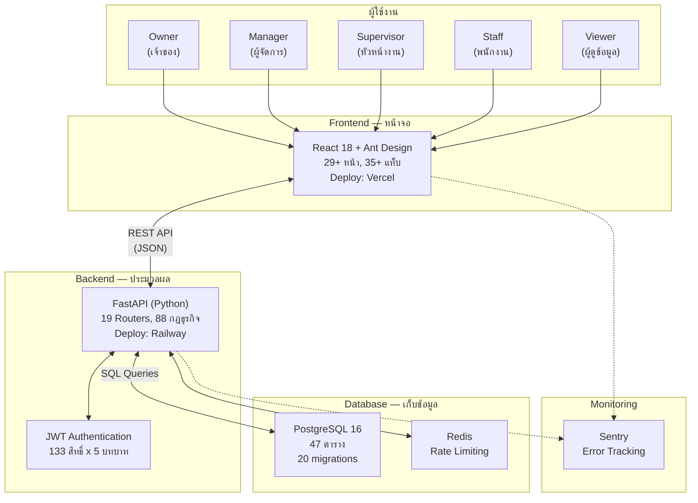

### เทคโนโลยีที่ใช้

| ชั้น | เทคโนโลยี | หน้าที่ |
|------|----------|--------|
| หน้าจอ (Frontend) | React 18 + Vite + Ant Design | แสดงผล + รับข้อมูลจากผู้ใช้ |
| ไอคอน | Lucide React | ไอคอนทั้งระบบ (ห้ามใช้ emoji / Ant Design Icons) |
| State Management | Zustand | จัดการ state ฝั่ง frontend |
| ประมวลผล (Backend) | FastAPI (Python 3.12) | ตรวจสอบกฎ + คำนวณ + จัดการข้อมูล |
| ฐานข้อมูล | PostgreSQL 16 + SQLAlchemy 2.0 (async) | เก็บข้อมูลทั้งหมด |
| Cache | Redis | Rate limiting + session cache |
| ยืนยันตัวตน | JWT Token (Access 15min + Refresh 7d) | Login + สิทธิ์การเข้าถึง |
| Deploy หน้าจอ | Vercel | เว็บไซต์ออนไลน์ |
| Deploy ประมวลผล | Railway | เซิร์ฟเวอร์ออนไลน์ |

---

## A3. สถานะแต่ละ Module + Owner Decisions

### แผนภาพความสัมพันธ์ 12 โมดูล

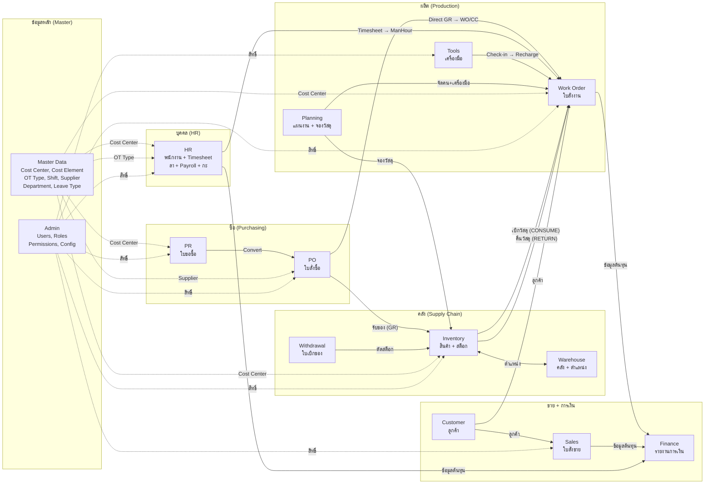

---

### Module 1: Inventory (สินค้า + Stock) — ✅ Feature Complete

ระบบจัดการสินค้าพร้อม stock tracking แบบ real-time ที่ระดับ product และ location รองรับ 6 ประเภท movement (CONSUME, RETURN, RECEIVE, ADJUST, REVERSAL, TRANSFER) โดย stock movement เป็น immutable — แก้ไขได้ผ่าน REVERSAL เท่านั้น มีการแจ้งเตือนเมื่อ stock ต่ำกว่า min_stock (แถวเหลือง + stat card)

**Owner Decision:** สินค้ามี 4 ประเภท — MATERIAL, CONSUMABLE, **SPAREPART** (ใหม่ สำหรับอะไหล่สำคัญ), SERVICE โดย SPAREPART แยกจาก MATERIAL เพื่อให้จัดการ critical parts ได้ง่ายขึ้น

**Owner Decision:** สินค้าต้องบันทึก **Model** และ **Serial Number (SN)** ได้ โดยใช้โครงสร้าง Serial Number sub-table: 1 SKU สามารถมีหลาย SN (เช่น เครื่องปั๊มรุ่น A มี SN-001, SN-002, SN-003)

**UX ที่ดี:** มี search/filter, stock quantity display ชัดเจน, low stock alert ด้วยสีเหลือง

**UX ที่ต้องปรับปรุง:**
- ไม่มี Stock Count/Adjustment UI — ต้องทำผ่าน movement ซึ่งไม่ตรงกับ workflow จริงของคลัง
- ไม่มี Stock Transfer ระหว่าง warehouse — ต้องทำ manual
- ไม่มี Import/Export สำหรับ bulk update สินค้า
- การค้นหาด้วย SKU, Model, SN ยังไม่ครบถ้วน — ต้องเพิ่ม filter/sort สำหรับ available items

---

### Module 2: Warehouse (คลัง + ตำแหน่ง) — ✅ Feature Complete (ต้องขยาย)

ระบบจัดการคลังสินค้าปัจจุบันเป็น 2 ระดับ (Warehouse → Location) รองรับ zone type (STORAGE, RECEIVING, SHIPPING, QUARANTINE)

**Owner Decision:** ขยายเป็น **3 ระดับ: Warehouse → Location → Bin** โดย Bin คือตำแหน่ง rack ที่เก็บสินค้าจริง ช่วยให้ระบุตำแหน่งได้แม่นยำขึ้น

**Owner Decision:** ระบบต้องรองรับ **หลาย site** ทั้ง fixed site (คลังถาวร) และ temporary site (คลังชั่วคราวที่หน้างาน) UI ต้องช่วยให้คนเบิก **ไม่หลง site** — แสดง site/warehouse ให้ชัดเจนในทุกหน้าที่เกี่ยวข้อง

**Owner Decision:** เรื่อง **ฝากของ (Consignment storage)** ต้องพิจารณาเพิ่ม — สินค้าที่ฝากไว้ในคลังแต่ไม่ใช่ของเรา ต้องแยกจาก stock ปกติ

**UX ที่ดี:** โครงสร้าง hierarchical ชัดเจน, CRUD ครบ

**UX ที่ต้องปรับปรุง:**
- ไม่มี visual map ของ warehouse layout — เป็นแค่ list
- ไม่มี stock summary per location
- ยังไม่มี Bin level

---

### Module 3: Work Order (ใบสั่งงาน) — ✅ Feature Complete (ต้องขยาย) 🆕

ระบบใบสั่งงานพร้อม Job Costing สถานะ DRAFT → OPEN → CLOSED ไปข้างหน้าเท่านั้น เบิก/คืนวัสดุได้เฉพาะ WO ที่ OPEN

**Owner Decision:** WO สามารถ **trigger PO สำหรับสั่งของพิเศษ** (direct purchase) โดยไม่ผ่านคลัง รวมถึง Service PO ด้วย เช่น WO ต้องการชิ้นส่วนพิเศษที่ไม่มีในสต็อก → สร้าง PR/PO อ้างอิง WO → ของส่งตรงไปที่ WO → charge cost เข้า WO โดยตรง

**Owner Decision:** **Subcontractor manhour** บันทึกเป็น PO cost เข้า WO โดยตรง (ไม่ผ่าน timesheet) เนื่องจากผู้รับเหมาช่วงไม่อยู่ในองค์กร PO มี cost_element แยกอยู่แล้ว ต้องปรับปรุงการแสดงผลต้นทุนให้เห็นชัด

**Owner Decision:** Job Costing อัปเดตเป็น **5 องค์ประกอบ**:
1. Material Cost = CONSUME - RETURN
2. ManHour Cost = (Regular + OT x Factor) x Rate
3. Tools Recharge = Hours x Tool Rate
4. Admin Overhead = ManHour Cost x Overhead Rate %
5. **Direct PO Cost** (ใหม่) = PO ที่อ้างอิง WO โดยตรง (subcontractor + special purchase)

**UX ที่ดี:** Popconfirm ก่อน action สำคัญ, summary cards แสดงต้นทุนรวม, status flow ชัดเจน

**UX ที่ต้องปรับปรุง:**
- Select สินค้า/คลัง โหลดทั้งหมด (limit:500) — ต้องเปลี่ยนเป็น search-as-you-type
- **ปุ่มเบิก/คืนวัสดุเล็กเกินไป สังเกตได้ยาก** — ต้อง redesign ให้ชัดเจนขึ้น
- total_manhours ใน Master Plan เป็น manual input — ควรคำนวณจาก manpower lines อัตโนมัติ
- ไม่มี print view สำหรับ WO detail/cost summary
- ยังไม่มี Direct PO Cost component ในหน้า cost summary

---

### Module 4: Supply Chain (คลังสินค้า + ใบเบิก) — ✅ Feature Complete (ต้อง redesign) 🆕

ระบบใบเบิกของ (Withdrawal Slip) แบบ multi-line พร้อม status flow (DRAFT → PENDING → ISSUED → CANCELLED) เมื่อจ่ายของจะสร้าง StockMovement อัตโนมัติ

**Owner Decision:** Supply Chain module ต้อง **เป็น module เฉพาะสำหรับเจ้าหน้าที่แผนกคลังสินค้า** คนแผนกอื่นที่ต้องการเบิกของ/ยืมเครื่องมือ ควรทำจาก UI หน้าอื่น (เช่น หน้า WO หรือหน้า My Tasks)

**Owner Decision:** การค้นหาด้วย **SKU, Model, SN** สำคัญมาก รวมถึง Filter/Sort ข้อมูลที่ available

**Owner Decision:** ใบเบิกของ/ใบยืมเครื่องมือที่เป็น **hardcopy ต้องมีการเก็บหลักฐานในระบบ** ต้องบันทึกหมายเลขใบเบิก/ใบยืมที่สามารถย้อนกลับมาได้ (reference number traceability)

**Owner Decision:** การนำเครื่องมือมาคืน **ไม่จำเป็นต้องมี hardcopy** เป็นความรับผิดชอบของเจ้าหน้าที่คลังในการบันทึกในระบบ

**Owner Decision:** เครื่องมือที่เสีย → **สร้าง WO เพื่อซ่อม** ส่วนจะ charge cost center ใครแล้วแต่ตกลงกันระหว่างผู้ยืมกับคลัง

**Owner Decision: GR มี 2 โหมด** 🆕
- **Stock GR**: PR จากแผนกคลัง → RECEIVE เข้า stock (สร้าง stock movement)
- **Direct GR**: PR จากแผนกอื่นที่ระบุ WO/CC → charge WO/CC โดยตรง (ไม่สร้าง stock movement)
- ระบบ auto-detect จาก context ของ PR แต่ GR operator สามารถ override ได้
- GR ที่ไม่ได้ระบุคลังเก็บ — practical สำหรับ Direct GR แต่ถ้าเป็นของที่ต้องเข้าคลัง ต้องมีกระบวนการนำเข้าคลังภายหลัง

**UX ที่ดี:** Print view สำหรับใบเบิก, Issue modal สำหรับคลังจ่ายของ, status flow ชัดเจน

**UX ที่ต้องปรับปรุง:**
- ไม่มี Barcode/QR scanning สำหรับจ่ายของ (เลื่อนไปคุยรอบถัดไป)
- Complex multi-step process อาจสับสนสำหรับผู้ใช้ใหม่
- ยังไม่มี UI แยกสำหรับ "คนเบิก" กับ "เจ้าหน้าที่คลัง"

---

### Module 5: Purchasing (จัดซื้อ) — ✅ Feature Complete (ต้อง redesign flow) 🆕

ระบบจัดซื้อแบบ 2 ขั้น: PR → PO → Goods Receipt มี Supplier master, PO QR code, delivery note

**Owner Decision:** PR **ไม่จำเป็นต้องเลือกจาก SKU list เท่านั้น** แผนกอื่นสามารถอธิบายสิ่งที่ต้องการซื้อได้อิสระ (free text) เพราะบางครั้งไม่รู้ว่ามี SKU อะไรในระบบ

**Owner Decision:** คนออก PR สามารถ **แนะนำ supplier จาก vendor list ได้ แต่ไม่บังคับ** สุดท้ายฝ่ายจัดซื้อเป็นผู้ตัดสินใจเลือก supplier

**Owner Decision:** GR ควรทำโดย **บุคคลที่ 3** ที่ไม่ใช่คนออก PR/PO — กำหนดเป็น option ของระบบได้ (configurable)

**Owner Decision: Procurement Flow ต้องมี Sourcer role** 🆕

กระบวนการจัดซื้อที่ถูกต้อง:
1. ผู้ขอ (Requester) สร้าง PR + อาจแนะนำ supplier
2. **Sourcer (ผู้จัดหา)** ค้นหา vendor + pricing → นำข้อมูลที่เกือบ final มาประกอบ
3. ผู้จัดการแผนก/คนสูงกว่า **อนุมัติ PR** (พร้อมข้อมูล vendor+pricing ที่ Sourcer เตรียม)
4. ฝ่ายจัดซื้อ **Convert approved PR → PO**
5. Sourcer กับคน Convert อาจเป็นคนเดียวกันก็ได้ (แต่ละองค์กรไม่เหมือนกัน)
6. **ระบบต้องบันทึกและย้อนกลับได้ว่าใครทำอะไร** — สำคัญเพราะ track performance ได้

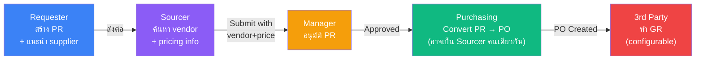

**UX ที่ดี:** Status progression ชัดเจน, PR detail page มี timeline/history, QR Code สำหรับ PO

**UX ที่ต้องปรับปรุง:**
- ConvertToPOModal โหลด supplier ทั้งหมด — ควรเปลี่ยนเป็น search
- ไม่มี partial conversion — ต้อง convert ทั้ง PR
- ไม่มี PO amendment/revision flow
- ไม่มีการส่ง PO ให้ supplier (email/print)
- ยังไม่มี Sourcer role tracking ในระบบ
- ยังไม่มี free text description บน PR line (ต้องเลือก product_id)

---

### Module 6: Sales (ขาย) — ⚠️ พื้นฐาน

ระบบขายมี SO (Sales Order) CRUD + approve เท่านั้น ยังไม่มี flow หลัง approve (ไม่มี Invoice, Delivery Order, Payment tracking)

**UX ที่ต้องปรับปรุง:**
- SO ที่ approved แล้วไม่มี next step — เป็น dead-end
- ไม่มี Invoice generation จาก SO
- ไม่มี Delivery Order / ใบส่งของ
- ไม่มี Payment tracking
- เรียบง่ายเกินไปเมื่อเทียบกับ Purchasing module

---

### Module 7: HR (บุคคล) — ✅ Feature Complete 🆕

ระบบ HR ครบทุก sub-module: Employee management, Timesheet (3-step approve), Leave (quota-based), Payroll, Daily Report, Shift Management (FIXED + ROTATING), Standard Timesheet

**Owner Decision:** พนักงาน **ดู Payslip ของตัวเองได้** — ยืนยันแล้ว

**Owner Decision:** พนักงาน **แก้ไขข้อมูลส่วนตัวเองได้** (เบอร์โทร, ที่อยู่) — ยืนยันแล้ว

**Owner Decision:** Roster UX ต้อง **ทำให้ง่าย** ไม่ต้องมานั่งทำ form ทีละวัน ให้ available สำหรับ bulk edit

**Owner Decision:** Timesheet objective คือ **track manhour เข้า WO** ดังนั้นใช้ **Daily Work Report เพื่อบันทึก timesheet ไปพร้อมกัน** (ลดขั้นตอนซ้ำซ้อน)

**UX ที่ดี:** Comprehensive employee management, leave balance tracking, payroll calculation with OT/deductions

**UX ที่ต้องปรับปรุง:**
- Modal ซ้อน Modal — บาง flow มี form ลึกหลายชั้น
- Timesheet stat card ใน MePage แสดง "—" แทนข้อมูลจริง
- ยังไม่มีหน้า Employee self-service (payslip view, profile edit)

---

### Module 8: Tools (เครื่องมือ) — ✅ Feature Complete

ระบบจัดการเครื่องมือ/อุปกรณ์ พร้อม checkout/checkin tracking, recharge rate (ค่าเสื่อม), คำนวณ cost เข้า WO อัตโนมัติเมื่อคืน

**Owner Decision:** Maintenance scheduling ควรมี แต่ **ไปอยู่กับ Maintenance Module แยกต่างหาก** (ดู C10)

**UX ที่ดี:** Checkout/return tracking ชัดเจน, status tracking (available/checked-out/maintenance)

---

### Module 9: Planning (วางแผน) — ✅ Feature Complete

**Owner Decision:** WO Plan / Project Plan มีไว้เพื่อ **forecast resources** และเป็น **performance indicator เทียบกับ result**

**Owner Decision:** Daily Plan มีไว้เพื่อ **จัดการ resources ให้มีประสิทธิภาพ** ตาราง Daily Plan ควรดูภาพได้ **14 วันข้างหน้า** และทำให้ง่ายเหมือน Excel (ยอมรับว่าเป็นความท้าทายของการออกแบบ)

**Owner Decision:** Gantt chart — **ยังนึกไม่ออก** เก็บไว้เป็น future option

**Owner Decision:** ERP ต้อง support ทั้ง **ธุรกิจ Service และ Product Manufacturing** ทำอย่างไรก็ได้ที่สะท้อนภาพรวม คาดการณ์ล่วงหน้าได้ ลด conflict ภายในองค์กร

**UX ที่ดี:** Date-based planning, links to WO and products

**UX ที่ต้องปรับปรุง:**
- Daily Plan เป็นแค่ตาราง — ไม่มี drag-and-drop หรือ calendar view
- ไม่มี auto-reservation จาก WO Master Plan
- 14-day lookahead ยังไม่มี

---

### Module 10: Customer (ลูกค้า) — ✅ Feature Complete

ระบบจัดการข้อมูลลูกค้า CRUD + export

**UX ที่ต้องปรับปรุง:**
- ไม่มี contact management — ผู้ติดต่อหลายคนต่อลูกค้า
- ไม่มี communication history
- ไม่มี customer dashboard (ยอดสั่งซื้อรวม, SO history)

---

### Module 11: Finance (การเงิน) — ⚠️ พื้นฐานมาก

มีเพียง summary report + CSV export เท่านั้น ยังไม่มี financial reports จริง

**UX ที่ต้องปรับปรุง:**
- หน้าจอแทบว่างเปล่า — แค่ตัวเลขรวม
- ไม่มี chart หรือ graph
- ไม่มี drill-down จากตัวเลขรวมไปรายการ
- ไม่มี date range filter ที่ยืดหยุ่น

---

### Module 12: Admin (จัดการระบบ) — ✅ Feature Complete

ระบบจัดการ Users, Roles (view-only — roles hardcoded), Org Settings, Approval Bypass config, Setup Wizard

**UX ที่ดี:** User management with role assignment, audit log, setup wizard

**UX ที่ต้องปรับปรุง:**
- Role management เป็น view-only — ไม่สามารถ customize permission per role
- ไม่มี login history / session management
- ไม่มี password policy configuration

---

### Cross-cutting Features (ทำเสร็จแล้ว)

| Feature | สถานะ | หมายเหตุ |
|---------|--------|----------|
| RBAC (133 permissions, 5 roles) | ✅ | ทุกหน้าตรวจสิทธิ์ |
| Data Scope (Staff=own, Supervisor=dept, Manager/Owner=all) | ✅ | HR + Purchasing endpoints |
| Staff Portal (ของฉัน) | ✅ | My Daily Report, My Leave, My Timesheet, My Tasks |
| Approval Center (6 tabs) | ✅ | DailyReport, PR, Timesheet, Leave, PO, SO + Badge Count |
| Approval Bypass | ✅ | OrgApprovalConfig — auto-approve เมื่อเปิด |
| Setup Wizard | ✅ | First-time org setup |
| Multi-tenant | ✅ | org_id filter ทุก query |

---

## A4. จุดเชื่อมต่อระหว่าง Module 🆕

| จาก | ไป | ประเภทการเชื่อม | ตัวอย่าง |
|------|-----|----------------|---------|
| PR | PO | เปลี่ยนสถานะ | PR อนุมัติแล้ว → กดแปลงเป็น PO |
| PO (Stock GR) | Inventory | สร้าง movement | รับของ → RECEIVE movement → stock เพิ่ม |
| PO (Direct GR) | Work Order/CC | charge ตรง | รับของ → charge cost เข้า WO/CC โดยตรง (ไม่ผ่าน stock) |
| Inventory | Work Order | เบิก/คืนวัสดุ | CONSUME → stock ลด + cost เข้า WO / RETURN → stock เพิ่ม |
| Withdrawal | Inventory | ตัดสต็อก | Issue ใบเบิก → สร้าง CONSUME/ISSUE movement ต่อรายการ |
| Inventory | Warehouse | ตำแหน่งจัดเก็บ | สินค้าอยู่ location/bin ไหน, stock ต่อ location |
| HR (Timesheet) | Work Order | ค่าแรง | HR final approve → ManHour Cost เข้า WO |
| Tools | Work Order | ค่าเครื่องมือ | Check-in → คำนวณชั่วโมง x อัตรา → Tools Recharge เข้า WO |
| Planning | Work Order | จัดคน/เครื่องมือ | Daily Plan → จัดพนักงาน + เครื่องมือ ลง WO ต่อวัน |
| Planning | Inventory | จองวัสดุ | Material Reservation → กัน stock ไว้ให้ WO |
| Master Data | ทุก module | ข้อมูลอ้างอิง | Cost Center, Cost Element, OT Type, Supplier, Department |
| Customer | Sales + WO | ลูกค้า | SO ต้องมีลูกค้า, WO อ้างอิง SO |
| WO + Sales + HR | Finance | ต้นทุน/รายได้ | รายงานการเงินรวมจากทุกแหล่ง |
| WO | PO (ใหม่) | สั่งของพิเศษ | WO trigger PR/PO สำหรับ direct purchase → charge WO |
| Internal Recharge | Finance (ใหม่) | cost allocation | แผนกเบิกของ → charge cost ข้ามแผนก |

---

## A5. ปัญหา UX ทั่วทั้งระบบ + Department-based Menu 🆕

### ปัญหา UX ทั่วระบบ

| ปัญหา | ผลกระทบ | ระดับ |
|--------|---------|-------|
| **Select โหลดข้อมูลทั้งหมด (limit:500)** | หน้าจอจะช้ามากเมื่อมีข้อมูลเยอะ ต้องเปลี่ยนเป็น search-as-you-type | สูง |
| **ไม่มี Mobile Responsive** | ใช้งานจากมือถือไม่ได้เลย — desktop only | สูง |
| **ไม่มี Notification** | ต้อง "เข้าไปดู" เองว่ามีอะไรรออนุมัติ | สูง |
| **Error handling เงียบ** | หลายหน้า catch error แล้วไม่แสดงอะไร | กลาง |
| **Bulk actions จำกัด** | มีแค่ Daily Report approval ที่ทำ batch ได้ | กลาง |
| **Search ไม่สม่ำเสมอ** | บางหน้ามี search, บางหน้าไม่มี | กลาง |
| **ไม่มี Print view** | มีแค่ Withdrawal Slip ที่ print ได้ | กลาง |
| **ปุ่มเบิก/คืนวัสดุเล็ก** | สังเกตได้ยาก ต้อง redesign ให้ชัดเจน | กลาง |
| **Loading state ไม่สม่ำเสมอ** | บางหน้าแสดง Spin, บางหน้าไม่แสดง | ต่ำ |
| **ไม่มี Keyboard shortcuts** | ทุกอย่างต้องใช้เมาส์ | ต่ำ |
| **Login page แสดง test accounts** | ต้องเอาออกก่อน production | ต่ำ |

### Owner Decision: Department-based Menu UI 🆕

**ออกแบบ UI/UX เป็นกลุ่มแผนก** แต่ละกลุ่มมี Menu ไม่เหมือนกัน การเข้าถึงเป็นไปตาม permission

**วิธีทำ: Hybrid Approach**

| Layer | วิธีการ | คำอธิบาย |
|-------|---------|----------|
| **Layer 1: Permission-driven (auto)** | ระบบกรอง menu อัตโนมัติตาม permission ของ user | เมนูแสดงเฉพาะสิ่งที่ user มีสิทธิ์เข้าถึง |
| **Layer 2: Department Preset (template)** | Admin กำหนด menu template ต่อแผนก | ลำดับเมนู, pinned items, กลุ่มเมนูที่เน้น |

**ผลลัพธ์:** Menu ที่แสดง = Permission (filter) + Dept Template (ordering/highlighting)

```
┌─────────────────────────────────────────┐
│ ตัวอย่าง: แผนกคลัง (Store)              │
│ ┌───────────────────────────────┐       │
│ │ ★ Supply Chain (pinned)       │       │
│ │   ★ Withdrawal Slips (pinned)  │       │
│ │   Inventory                    │       │
│ │   Warehouse                    │       │
│ │   Tools                        │       │
│ │ ─────────────────────         │       │
│ │ Purchasing                     │       │
│ │ Work Orders                    │       │
│ └───────────────────────────────┘       │
├─────────────────────────────────────────┤
│ ตัวอย่าง: แผนกผลิต (Production)         │
│ ┌───────────────────────────────┐       │
│ │ ★ Work Orders (pinned)        │       │
│ │ ★ Planning (pinned)           │       │
│ │ ─────────────────────         │       │
│ │ Supply Chain                   │       │
│ │ HR                             │       │
│ └───────────────────────────────┘       │
└─────────────────────────────────────────┘
```

---

## A6. Business Flows หลัก

ระบบมี 6 flow หลัก (เพิ่ม 1 flow ใหม่จาก feedback):

### Flow 1: จัดซื้อ (Procurement) 🆕

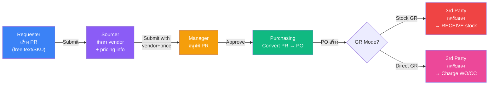

**สรุป:** Requester ขอซื้อ → Sourcer หา vendor+ราคา → Manager อนุมัติ → Convert PO → GR (2 modes: เข้า stock หรือ charge ตรง)

**กฎสำคัญ:**
- PO ต้องมาจาก PR เท่านั้น, 1 PR = 1 PO
- PR ไม่จำเป็นต้องเลือก SKU — กรอก free text ได้
- Supplier แนะนำได้แต่ไม่บังคับ
- GR ควรเป็นบุคคลที่ 3 (configurable)
- ระบบต้อง track ว่าใครเป็น Sourcer, ใครเป็น Converter

---

### Flow 2: คำนวณต้นทุนงาน (Job Costing — 5 องค์ประกอบ) 🆕

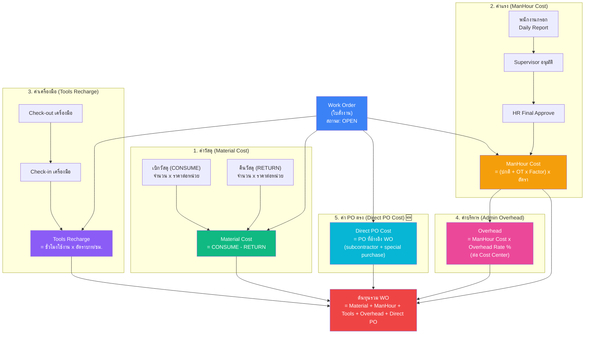

**สรุป:** ต้นทุนงาน = วัสดุ (เบิก-คืน) + แรงงาน (ชม. x อัตรา) + เครื่องมือ (ชม. x อัตรา) + ค่าบริหาร (% ของค่าแรง) + **PO ตรง (subcontractor + สั่งพิเศษ)**

---

### Flow 3: รายงานประจำวัน → Timesheet → Payroll

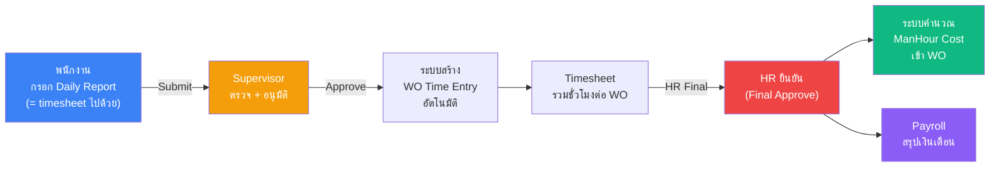

**สรุป:** พนักงานกรอก Daily Report (= timesheet) → หัวหน้าอนุมัติ → สร้าง Timesheet อัตโนมัติ → HR ตรวจ → คำนวณต้นทุนแรงงาน + Payroll

**กฎสำคัญ:** 1 ชั่วโมง = 1 WO (ห้ามซ้อน), กรอกย้อนหลังได้ 7 วัน, OT Factor <= Max Ceiling

---

### Flow 4: ใบเบิกของ (Stock Withdrawal Slip)

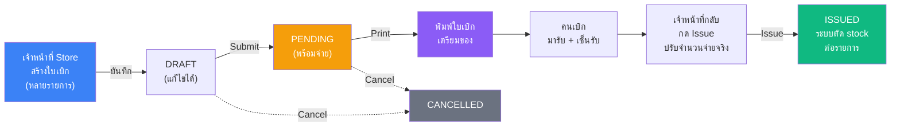

Hardcopy ใบเบิก/ใบยืมต้องมี reference number ที่ย้อนกลับได้ในระบบ

---

### Flow 5: การเคลื่อนไหวสต็อก (6 ประเภท)

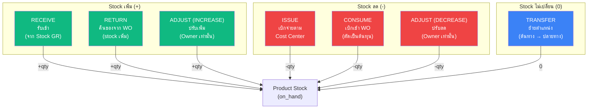

| ประเภท | ทิศทาง | ต้องระบุ | ใครทำได้ |
|--------|--------|---------|---------|
| RECEIVE | +stock | Product + จำนวน + ราคา | Staff+ |
| RETURN | +stock | Work Order (OPEN) + Product (วัสดุ) | Staff+ |
| ISSUE | -stock | Cost Center + Product + จำนวน | Staff+ |
| CONSUME | -stock | Work Order (OPEN) + Product (วัสดุ) | Staff+ |
| TRANSFER | 0 | ตำแหน่งต้นทาง + ปลายทาง (ต่างกัน) | Staff+ |
| ADJUST | +/- | ทิศทาง (เพิ่ม/ลด) + Product + จำนวน | **Owner เท่านั้น** |

หมายเหตุ: Direct GR ไม่สร้าง stock movement — charge WO/CC โดยตรง

---

### Flow 6: Internal Recharge (Cost Allocation) 🆕


ดูรายละเอียดเพิ่มที่ [C9. Internal Recharge](#c9-internal-recharge-cost-allocation-🆕)

---

## A7. สถานะเอกสาร

### ตารางสรุป 10 ประเภท

| เอกสาร | สถานะที่เป็นไปได้ | ย้อนกลับได้ไหม |
|--------|-----------------|--------------|
| Work Order | DRAFT → OPEN → CLOSED | ไม่ได้ |
| PR (ใบขอซื้อ) | DRAFT → SUBMITTED → APPROVED → PO_CREATED (+ REJECTED / CANCELLED) | REJECTED กลับแก้ไขได้ |
| PO (ใบสั่งซื้อ) | APPROVED → PARTIAL → RECEIVED (+ CANCELLED) | ไม่ได้ |
| SO (ใบสั่งขาย) | DRAFT → SUBMITTED → APPROVED → IN_PROGRESS → COMPLETED (+ REJECTED / CANCELLED) | ไม่ได้ |
| Timesheet | DRAFT → SUBMITTED → APPROVED → FINAL (+ REJECTED) | ไม่ได้ |
| Leave (ใบลา) | PENDING → APPROVED / REJECTED | ไม่ได้ |
| Daily Work Report | DRAFT → SUBMITTED → APPROVED / REJECTED | REJECTED → DRAFT ได้ |
| Withdrawal Slip | DRAFT → PENDING → ISSUED (+ CANCELLED) | ไม่ได้ |
| Tool | AVAILABLE ↔ CHECKED_OUT | สลับได้ |
| Payroll | DRAFT → FINAL | ไม่ได้ |

### State Diagrams (4 เอกสารหลัก)

**Work Order:**
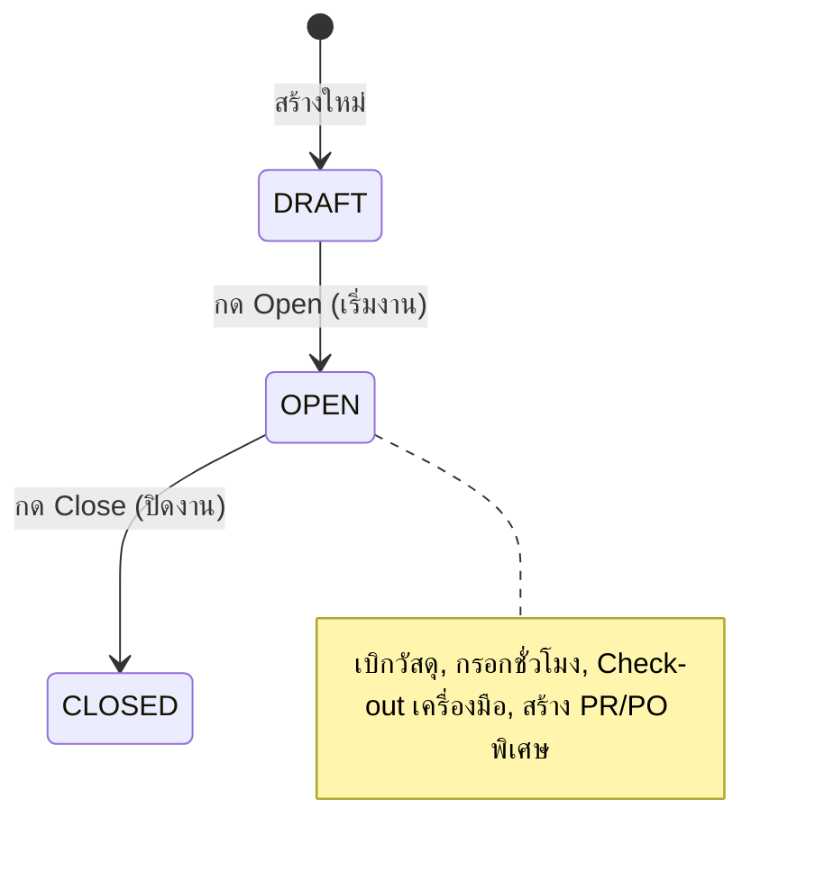

**Purchase Requisition:**
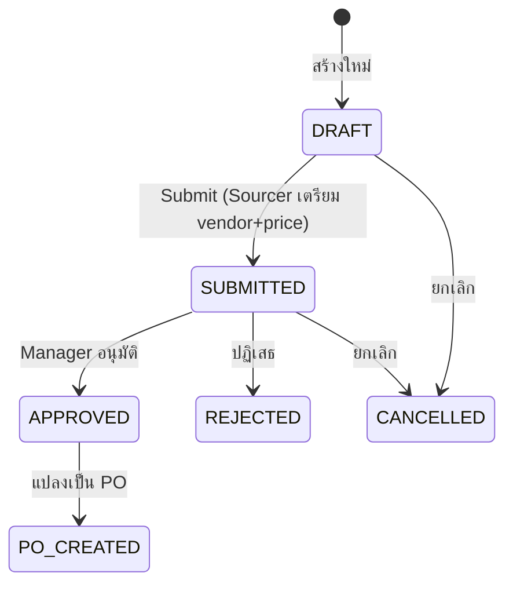

**Withdrawal Slip:**
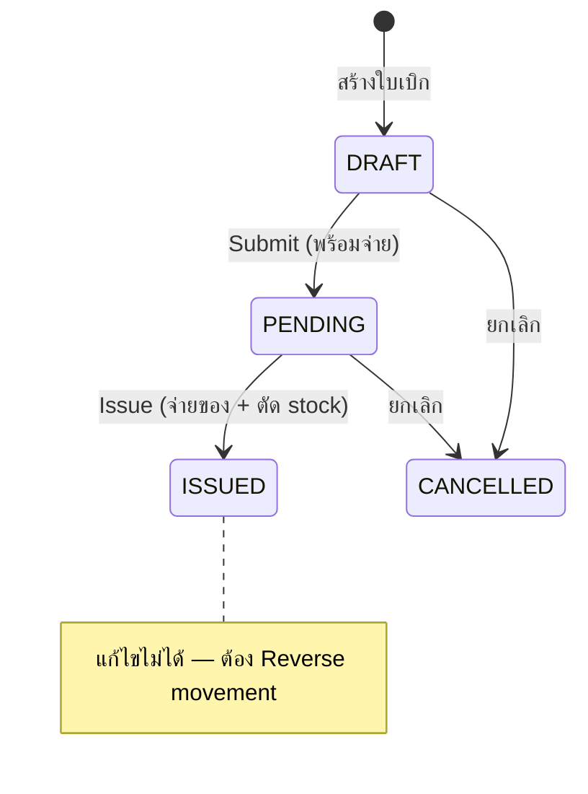

**Timesheet:**
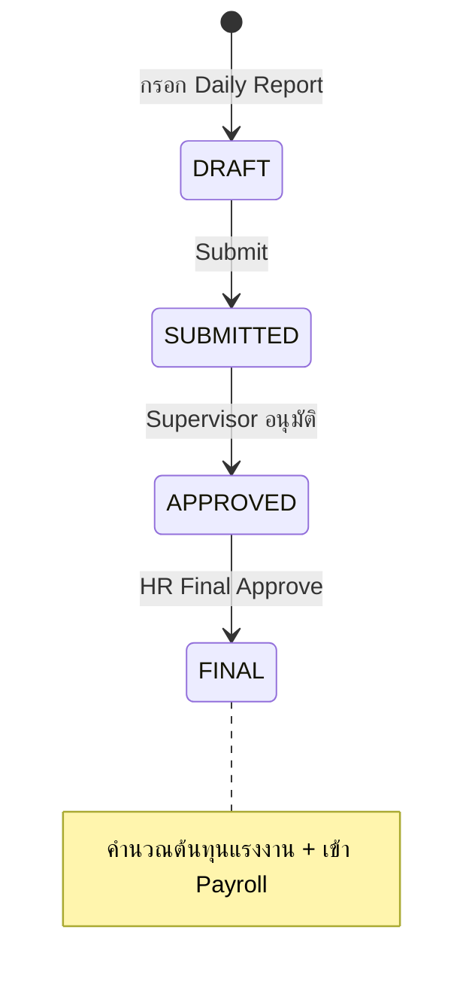

---

## A8. แผนที่หน้าจอ + ภาพร่าง

### Sidebar — 3 กลุ่ม (ปรับตาม Department Template)

**กลุ่ม 1: ของฉัน (ME)**

| เมนู | Route | แท็บย่อย |
|------|-------|---------|
| ของฉัน | /me | รายงานประจำวัน, ใบลา, Timesheet, งานของฉัน, Payslip (ใหม่), ข้อมูลส่วนตัว (ใหม่) |

**กลุ่ม 2: อนุมัติ**

| เมนู | Route | แท็บย่อย |
|------|-------|---------|
| อนุมัติ | /approval | รายงาน(N), PR(N), Timesheet(N), ลา(N), PO(N), SO(N) |

**กลุ่ม 3: ระบบงาน** (ลำดับปรับตาม Department Template)

| เมนู | Route | แท็บย่อย |
|------|-------|---------|
| Dashboard | / | stat cards + recent activity |
| Supply Chain | /supply-chain | Inventory, Stock Movements, Warehouse, Locations, เครื่องมือ, ใบเบิกของ |
| Work Orders | /work-orders | list + detail page |
| Purchasing | /purchasing | ใบขอซื้อ (PR), ใบสั่งซื้อ (PO) |
| Sales | /sales | list + detail page |
| HR | /hr | พนักงาน, Timesheet, Standard Timesheet, ลาหยุด, โควต้าลา, Payroll, ตารางกะ, อนุมัติรายงาน |
| Customer | /customers | list |
| Planning | /planning | Daily Plan (14-day view), Reservation |
| Master Data | /master | แผนก, Cost Center, Cost Element, ประเภท OT, ประเภทลา, ประเภทกะ, ตารางกะ, ซัพพลายเออร์ |
| Finance | /finance | summary report |
| Admin | /admin | Roles, Users, Audit Log, Org Config, **Dept Menu Template (ใหม่)** |

**Detail Pages:**

| หน้า | Route | เข้าจาก |
|------|-------|---------|
| Work Order Detail | /work-orders/:id | รายการ WO |
| PR Detail | /purchasing/pr/:id | รายการ PR |
| PO Detail | /purchasing/po/:id | รายการ PO |
| SO Detail | /sales/:id | รายการ SO |
| Withdrawal Slip Detail | /withdrawal-slips/:id | รายการใบเบิก |

### ภาพร่างหน้าจอหลัก

**Dashboard:**
```
┌─────────────────────────────────────────────────────────┐
│  SSS Corp ERP                          [User] [Logout]  │
├────────┬────────────────────────────────────────────────┤
│  MENU  │  Dashboard                                     │
│        │  ┌──────────┐ ┌──────────┐ ┌──────────┐       │
│ ของฉัน  │  │ WO เปิด   │ │ PR รอ    │ │ Stock    │       │
│ อนุมัติ  │  │    12     │ │ อนุมัติ 3  │ │ ต่ำ  5  │       │
│        │  └──────────┘ └──────────┘ └──────────┘       │
│ ระบบงาน │  ┌──────────┐ ┌──────────┐ ┌──────────┐       │
│ ★ pinned│  │ PO รอรับ  │ │ Timesheet│ │ ใบเบิก   │       │
│ Dashboard│ │ ของ  4   │ │ รอ  8   │ │ PENDING 2│       │
│ Supply..│  └──────────┘ └──────────┘ └──────────┘       │
│ Work O..│  [ตาราง: รายการล่าสุด / กิจกรรมวันนี้]          │
│ ...     │                                               │
└────────┴────────────────────────────────────────────────┘
```

**Work Order Detail (อัปเดต: 5 cost components):**
```
┌────────────────────────────────────────────────────────┐
│  ← Work Order: WO-2026-0015          [StatusBadge:OPEN]│
│  ┌─ ข้อมูลทั่วไป ───────────────────────────────┐       │
│  │ เลขที่: WO-2026-0015    ลูกค้า: ABC Co.       │       │
│  │ ชื่องาน: ผลิตชิ้นส่วน A   Cost Center: ผลิต-1   │       │
│  └──────────────────────────────────────────────┘       │
│  ┌─ สรุปต้นทุน (5 ส่วน) ──────────────────────────┐     │
│  │ ค่าวัสดุ:      15,000    ค่าแรง:    42,500      │     │
│  │ ค่าเครื่องมือ:   3,200    ค่าบริหาร:  8,500      │     │
│  │ ค่า PO ตรง:   12,000                           │     │
│  │                       รวม:  81,200 บาท          │     │
│  └──────────────────────────────────────────────┘       │
│  ┌─ วัสดุที่เบิก ─────────────────────────────────┐      │
│  │ [เบิกวัสดุ (ปุ่มใหญ่)]  [คืนวัสดุ (ปุ่มใหญ่)]    │      │
│  │ วันที่ | สินค้า  | ประเภท  | จำนวน | ต้นทุน       │      │
│  │ 01/03 | เหล็ก  | CONSUME | 50   | 7,500       │      │
│  │ 02/03 | เหล็ก  | RETURN  | -5   | -750        │      │
│  └──────────────────────────────────────────────┘      │
│  ┌─ PO ที่อ้างอิง WO ──────────────────────────────┐    │
│  │ PO-0012 | ผู้รับเหมาช่วง XYZ | 12,000 | RECEIVED│    │
│  └──────────────────────────────────────────────┘      │
│  [กดปิดงาน]                                            │
└────────────────────────────────────────────────────────┘
```

---

## A9. ระบบสิทธิ์

### 5 บทบาทในระบบ

| บทบาท | คำอธิบาย | จำนวนสิทธิ์ | ขอบเขตข้อมูล |
|--------|---------|-----------|-------------|
| **Owner** | เจ้าของ/Admin | 133 (ทั้งหมด) | ทั้งองค์กร |
| **Manager** | ผู้จัดการ | ~81 | ทั้งองค์กร |
| **Supervisor** | หัวหน้างาน | ~65 | ทั้งแผนก |
| **Staff** | พนักงาน | ~39 | ของตัวเอง |
| **Viewer** | ผู้ดูข้อมูล | ~26 | ทั้งองค์กร |

### สิทธิ์ต่อ Module

| Module | Owner | Manager | Supervisor | Staff | Viewer |
|--------|:-----:|:-------:|:----------:|:-----:|:------:|
| Inventory (สินค้า) | CRUD+Export | CRU+Export | CRU+Export | R | R+Export |
| Stock Movement | CRD+Export | CR+Export | CR+Export | CR+Export | R |
| Withdrawal (ใบเบิก) | CRUD+Approve+Export | CR+Approve+Export | CR+Approve+Export | CR | R+Export |
| Warehouse (คลัง) | CRUD | CRU | CRU | CR | R |
| Work Order | CRUD+Approve+Export | CRU+Approve+Export | CRU+Approve+Export | CRU+Export | R |
| Planning (แผนงาน) | CRUD | CRU | R | R | R |
| Purchasing PR | CRUD+Approve | CRU+Approve | CRU+Approve | CR | R |
| Purchasing PO | CRUD+Approve+Export | CRU+Approve | CRU+Approve | CR | R+Export |
| Sales (ขาย) | CRUD+Approve+Export | CRU+Approve+Export | CRU+Approve+Export | CR | R+Export |
| HR (บุคคล) | Full | Most | Dept scope | Own data | - |
| Tools (เครื่องมือ) | CRUD+Execute+Export | CRU+Execute+Export | CRU+Execute+Export | R+Execute | R+Export |
| Master Data | CRUD | CRU | CRU | R | R |
| Customer | CRUD+Export | CRU+Export | CRU+Export | R | R+Export |
| Finance | R+Export | R | R | R | R |
| Admin | Full | - | - | - | - |

*C=Create, R=Read, U=Update, D=Delete*

### ขอบเขตข้อมูลตามบทบาท (Data Scope)

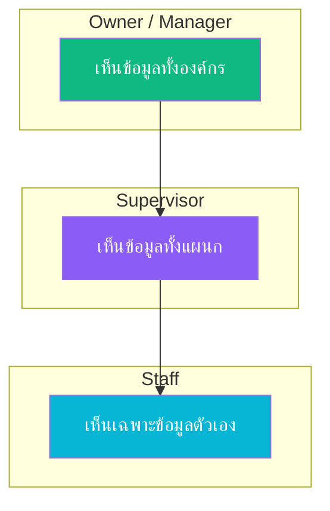

| ข้อมูล | Staff | Supervisor | Manager/Owner |
|--------|-------|------------|---------------|
| Timesheet, ใบลา, รายงานประจำวัน | ของตัวเอง | ทั้งแผนก | ทั้งองค์กร |
| พนักงาน | ไม่มีสิทธิ์ | ทั้งแผนก | ทั้งองค์กร |
| ใบขอซื้อ (PR) | ของตัวเอง | ทั้งแผนก | ทั้งองค์กร |
| Payslip (ใหม่) | ของตัวเอง | ไม่มีสิทธิ์ | ทั้งองค์กร |
| Inventory, WO, อื่นๆ | ทั้งองค์กร | ทั้งองค์กร | ทั้งองค์กร |
| Payroll, Finance | ไม่มีสิทธิ์ | ไม่มีสิทธิ์ | ทั้งองค์กร |

---

## A10. กฎธุรกิจสำคัญ

กฎที่ระบบบังคับใช้อัตโนมัติ — 88+ ข้อ สรุปเป็นภาษาคน:

### สต็อก (Inventory)

| กฎ | อธิบาย |
|-----|--------|
| ห้ามติดลบ | จำนวนสินค้าในสต็อกต้อง >= 0 เสมอ |
| เบิกไม่เกิน | เบิกหรือจ่ายสินค้าได้ไม่เกินจำนวนที่มี (ทั้ง product level และ location level) |
| ห้ามแก้ movement | การเคลื่อนไหว stock แก้ไขไม่ได้ ต้องทำ Reversal |
| SKU ห้ามซ้ำ | รหัสสินค้าต้องไม่ซ้ำกัน ถ้ามี movement แล้วห้ามเปลี่ยน |
| SERVICE ไม่มี stock | สินค้าประเภท SERVICE ไม่นับ stock, ห้ามสร้าง movement |
| Stock ต่ำ | ถ้า on_hand <= min_stock → แจ้งเตือน (แถวเหลือง + นับบน stat card) |
| ราคาวัสดุ | สินค้าประเภท MATERIAL ต้องมีราคา >= 1.00 บาท |
| SPAREPART (ใหม่) | ประเภทสินค้าใหม่สำหรับอะไหล่สำคัญ — มี stock เหมือน MATERIAL |

### ใบสั่งงาน (Work Order)

| กฎ | อธิบาย |
|-----|--------|
| สถานะไปข้างหน้าเท่านั้น | DRAFT → OPEN → CLOSED ห้ามย้อนกลับ |
| ปิดงานต้องมีสิทธิ์ | ต้องเป็น Supervisor+ ถึงปิด WO ได้ |
| ลบได้เฉพาะ DRAFT | ลบ WO ได้เฉพาะสถานะ DRAFT + ไม่มี movement + เจ้าของเท่านั้น |
| เบิกวัสดุต้อง WO เปิด | CONSUME/RETURN ได้เฉพาะ WO ที่สถานะ OPEN |
| เบิกได้เฉพาะวัสดุ | CONSUME/RETURN ได้เฉพาะ MATERIAL, CONSUMABLE, SPAREPART |
| ต้นทุนรวม 5 ส่วน (ใหม่) | Material + ManHour + Tools Recharge + Admin Overhead + Direct PO Cost |
| ค่าวัสดุ = เบิก - คืน | Material Cost = CONSUME - RETURN (ต่ำสุด = 0) |
| WO trigger PO (ใหม่) | WO สามารถ trigger PR/PO สำหรับ direct purchase |

### เบิกของ (Stock Movement — 6 ประเภท)

| กฎ | อธิบาย |
|-----|--------|
| CONSUME ต้องมี WO | ต้องระบุ Work Order ที่สถานะ OPEN |
| RETURN ต้องมี WO | ต้องระบุ Work Order ที่สถานะ OPEN |
| ISSUE ต้องมี Cost Center | ต้องระบุ Cost Center ที่ active |
| TRANSFER ต้องคนละที่ | ต้องมีตำแหน่งต้นทาง + ปลายทาง และต้องต่างกัน |
| TRANSFER stock คงที่ | ต้นทาง -qty, ปลายทาง +qty, จำนวนรวมไม่เปลี่ยน |
| ADJUST Owner เท่านั้น | เฉพาะ Owner ปรับ stock ได้ (เพิ่ม/ลด) |

### ใบเบิกของ (Withdrawal Slip)

| กฎ | อธิบาย |
|-----|--------|
| สถานะ: DRAFT → PENDING → ISSUED | ห้ามย้อน, Cancel ได้จาก DRAFT/PENDING |
| จ่ายน้อยกว่าขอได้ | issued_qty สามารถ < quantity |
| WO ต้อง OPEN | ถ้าเบิกเข้า WO, WO ต้องสถานะ OPEN ตอน Issue |
| ห้ามสินค้า SERVICE | ทุกรายการต้องเป็น MATERIAL, CONSUMABLE หรือ SPAREPART |
| ISSUED แก้ไม่ได้ | ถ้าผิดต้อง Reverse movement ทีละรายการ |
| Hardcopy traceability (ใหม่) | หมายเลขใบเบิก hardcopy ต้องบันทึกในระบบ ย้อนกลับได้ |

### ชั่วโมงทำงาน (Timesheet)

| กฎ | อธิบาย |
|-----|--------|
| 1 ชั่วโมง = 1 งาน | ชั่วโมงเดียวกันกรอกให้ WO ได้แค่ 1 ใบ (ห้ามซ้อน) |
| กรอกย้อนหลังได้ 7 วัน | เกิน 7 วัน ต้องให้ HR ปลดล็อคก่อน |
| ชั่วโมงไม่เกินวัน | ชั่วโมงรวมต่อวัน <= ชั่วโมงทำงานปกติของวันนั้น |
| หัวหน้ากรอกแทนได้ | ถ้าพนักงานไม่กรอก Supervisor กรอกแทนได้ |
| 3 ขั้นอนุมัติ | กรอก → Supervisor อนุมัติ → HR Final (ก่อนเข้า Payroll) |
| OT Factor ห้ามเกิน Ceiling | OT Factor พิเศษต้อง <= ค่าสูงสุดที่ Admin กำหนด |
| Daily Report = Timesheet (ใหม่) | ใช้ Daily Report บันทึก timesheet ไปพร้อมกัน |

### ลางาน (Leave)

| กฎ | อธิบาย |
|-----|--------|
| ลาเกินโควต้าไม่ได้ | จำนวนวันลาใช้ + ขอลาใหม่ <= โควต้า |
| ลาได้เงิน = 8 ชม. | วันลาที่ได้เงิน → Timesheet คิด 8 ชม. ปกติ |
| ลาไม่ได้เงิน = 0 ชม. | วันลาไม่ได้เงิน → Timesheet คิด 0 ชม. (หัก payroll) |
| วันลาห้ามกรอก WO | วันที่ลา ห้ามกรอกชั่วโมงให้ Work Order |

### เครื่องมือ (Tools)

| กฎ | อธิบาย |
|-----|--------|
| 1 คน ต่อ 1 เครื่อง | เครื่องมือถูก checkout ได้ 1 คน ณ เวลาเดียว |
| คิดเงินตอน check-in | ค่าเครื่องมือคำนวณเมื่อคืน (ชั่วโมง x อัตรา) |
| เครื่องมือเสีย → WO ซ่อม (ใหม่) | สร้าง WO เพื่อซ่อม, charge CC ตามตกลง |

### จัดซื้อ (Purchasing)

| กฎ | อธิบาย |
|-----|--------|
| PO ต้องมาจาก PR ก่อน | ห้ามสร้าง PO ตรง ต้องผ่าน PR ก่อนเสมอ |
| 1 PR = 1 PO | แต่ละ PR แปลงเป็น PO ได้ 1 ใบ |
| PR ต้องมี Cost Center | ทุก PR ต้องระบุ Cost Center |
| PR line ต้องมี Cost Element | ทุกรายการใน PR ต้องระบุ Cost Element |
| GOODS ต้องมีสินค้า/คำอธิบาย | รายการ GOODS เลือก SKU หรือ free text |
| SERVICE ต้องมีคำอธิบาย | รายการ SERVICE ต้องกรอกคำอธิบาย |
| GR 2 modes (ใหม่) | Stock GR (เข้าสต็อก) vs Direct GR (charge WO/CC ตรง) |
| GR บุคคลที่ 3 (ใหม่) | GR operator ไม่ควรเป็นคนเดียวกับ PR/PO creator (configurable) |
| Track Sourcer (ใหม่) | ระบบต้องบันทึกว่าใครเป็น Sourcer, ใครเป็น Converter |

### การวางแผน (Planning)

| กฎ | อธิบาย |
|-----|--------|
| 1 คน = 1 งาน/วัน | จัดคนเข้างานได้ 1 WO ต่อวัน |
| 1 เครื่องมือ = 1 งาน/วัน | จัดเครื่องมือเข้างานได้ 1 WO ต่อวัน |
| คนลาจัดงานไม่ได้ | วันที่พนักงานลา ห้ามจัดลงงาน |
| จองวัสดุหัก stock | Available = on_hand - จำนวนจองแล้ว |
| จองเครื่องมือห้ามซ้อน | ห้ามจองเครื่องมือซ้อนช่วงวันเดียวกัน |

### ระบบ (Admin)

| กฎ | อธิบาย |
|-----|--------|
| Owner ลดตัวเองไม่ได้ | เจ้าของระบบห้ามลด role ตัวเอง |
| สิทธิ์ต้องอยู่ในรายการ | Permission ต้องอยู่ในรายการที่กำหนด (133 ตัว) |
| Action ต้องถูกต้อง | ต้องเป็น 1 ใน 7: create/read/update/delete/approve/export/execute |
| ทุก query ต้อง filter org | Multi-tenant: ข้อมูลแยกตามองค์กร |
| เงินห้ามใช้ Float | ตัวเลขเงินต้องใช้ Numeric(12,2) เท่านั้น |

---

## A11. ข้อบังคับเด็ดขาด (Hard Constraints)

ข้อบังคับเหล่านี้ต้องรักษาไว้ตลอด ไม่ว่าจะ implement อะไรเพิ่ม:

| # | ข้อบังคับ |
|---|----------|
| 1 | Permission format: `module.resource.action` (3 ส่วนเสมอ) |
| 2 | Stock movements เป็น immutable — แก้ผ่าน REVERSAL เท่านั้น |
| 3 | Financial fields ใช้ Numeric(12,2) — ห้ามใช้ Float |
| 4 | on_hand >= 0 ตลอดเวลา |
| 5 | Multi-tenant: ทุก query ต้องมี org_id filter |
| 6 | Data Scope: HR endpoints ต้อง filter ตาม role |
| 7 | WO Status: DRAFT→OPEN→CLOSED ห้ามย้อน |
| 8 | Timesheet: 1 employee/WO/date = unique (ห้าม overlap) |
| 9 | OT Factor <= Maximum Ceiling ที่ Admin กำหนด |
| 10 | PO ต้องสร้างจาก PR เท่านั้น |
| 11 | Icons: ใช้ Lucide React เท่านั้น — ห้ามใช้ emoji / Ant Design Icons |
| 12 | Token: เก็บใน Zustand (memory) เท่านั้น — ห้าม localStorage |
| 13 | Job Costing = 5 components (Material + ManHour + Tools + Overhead + Direct PO) |
| 14 | Warehouse = 3 levels (Warehouse → Location → Bin) |
| 15 | Product types = 4 (MATERIAL, CONSUMABLE, SPAREPART, SERVICE) |

---

## A12. Progress Summary

| Phase | ชื่อ | สถานะ |
|-------|------|--------|
| 0 | Foundation | ✅ 100% |
| 1 | Core Modules (Inventory, Master, Warehouse) | ✅ 100% |
| 2 | HR + Job Costing | ✅ 100% |
| 3 | Business Flow + Frontend | ✅ 100% |
| 4 | Organization, Planning & Production | ✅ 100% |
| 5 | Staff Portal & Daily Report | ✅ 100% |
| 6 | Data Scope | ✅ 100% |
| 7 | Approval Center + PR/PO Redesign | ✅ 100% |
| 11 (partial) | Stock-Location, Supplier, QR, Withdrawal | ✅ 100% |
| 8 | Dashboard & Analytics | ❌ ยังไม่เริ่ม |
| 9 | Notification Center | ❌ ยังไม่เริ่ม |
| 10 | Export & Print | ❌ ยังไม่เริ่ม |
| 11 (remaining) | Inventory Enhancement | ❌ ยังไม่เริ่ม |
| 12 | Mobile Responsive | ❌ ยังไม่เริ่ม |
| 13 | Audit & Security | ❌ ยังไม่เริ่ม |
| 14 | AI Performance Monitoring | ❌ ยังไม่เริ่ม |

**สรุป: Core operations ครบ 100% — ต้อง implement feedback จาก Owner (SPAREPART, Bin, Direct PO Cost, Sourcer, GR 2 modes, Dept Menu, Employee Self-service) ก่อน production**

---

# ส่วน B — แผนที่วางไว้แล้ว (Phase 8-14)

---

## B1. Dashboard & Analytics (Phase 8)

เปลี่ยน Dashboard จาก basic stats เป็น KPI dashboard ที่มี charts, trends, และ actionable insights

| Feature | รายละเอียด |
|---------|-----------|
| KPI Dashboard | Stat cards: ยอดขาย, ต้นทุน WO, สถานะ stock, pending approvals |
| Charts | WO Cost Trend, Inventory Turnover, Revenue (Recharts/Ant Charts) |
| Manager Dashboard v2 | Department comparison, cost center breakdown, employee productivity |
| Staff Dashboard v2 | Personal KPIs: WO assigned, hours logged, leave balance |
| Finance Dashboard | P&L summary, cost analysis, budget vs actual |
| Internal Recharge Dashboard (ใ���ม่) | แสดง cost allocation ระหว่างแผนก |
| Aggregation APIs | Backend endpoints สำหรับ aggregate data |

---

## B2. Notification Center (Phase 9)

ระบบแจ้งเตือน In-app + Email (optional) ลดการ "เข้าไปดู" เอง

| Feature | รายละเอียด |
|---------|-----------|
| Notification Model | user_id, type, title, message, is_read, link |
| Event Triggers | แจ้งเตือนเมื่อ: มีงานรออนุมัติ, สถานะเปลี่ยน, stock ต่ำ |
| Bell Icon | Header dropdown + unread badge count |
| Real-time Push | WebSocket/SSE หรือ polling |
| Email Channel | ส่ง email ควบคู่กับ in-app |
| User Preferences | เลือกได้ว่าจะรับแจ้งเตือนช่องทางไหน |

---

## B3. Export & Print (Phase 10)

PDF generation + Excel export + Print-friendly layouts

| Feature | รายละเอียด |
|---------|-----------|
| PDF Engine | สร้าง PDF จากข้อมูลในระบบ |
| WO Report PDF | Cost summary (5 components), material list, manhour breakdown |
| PO/SO PDF | Document header, line items, totals, approval signatures |
| Payroll PDF / Payslip | Employee payslip — พนักงานดูเองได้ |
| Excel Export | ทุก list page สามารถ export Excel ได้ |
| Print CSS | @media print styles สำหรับหน้าสำคัญ |
| Report Templates | Admin กำหนด header (logo, ที่อยู่บริษัท) |

---

## B4. Inventory Enhancement (Phase 11 — ส่วนที่เหลือ) 🆕

| Feature | รายละเอียด |
|---------|-----------|
| **Serial Number sub-table** | 1 SKU = many SN, track SN per movement |
| **Model field on Product** | เพิ่ม field Model สำหรับค้นหา |
| **SPAREPART product type** | ประเภทสินค้าใหม่สำหรับอะไหล่สำคัญ |
| **Bin level** | Warehouse → Location → Bin (rack position) |
| **Multi-site** | Fixed site + Temporary site, ช่วยคนเบิกระบุ site |
| **Consignment storage** | สินค้าฝากในคลัง — แยกจาก stock ปกติ |
| Stock Aging Report | รายงานมูลค่าสินค้าตามอายุ (0-30, 31-60, 61-90, 90+ วัน) |
| Batch/Lot Tracking | batch_number บน StockMovement, FIFO/LIFO costing |
| Barcode/QR for SKU | Generate barcode สำหรับ SKU + print label |
| Stock Take | Cycle count workflow: count → variance → adjust |
| Multi-warehouse Transfer | TRANSFER ระหว่าง warehouse พร้อม approval |

---

## B5. Mobile Responsive (Phase 12)

| Feature | รายละเอียด |
|---------|-----------|
| Responsive Layout | Ant Design Grid breakpoints, collapsible sidebar |
| Mobile Staff Portal | Daily Report create/edit จากมือถือ |
| Mobile Tool Check-in/out | Simplified form สำหรับ field workers |
| Mobile Approval | Swipe approve/reject |
| PWA | Offline-first สำหรับ read |

---

## B6. Audit & Security (Phase 13)

| Feature | รายละเอียด |
|---------|-----------|
| Enhanced Audit Trail | Model-level event logging (who, what, when, before/after values) |
| Login History | Device, IP, location, timestamp per user |
| Session Management | Active sessions list, remote logout |
| Password Policy | Min length, complexity, expiry, history |
| Two-Factor Auth (2FA) | TOTP (Google Authenticator) |
| Per-user Rate Limiting | Different limits per role |
| Data Export Audit | Log all export/download actions |

---

## B7. AI-Powered Performance Monitoring (Phase 14)

| Feature | รายละเอียด |
|---------|-----------|
| Performance Middleware | Response time tracking, slow request detection |
| DB Query Profiler | Slow query logging, N+1 detection |
| Frontend Performance | Web Vitals (LCP/FID/CLS) |
| AI Analysis Engine | Claude API วิเคราะห์ + แนะนำเป็นภาษาไทย |
| Performance Dashboard | Stat cards + AI card + charts |
| Natural Language Query | ถามเป็นภาษาคน → AI ตอบ |
| Scheduled AI Report | Daily background job + email digest |

---

# ส่วน C — ช่องว่างที่พบ

จากการวิเคราะห์ codebase + feedback จาก Owner พบช่องว่าง 11 รายการ:

| # | Feature | ปัญหาปัจจุบัน | ผลกระทบ |
|---|---------|--------------|---------|
| C1 | **Invoice / Billing** | SO approved แล้วไม่มี Invoice | สูง |
| C2 | **Delivery Order** | SO approved แล้วไม่มีใบส่งของ | สูง |
| C3 | **Accounts Payable** | PO รับของแล้วไม่มี track การจ่ายเงิน | กลาง |
| C4 | **Budget Management** | ไม่มี budget allocation per CC | กลาง |
| C5 | **Tax Calculation (VAT 7%)** | ไม่มีการคำนวณ VAT | สูง |
| C6 | **Multi-currency** | รองรับเฉพาะ THB | ต่ำ |
| C7 | **WO Gantt Chart** | ไม่มี visual timeline (Owner ยังไม่ตัดสินใจ) | กลาง |
| C8 | **Employee Self-service** | พนักงานดู payslip/แก้ข้อมูลไม่ได้ | กลาง |
| C9 | **Internal Recharge** 🆕 | ไม่มี cost allocation ข้ามแผนก | สูง |
| C10 | **Maintenance Module** 🆕 | ไม่มีระบบ maintenance scheduling | กลาง |
| C11 | **Multi-Company** 🆕 | ไม่รองรับหลายนิติบุคคล | ต่ำ (อนาคต) |

---

## C1. Invoice / Billing (ใบแจ้งหนี้)

**ปัญหา:** SO ที่ approved แล้ว ไม่มีทางสร้าง Invoice — ขาด revenue tracking ทั้งหมด

| Feature | รายละเอียด |
|---------|-----------|
| Invoice จาก SO | สร้าง Invoice จาก Sales Order ที่ approved |
| Invoice Status | DRAFT → SENT → PAID → CANCELLED |
| Payment Tracking | บันทึกการชำระเงิน (partial/full) |
| Accounts Receivable | ลูกหนี้การค้า — ยอดค้างชำระ per customer |

---

## C2. Delivery Order (ใบส่งของ)

**ปัญหา:** SO ที่ approved แล้ว ไม่มีทางสร้างใบส่งของ

| Feature | รายละเอียด |
|---------|-----------|
| DO จาก SO | สร้าง Delivery Order จาก SO |
| DO Status | DRAFT → SHIPPED → DELIVERED |
| Stock Deduction | ตัด stock เมื่อ ship |

---

## C3. Accounts Payable (เจ้าหนี้การค้า)

**ปัญหา:** PO ที่รับของแล้ว ไม่มีที่ track ว่าจ่ายเงินแล้วหรือยัง

| Feature | รายละเอียด |
|---------|-----------|
| Payment Record | บันทึกการจ่ายเงินต่อ PO |
| AP Aging | รายงานเจ้าหนี้ตามอายุ |
| Payment Status on PO | UNPAID → PARTIAL → PAID |

---

## C4. Budget Management (งบประมาณ)

| Feature | รายละเอียด |
|---------|-----------|
| Budget per Cost Center | กำหนดงบประมาณต่อ Cost Center ต่อปี/ไตรมาส |
| Budget vs Actual | เปรียบเทียบงบกับค่าใช้จ่ายจริง |
| Budget Alert | แจ้งเตือนเมื่อใช้งบเกิน threshold |

---

## C5. Tax Calculation (ภาษี)

| Feature | รายละเอียด |
|---------|-----------|
| VAT 7% | คำนวณ VAT อัตโนมัติบน PO, SO, Invoice |
| Tax Report | รายงานภาษีซื้อ-ภาษีขาย |
| Withholding Tax | หัก ณ ที่จ่าย |

---

## C6. Multi-currency (หลายสกุลเงิน)

| Feature | รายละเอียด |
|---------|-----------|
| Currency Master | สกุลเงิน + อัตราแลกเปลี่ยน |
| PO/SO Currency | เลือกสกุลเงินต่อ document |
| Auto Convert | แปลงเป็น THB ตามอัตราแลกเปลี่ยน |

---

## C7. WO Gantt Chart / Visual Timeline

**Owner Decision:** ยังนึกไม่ออก — เก็บไว้เป็น future option

| Feature | รายละเอียด |
|---------|-----------|
| Gantt Chart | แสดง WO timeline แบบ visual |
| Drag & Drop | ลาก WO เพื่อเปลี่ยนวันที่ |
| Resource View | ดูว่าพนักงาน/เครื่องมือถูกจัดที่ไหน |

---

## C8. Employee Self-service 🆕

**Owner Decision:** ยืนยันแล้ว — พนักงานต้องทำได้

| Feature | รายละเอียด | สถานะ |
|---------|-----------|--------|
| View Payslip | ดู payslip ของตัวเอง | **ยืนยันแล้ว** |
| Edit Profile | แก้ไขข้อมูลส่วนตัว (เบอร์โทร, ที่อยู่) | **ยืนยันแล้ว** |
| Change Password | เปลี่ยนรหัสผ่านเอง | ต้องทำ |

---

## C9. Internal Recharge (Cost Allocation) 🆕

**แนวคิด:** แผนกต่างๆ charge cost ให้กันภายในองค์กร

**ตัวอย่าง:**
- แผนกคลังซื้อวัสดุมาเก็บ (charge CC คลัง)
- แผนกผลิตเบิกวัสดุ → ระบบ charge cost ไปที่ CC แผนกผลิต
- ผลลัพธ์: เห็นว่าแต่ละแผนกผลิต, ใช้จ่าย, เบิกใช้อะไรบ้าง

**ลักษณะสำคัญ:**
- เป็น **ตัวเลขภายใน** (internal numbers) ไม่ผูกพันทางกฎหมาย
- แยกจาก Financial Accounting (เงินจริงเข้า-ออก)
- ใช้ Cost Center เป็นหลัก — track ว่า CC ไหน produce/consume อะไร

| Feature | รายละเอียด |
|---------|-----------|
| Recharge Engine | คำนวณ cost allocation อัตโนมัติเมื่อมี movement |
| Department Cost Report | แสดง cost per department: ผลิต, ใช้จ่าย, เบิกใช้ |
| Internal Invoice (optional) | สร้างเอกสาร recharge ภายใน (ไม่ใช่ tax invoice) |
| Dashboard Integration | รวมใน Management Accounting dashboard |

**ความแตกต่าง: Management Accounting vs Financial Accounting**

| ด้าน | Management Accounting | Financial Accounting |
|------|----------------------|---------------------|
| วัตถุประสงค์ | ดูต้นทุนภายใน, ประสิทธิภาพ | จ่ายเงินจริง, ภาษี, กฎหมาย |
| ขอบเขต | Per CC, per dept, internal recharge | AP/AR, VAT, cash flow |
| ผูกพัน | ไม่ผูกพันทางกฎหมาย | ผูกพันทางกฎหมาย |
| ใครดู | Manager, Owner | Owner, นักบัญชี |
| ระบบปัจจุบัน | Job Costing (partial) | Finance Report (basic) |

---

## C10. Maintenance Module 🆕

**Owner Decision:** Maintenance scheduling ควรเป็น module แยกต่างหาก

| Feature | รายละเอียด |
|---------|-----------|
| Maintenance Schedule | กำหนดตาราง maintenance ตามเวลา/ชั่วโมงใช้งาน |
| Maintenance WO | สร้าง WO สำหรับซ่อม/บำรุงรักษา |
| Broken Tool → WO | เครื่องมือเสีย → auto สร้าง WO ซ่อม |
| Cost Allocation | charge CC ตามตกลงระหว่างผู้ยืมกับคลัง |
| Alert System | แจ้งเตือนเมื่อถึงกำหนด maintenance |
| History Tracking | ประวัติการซ่อม/บำรุงรักษาต่อเครื่องมือ |

---

## C11. Multi-Company 🆕

**Owner Decision:** ต้องพิจารณาในอนาคต — ต้องมีผู้เชี่ยวชาญบัญชี

**สถานการณ์:** หลายนิติบุคคลอยู่ใน physical site เดียวกัน ใช้ resources ร่วมกัน

| Feature | รายละเอียด |
|---------|-----------|
| Company Entity | หลาย legal entity ใน site เดียว |
| Inter-company Invoice | ออก invoice ข้ามบริษัท |
| Transfer Pricing | กำหนดราคาโอนระหว่างบริษัท |
| Shared Resources | ใช้คลัง/เครื่องมือ/พนักงานร่วมกัน |
| Accounting Separation | แยกบัญชีตามนิติบุคคล |

**หมายเหตุ:** สถาปัตยกรรมปัจจุบัน (org_id, cost center) ไม่ปิดกั้นการขยายในอนาคต แต่ต้องวางแผนร่วมกับผู้เชี่ยวชาญบัญชี

---

# ส่วน D — ลำดับความสำคัญที่แนะนำ

ปรับลำดับตาม feedback จาก Owner:

| ลำดับ | Feature | เหตุผล |
|-------|---------|--------|
| 1 | **Owner Feedback Implementation** | SPAREPART, Bin, SN, GR 2 modes, Sourcer tracking, Direct PO Cost, Dept Menu, Employee Self-service — ต้องทำก่อนเพราะเป็น core business requirement |
| 2 | **Export & Print (B3)** | ผู้ใช้ต้องการ print PO/SO/Payslip ทุกวัน — เป็น daily need |
| 3 | **Cross-cutting UX Fix (A5)** | แก้ Select limit:500, error handling, ปุ่มเบิก/คืนเล็ก, loading states |
| 4 | **Internal Recharge (C9)** | Owner ให้ความสำคัญกับ cost visibility ระหว่างแผนก |
| 5 | **Tax Calculation (C5)** | VAT 7% จำเป็นก่อน production |
| 6 | **Dashboard & Analytics (B1)** | มีข้อมูลครบแล้ว ยังไม่มี visualization |
| 7 | **Notification Center (B2)** | ลดการ "เข้าไปดู" ว่ามีอะไรรอ |
| 8 | **Invoice/Billing (C1) + Delivery Order (C2)** | ปิด revenue cycle (SO → DO → Invoice → Payment) |
| 9 | **Maintenance Module (C10)** | Owner ยืนยันว่าต้องมี |
| 10 | **Inventory Enhancement (B4)** | SN sub-table, Bin, Multi-site, Consignment |
| 11 | **Mobile Responsive (B5)** | Staff ต้องกรอก Daily Report จากหน้างาน |
| 12 | **Security (B6)** | สำคัญก่อน production scale |
| 13 | **Multi-Company (C11)** | อนาคต — ต้องมีผู้เชี่ยวชาญ |
| 14 | **AI Performance (B7)** | Nice-to-have, ทำทีหลังได้ |

---

# สรุป Owner Decisions ทั้งหมด

| # | หัวข้อ | การตัดสินใจ |
|---|--------|-----------|
| 1 | Product Types | 4 ประเภท: MATERIAL, CONSUMABLE, **SPAREPART** (ใหม่), SERVICE |
| 2 | Serial Number | SN sub-table: 1 SKU = many SN |
| 3 | Product Model | เพิ่ม Model field สำหรับค้นหา |
| 4 | Warehouse Levels | 3 ระดับ: Warehouse → Location → **Bin** |
| 5 | Multi-site | รองรับ fixed + temporary site |
| 6 | GR Modes | 2 modes: **Stock GR** (เข้าสต็อก) vs **Direct GR** (charge WO/CC) |
| 7 | GR Operator | บุคคลที่ 3 (configurable) |
| 8 | Job Costing | 5 components: Material + ManHour + Tools + Overhead + **Direct PO Cost** |
| 9 | Subcontractor | PO cost → WO direct (ไม่ผ่าน timesheet) |
| 10 | WO → PO | WO trigger PR/PO สำหรับ direct purchase |
| 11 | PR Free Text | ไม่ต้องเลือก SKU — กรอกอธิบายได้อิสระ |
| 12 | Supplier Suggest | แนะนำได้ไม่บังคับ — จัดซื้อตัดสินใจ |
| 13 | Sourcer Role | ต้อง track ว่าใครจัดหา ใคร convert — performance tracking |
| 14 | Supply Chain UI | module เฉพาะแผนกคลัง — คนอื่นเบิกจาก UI อื่น |
| 15 | Hardcopy Tracking | ใบเบิก hardcopy ต้องมี reference number ในระบบ |
| 16 | Tool Return | ไม่ต้องมี hardcopy — คลังรับผิดชอบบันทึก |
| 17 | Broken Tool | สร้าง WO ซ่อม, charge CC ตามตกลง |
| 18 | Payslip | พนักงานดูเองได้ — ยืนยันแล้ว |
| 19 | Profile Edit | พนักงานแก้ข้อมูลส่วนตัวเองได้ — ยืนยันแล้ว |
| 20 | Roster UX | ต้องง่าย ไม่ต้อง form ทีละวัน, bulk edit |
| 21 | Timesheet = Daily Report | ใช้ Daily Report บันทึก timesheet ไปด้วย |
| 22 | Maintenance | แยกเป็น Maintenance Module ต่างหาก |
| 23 | Menu UI | Hybrid: Permission (filter) + Dept Template (ordering) |
| 24 | Gantt Chart | ยังนึกไม่ออก — future option |
| 25 | Daily Plan 14-day | ดูภาพ 14 วัน, ง่ายเหมือน Excel |
| 26 | ERP Scope | รองรับทั้ง Service business + Product manufacturing |
| 27 | Internal Recharge | ต้องมี cost allocation ข้ามแผนก (management accounting) |
| 28 | Multi-Company | อนาคต — ต้องมีผู้เชี่ยวชาญบัญชี |
| 29 | Consignment | ต้องพิจารณา — สินค้าฝากในคลังที่ไม่ใช่ของเรา |
| 30 | Barcode Scanner | เลื่อนคุยรอบถัดไป |
| 31 | Search | SKU + Model + SN ค้นหาได้ + Filter/Sort available items |

---

# คำศัพท์ (Glossary)

| คำ | ความหมาย |
|----|----------|
| PR | Purchase Requisition — ใบขอซื้อ |
| PO | Purchase Order — ใบสั่งซื้อ |
| SO | Sales Order — ใบสั่งขาย |
| GR | Goods Receipt — การรับของ |
| WO | Work Order — ใบสั่งงาน/ใบสั่งผลิต |
| DO | Delivery Order — ใบส่งของ |
| BR | Business Rule — กฎเกณฑ์ทางธุรกิจ |
| RBAC | Role-Based Access Control — การควบคุมสิทธิ์ตามบทบาท |
| Data Scope | ขอบเขตข้อมูลที่แต่ละ role เห็น |
| Job Costing | การคำนวณต้นทุนต่อ Work Order (5 components) |
| Approval Bypass | ข้ามขั้นตอนอนุมัติ (auto-approve) ตาม OrgApprovalConfig |
| Standard Timesheet | Timesheet ที่ระบบ generate อัตโนมัติตาม Shift Roster |
| Shift Roster | ตารางกะการทำงานรายวันต่อพนักงาน |
| CC | Cost Center — ศูนย์ต้นทุน |
| CE | Cost Element — หมวดต้นทุน |
| VAT | Value Added Tax — ภาษีมูลค่าเพิ่ม 7% |
| AP | Accounts Payable — เจ้าหนี้การค้า |
| AR | Accounts Receivable — ลูกหนี้การค้า |
| PWA | Progressive Web App — เว็บแอปที่ทำงานคล้าย native app |
| UX | User Experience — ประสบการณ์การใช้งาน |
| KPI | Key Performance Indicator — ตัวชี้วัดผลงาน |
| SN | Serial Number — หมายเลขเครื่อง/ชิ้นส่วน |
| Bin | ตำแหน่ง rack ในคลัง (ระดับ 3 ของ warehouse hierarchy) |
| Stock GR | การรับของเข้าสต็อก (สร้าง stock movement) |
| Direct GR | การรับของ charge ตรงเข้า WO/CC (ไม่สร้าง stock movement) |
| Internal Recharge | การ charge cost ข้ามแผนกภายในองค์กร (management accounting) |
| Sourcer | ผู้จัดหา — ค้นหา vendor + pricing ก่อนอนุมัติ PR |
| Management Accounting | บัญชีบริหาร — ดูต้นทุนภายใน ไม่ผูกพันทางกฎหมาย |
| Financial Accounting | บัญชีการเงิน — เงินจริงเข้า-ออก ผูกพันทางกฎหมาย |
| Consignment | การฝากของไว้ในคลัง — สินค้าที่ไม่ใช่ของเราแต่เก็บไว้ในคลัง |
| SPAREPART | ประเภทสินค้าใหม่สำหรับอะไหล่สำคัญ (critical parts) |
| Direct PO Cost | ต้นทุน PO ที่ charge เข้า WO โดยตรง (subcontractor, special purchase) |
| Dept Template | เทมเพลตเมนูตามแผนก — Admin กำหนดลำดับ/pinned items |

---

*SSS Corp ERP — PRD V4 | Integrated Owner Feedback from P'Hot | 2026-03-02*
*เอกสารนี้เป็น living document — จะ update เมื่อมีการเปลี่ยนแปลง*